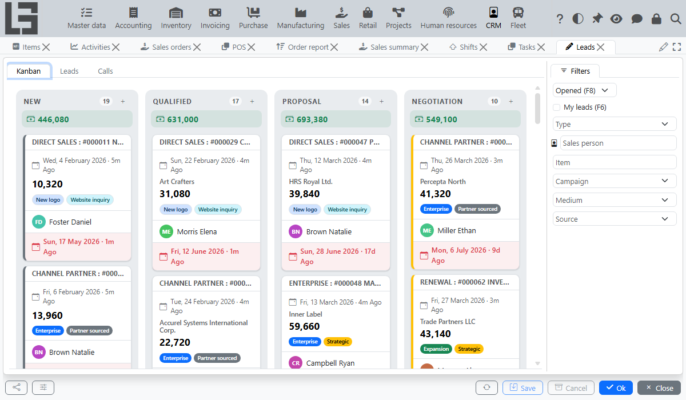
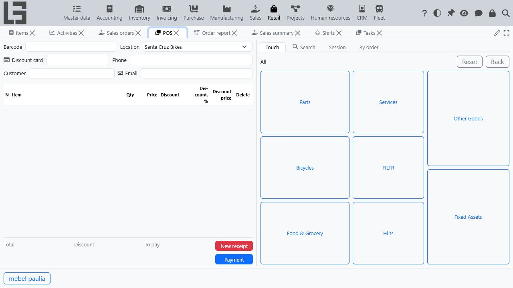

# MyCompany — Free Open-Source ERP & CRM for Small Business

MyCompany is a free, self-hosted ERP and CRM for small and medium-sized businesses: inventory, invoicing, manufacturing, sales, purchasing, projects, HR and retail POS in one application with a single database, built on the open-source [lsFusion](https://lsfusion.org) platform.

[](LICENSE)
[](https://github.com/lsfusion-solutions/mycompany/releases)
[](https://demo.lsfusion.org/mycompany/)

**[Live Demo](https://demo.lsfusion.org/mycompany/)** (no login) · **[Website](https://mycompany.lsfusion.org/)** · **[Documentation](https://mycompany-docs.lsfusion.org/)** · **[Installation](#-installation)**

Actively developed since 2019 — see the [changelog](CHANGELOG.md).



## 📦 Modules

- **Sales & CRM** — lead kanban board, calls and e-mails logged on the lead, sales orders and invoices created from leads, marketing source tracking
- **Purchasing & Inventory** — purchase orders, multi-warehouse stock, receipts, shipments and movement history
- **Invoicing** — customer invoices, payment tracking and payment calendar
- **Manufacturing** — production orders, BOMs with operations, work centers and work orders
- **Projects** — task boards, time tracking and supervisor timesheets
- **HR** — employee records, hourly rates and payslips
- **Retail POS** — cashier screen with barcode entry, payments, cash register sessions and discounts

All modules share one database, so there is no synchronization between parts of the system.

## 🚀 Installation

A server with **4 GB of RAM** and an Internet connection (for the install scripts and installer) is enough to start. The web client runs on port 8080; the desktop client uses port 7652.

### Quick install — Linux

Each script installs the lsFusion platform, PostgreSQL and MyCompany in one go. You can review a script before running it (for example, [install-mycompany-ubuntu18.sh](https://download.lsfusion.org/solutions/install-mycompany-ubuntu18.sh)).

#### Ubuntu 18+ / Debian 9+
```bash
source <(curl -fs https://download.lsfusion.org/solutions/install-mycompany-ubuntu18.sh)
```

#### RHEL 8+ / CentOS 8+ / Fedora 35+
```bash
source <(curl -fs https://download.lsfusion.org/solutions/install-mycompany-centos8.sh)
```

Russian and Polish localized scripts (`-ru`, `-pl`) and an update script are available at [download.lsfusion.org/solutions](https://download.lsfusion.org/solutions/).

### Windows

Download and run the [MyCompany installer (x64)](https://download.lsfusion.org/solutions/mycompany-6.2-x64.exe), or install the lsFusion platform and the MyCompany JAR manually — see the [installation guide](https://mycompany-docs.lsfusion.org/administration/installation/).

### Docker

See the [Docker installation guide](https://mycompany-docs.lsfusion.org/administration/installation-docker/).

## 🌍 Languages

The MyCompany interface is translated into **English, Polish and Russian**. It can also run in other languages (German, Spanish, French, Portuguese, Ukrainian, Chinese) using the platform's interface localization, with English fallback for untranslated application strings.

## 🔧 Customization

Company-specific changes — from extra fields to entirely new modules — live in separate lsFusion modules, so product updates stay manageable. See the [development guide](https://mycompany-docs.lsfusion.org/administration/development/).



## 🛠 Support

- 📚 [Documentation](https://mycompany-docs.lsfusion.org)
- 💬 [Slack](https://join.slack.com/t/lsfusion/shared_invite/zt-2klihpl2q-h6ol~nDRPky~O1uHC14Dwg)
- 📢 [Telegram](https://t.me/lsfusion_official)

Found a bug? Open an [issue](https://github.com/lsfusion-solutions/mycompany/issues). Want to contribute? See [CONTRIBUTING.md](CONTRIBUTING.md). Security issues: see [SECURITY.md](SECURITY.md).

## 📄 License

MyCompany is licensed under the [Apache License 2.0](LICENSE). The underlying lsFusion platform is licensed separately under LGPL v3.
