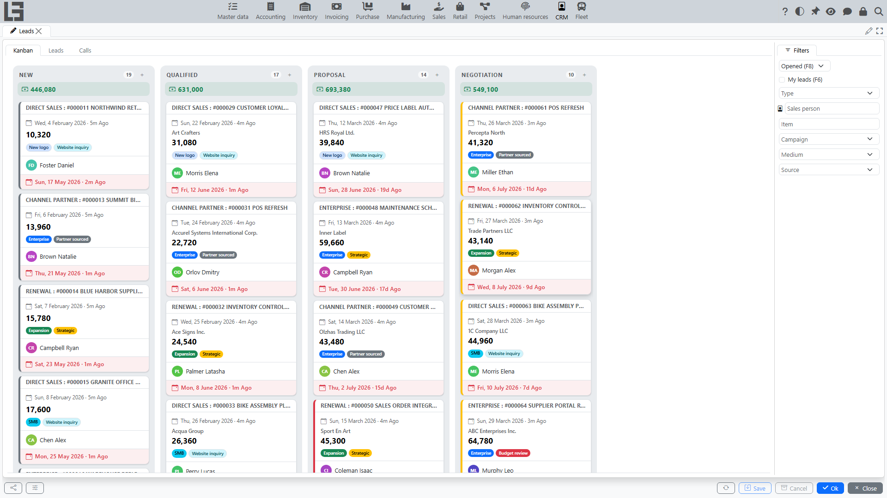

## Where to find it

Open the **“Leads”** section (the **“Operations”** group). The **“Kanban”** tab is the first tab of the section and opens by default.

## What the board is for

The lead board helps you manage the pipeline visually:

- each column corresponds to one status; the column header shows the status name and the number of leads in it;
- under the column header, the total **Expected revenue** of the leads in the column is shown;
- the **“+”** button in the column header creates a new lead directly in that status;
- leads are shown as cards;
- you can drag a lead to another status in one action.

This is convenient for daily work: quickly see bottlenecks, redistribute work, and not miss leads with no movement.

## Which statuses are shown

The board shows:

- statuses that are **not** marked as **“Closed”**;
- statuses allowed for the selected lead type (if you filtered the list by type).

Column order is determined by the **“Sorting order”** field on statuses.

If the board lacks columns or shows extra ones, check status and type settings (see [Settings and reference data](settings.md)).

## What is shown on a lead card

The card typically includes:

- a header of the form “type : name”;
- the creation date (with a relative duration, e.g. “5d ago”);
- **[Customer](../masterdata/partners.md)**;
- **Expected revenue**;
- **Lead tags** (colored);
- **Sales person** (with avatar);
- **Expected closing** at the bottom of the card — highlighted in red once the date has passed.

The card background is tinted with the **Lead priority** color.

### Card popup and quick actions

Clicking a card opens a quick-view popup with the lead details: status, priority, dates, expected revenue, tags and description. In the popup you can:

- open the lead for editing (the **“Edit”** button; double-clicking the card also opens it);
- delete the lead (if allowed by permissions);
- reassign the **Sales person** — click the avatar of another employee in the popup (the list offers employees who currently have open leads assigned).

## Drag-and-drop and card ordering

### Changing status

To change status, drag the lead card to the target column.

If the lead cannot be moved to the selected status:

- check the **lead type** (the type can restrict allowed statuses);
- check the “type ↔ statuses” configuration matrix.

### Ordering within a column

Within one status, you can order cards in the way that is convenient for you. The order is saved per user so that the next time you open the board, leads are arranged as you expect.

## Typical situations

- **No columns (or too few)** — statuses are marked as “Closed” or not allowed for the selected type.
- **A card does not move** — the status is not allowed for the lead type or you do not have permissions to change it.
- **Too many cards** — enable filtering by sales person or by type.

## Daily work on the board

An example of a simple routine (10–15 minutes in the morning):

1. Open “Kanban”.
2. Check the first column (usually “New”):
   - assign a sales person;
   - fill phone and email;
   - record the next step in the description.
3. Check the middle columns (for example, “Qualified”, “Proposition”):
   - set a date for leads without expected closing;
   - for leads without movement, clarify with the customer and update status.
4. If a decision is made:
   - move to a closing status;
   - or close via “Lost” with a reason.

## How to avoid “stuck” leads

- Always fill “Expected closing”.
- Use tags for prioritization (e.g., “urgent”), and priority for visual highlighting.
- Maintain column order via “Sorting order” in the statuses directory.