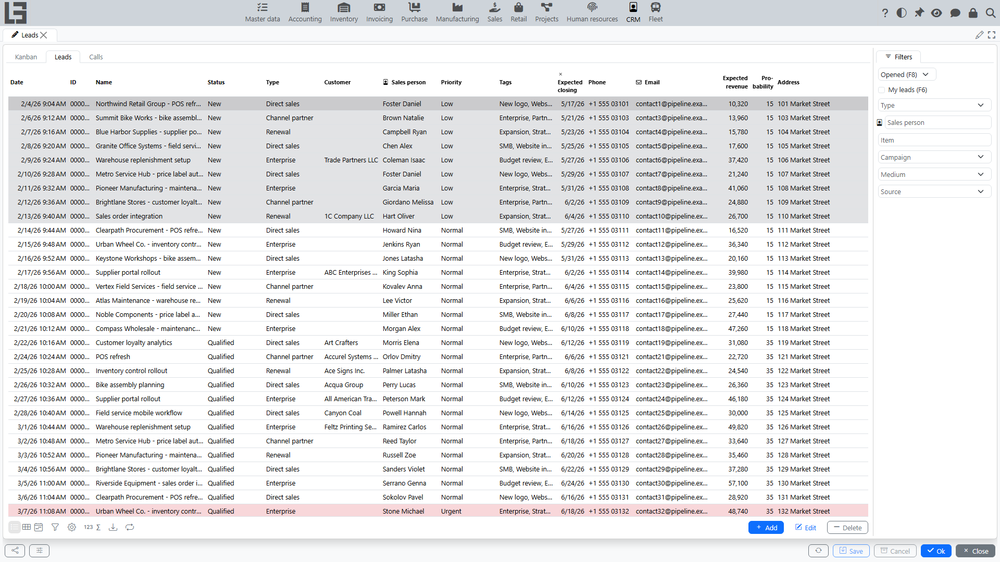
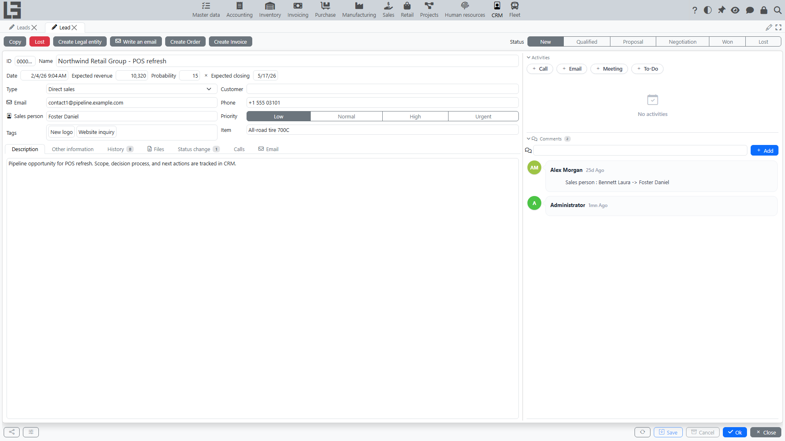

## Where to find it

Open the **“Leads”** section (in the navigation tree it is located in the **“Operations”** group).

In this section you can typically access:

- the lead list;
- the lead card;
- state filters (**“Opened”** and **“Closed”**) and **“My leads”**;
- the **[“Kanban”](kanban.md)** tab (the first tab, opens by default);
- tabs with communications (**“Calls”** and **“Email”**);
- a block of related documents ([sales orders](../sales/orders.md), [invoices](../sales/invoices.md)) in the lead card.

## Lead list

The list is intended for daily work: quickly see what is in progress, who is responsible, what needs to be closed, and where things are “stuck”.

### What data is shown in the list

The set of columns depends on configuration, but usually includes:

- **ID**, **Name**;
- **Item**;
- **Status** (and the “open/closed” state);
- **Type**;
- **[Customer](../masterdata/partners.md)**;
- **Sales person**;
- **Campaign**, **Medium**, **Source**;
- **Priority** and **Tags**;
- forecast: **Expected revenue**, **Probability**, **Expected closing**;
- contacts: **Phone**, **Email**;
- if needed — address and contact fields.

Tip: the list can use priority color indication so “urgent” leads stand out.

### Filters

On the right, in the **“Filters”** panel, quick toggles are usually available:

- **“Opened”** — shows open leads;
- **“Closed”** — shows closed leads;
- **“My leads”** — shows leads where **Sales person** equals the current user.

Dedicated filters are also available:

- by lead type;
- by sales person;
- by item;
- by campaign, medium and source (if the marketing module is enabled).

Recommendation: for daily work it is usually convenient to keep **“Opened”** enabled and then narrow down to **“My leads”**.

### Opening the lead card

To open a lead card:

1. Find the required row in the list.
2. Open the lead for editing (usually by double‑clicking the row or using the edit button).

## Lead card

The lead card is used to maintain full information about the lead and perform actions: change status, mark as lost, and work with related communications and documents.

### Card structure

Typically, the top of the card shows:

- **ID** and **Name**;
- forecast block: **Date**, **Expected revenue**, **Probability**, **Expected closing**;
- main attributes: **Type**, **[Customer](../masterdata/partners.md)**, **Item**, **Email**, **Phone**, **Sales person**, **Priority**, **Tags**.

The lead **Status** is shown as a separate selector at the top of the card.

Below are tabs such as:

- **“Description”** — a text description of the inquiry, agreements, next step;
- **“Other information”** — legal entity name, website, address fields, contact person, and the **Marketing** block (**Campaign**, **Medium**, **Source**);
- **“History”** — the change history of the lead;
- **“Files”** — files attached to the lead;
- **“Status change”** — the log of status transitions: when and by whom each status was set and how many hours the lead spent in it;
- **“Calls”** and **“Email”** — communications linked to the lead (see [Communications: calls and emails](communications.md)).

The right side of the card contains the related documents blocks (**“Orders”**, **“Invoices”**), the **“Activities”** panel and the **“Comments”** feed (see below).

### Recommended filling order

1. Select **Item** (if specified) — the lead **Name** will be filled automatically from the item name if it was empty.
2. Set **Name** — short and clear (what is requested and from whom), if not filled automatically.
3. Set **[Customer](../masterdata/partners.md)**, if known.
4. Check **Sales person** — for a new lead it is set to the current user by default; change it if needed.
5. Select **Type**.
6. Select **Status**.
7. Add contacts and description.

### Lead type and allowed statuses

The list of available statuses depends on the selected lead type:

- for each type, you can configure which statuses are allowed;
- if a type has no status list configured, all statuses are allowed.

If the selected status is not allowed for the type, the system will not let you save the lead. When you change the type, the status is reset automatically only if the current status is not allowed for the new type.

### Contacts and validation

- The **“Email”** field is validated by format. If the address is entered incorrectly, the system will show an error.
- The **“Phone”** field is used, among other things, for automatic lead lookup when processing calls.

### Closing a lead via “Lost”

If the lead is not closed yet, the **“Lost”** action is available in the lead card.

How it works:

1. Click **“Lost”**.
2. Select a **lost reason**.
3. The system saves the reason and sets the lead status that is configured in settings as “Lost”.

After that, the **“Lost reason”** field is shown in the card.

### Creating a customer from a lead

If the lead has no **Customer** yet, the **“Create Legal entity”** action is available in the lead card. It creates a [legal entity](../masterdata/partners.md) from the lead data — the name is taken from the **“Legal entity name”** field, plus phone, email, address and website — and, if at least the contact’s first name or surname is filled, a contact person for it. The created legal entity is then set as the lead **Customer**.

### Copying a lead

The **“Copy”** action creates a new lead and copies the main fields of the current one: name, type, customer, sales person, description, priority, tags, expected revenue and probability, contacts, address, website, legal entity name and contact person. Use it for similar repeat inquiries.

### History

The lead card can include a **“History”** tab:

- shows who changed the main lead fields and when;
- records key events (including status changes).

History tracks selected fields rather than being a complete audit log; the contact history is in the “Calls”/“Email” tabs and in the comments. The practical value of history is to quickly understand why the lead is in its current state.

### Related communications

If communications are enabled in your configuration, the lead card can show:

- a list of calls linked to the lead;
- a list of emails linked to the lead.

See details in [Communications: calls and emails](communications.md).

### Related documents: orders and invoices

If creating documents from a lead is enabled, the card can include a related documents block:

- **“Orders”** — documents created from the lead;
- **“Invoices”** — documents created from the lead.

See details in [Orders and invoices from a lead](sales-and-documents.md).

### Activities and comments

The right side of the card also contains:

- **“Activities”** — planned activities for the lead (the set of activity types depends on configuration): add an activity of the required type, assign a person responsible, set a due date and mark it as done when completed (you can enter feedback at that moment; a record about the completed activity is added to the lead comments). The panel is shown when activity types are configured.
- **“Comments”** — a comment feed for the lead. Comments support mentioning users with **@**; attached files and key changes are shown together with the comments. The sales person and mentioned users can receive email notifications about new comments (enabled in the user profile).

## Creating and deleting a lead

### Creating

Typically, a new lead is created from the lead list:

1. Open the “Leads” section.
2. Click “Add”.
3. Fill in the fields — at least “Name”, so the lead is easy to find later.
4. Save.

Recommendation: assign “Sales person” and set “Expected closing” right away so the lead is not lost.

### Deleting

Delete a lead only if it was created by mistake or is an obvious duplicate.

Before deleting, check:

- there are no related [sales orders](../sales/orders.md) and [invoices](../sales/invoices.md);
- there are no related calls and emails.

If there are links, it is often better to close the lead via a status or via “Lost” rather than delete it.

## Lead maintenance practices

#### What to write in “Description”

A good description format:

- short: what the customer wants;
- what has already been done (call, email, proposal sent);
- next step and date (for example, “call back on 20 Dec”, “waiting for reply until 25 Dec”).

#### How to use tags

Tags are convenient for cross-cutting marks across statuses, for example:

- source: “exhibition”, “website”, “referral” (alternatively, use the dedicated marketing fields);
- request type: “delivery”, “selection”, “urgent”.

Do not use tags instead of statuses: a status is a process stage, a tag is an additional attribute.

## Common mistakes

- **A lead cannot be saved** — a status was selected that is not allowed for the lead type.
- **Cannot write an email** — “Email” is not filled in or is invalid.
- **Leads get “lost”** — no sales person is assigned and/or expected closing is not set.