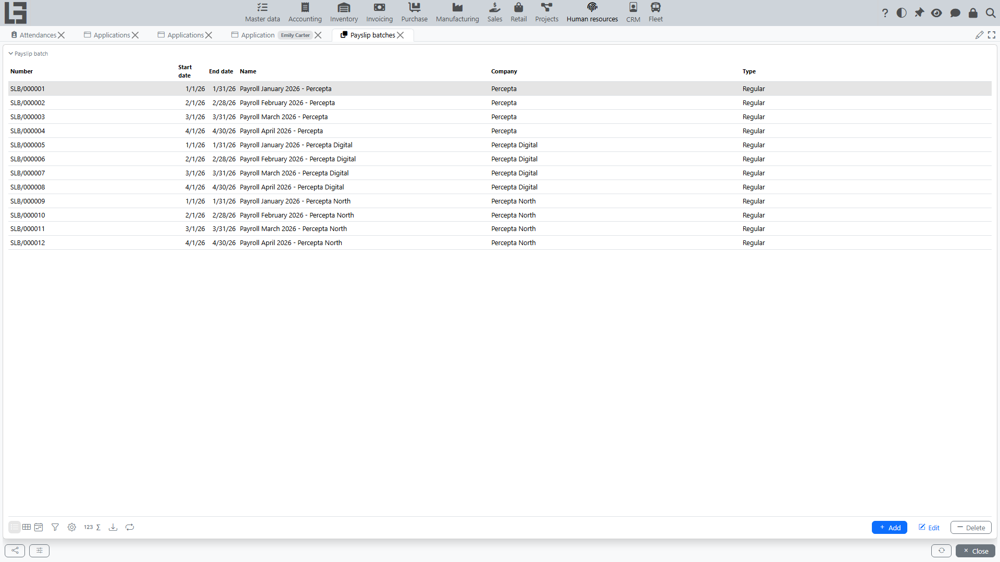
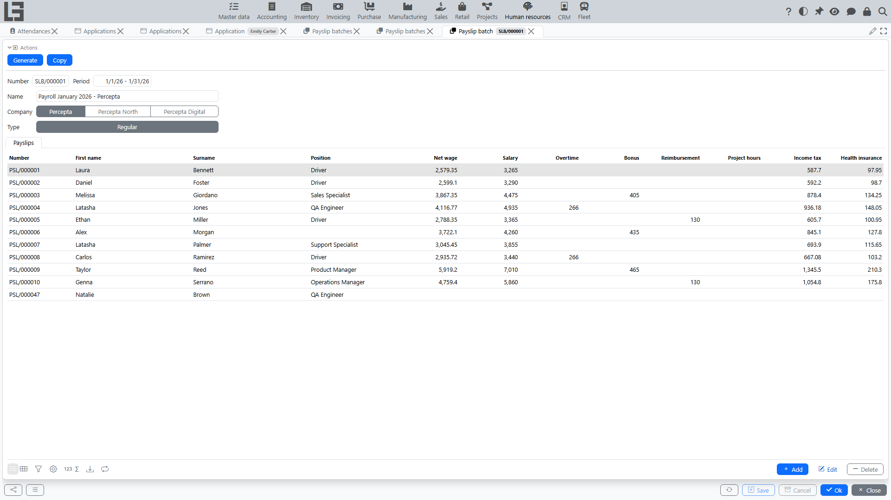

A payslip batch is used when you need to **generate payslips for multiple employees** for the same period.

Typically the workflow is:

1. create a payslip batch (company + period + type);
2. run **“Generate”**;
3. open employee payslips and review calculation lines and the **“Net wage”** total;
4. register payments if needed.

## Where to find it

Open **“Human Resources” → “Operations” → “Payslip batches”**.

## Batch fields

In a batch you usually fill:

- **Company** — the company payroll is generated for;
- **Period** — dates the payroll calculation covers;
- **Type** — payslip type that will be assigned to generated payslips;
- **Name** (if used) — a free comment, e.g., “Payslips for December”.

If only one payslip type exists in the system, it is selected automatically by default.

## What is inside the batch

The batch shows a list of payslips linked to the batch. For each employee you typically see:

- payslip number;
- employee first name and surname;
- position;
- **“Net wage”** total;
- totals by **payslip category** (one column per category, ordered by the category **“Index”**).

A category total can be entered directly in the table if the category is marked **“Editable”** in the settings — the system creates or updates a separate **manual** payslip line with the entered value. If the same category also has automatically generated lines (e.g., time-entry earnings), the column shows the **sum** of all its lines — the entered value is added to the generated ones, not replacing them; keep such categories non-editable unless an additive adjustment is intended. Totals of non-editable categories are read-only.

From the batch you can open a payslip and review its **“Salary computation”** lines.

## What “Generate” does

The **“Generate”** action performs two key steps:

1. **Creates payslips** for employees of the legal entity for the selected period and type.
   - As a rule, payslips are created for **active employees**.
   - If a payslip for the same **period + employee + legal entity + type** already exists, the system **does not create a duplicate**.
2. **Fills (or updates) the salary-computation lines** in the payslips of the batch.
   - Some lines may be calculated automatically (for example, based on time entries).
   - After generation, it is recommended to open several payslips and review the result.

If a payslip already linked to the batch belongs to an employee who does not belong to the batch’s **company**, **“Generate”** stops with an error and changes nothing — fix or remove that payslip and run it again.

#### How the employee list is formed

The employee set depends on the selected **legal entity** and on the employee active flag.

If an employee does not belong to the selected legal entity or is not active, a payslip for them is typically not created.

#### If a payslip was created separately

If a payslip with the same **period + employee + legal entity + type** already exists, the batch does not create it again.

At the same time, in the batch you usually see **only the payslips linked to this batch**. Therefore, if a payslip was created separately (not from the batch), it may not appear in the current batch list.

In such a case, it is recommended to choose a single scenario (generate payroll via batches) and avoid parallel document creation for the same period.

#### Re-running “Generate”

You can run generation again if source data changed (e.g., time entries, hourly rate, calculation settings). Re-running is typically used to **refresh** the calculation.

## If a payslip did not appear in the batch

Check typical reasons:

1. The employee is **inactive** or does not belong to the selected legal entity.
2. A payslip with the same period, legal entity, and type was already created for this employee.

Missing source data (e.g., no time entries with a selected project) does **not** prevent the payslip itself from being created — it only leaves the automatic calculation lines absent. See [Payment by time entries](payroll-time-entries.md).

## Copying a batch

If the **“Copy”** action is available, it helps create a new batch based on an existing one:

- copies the company, type, and name — the new batch has **no period**, so enter it first;
- copies the linked payslips (with new numbers) together with their manually entered lines; lines calculated from time entries are not copied.

After copying, set the period, verify the payslips, and run **“Generate”** to refresh the automatic lines.
