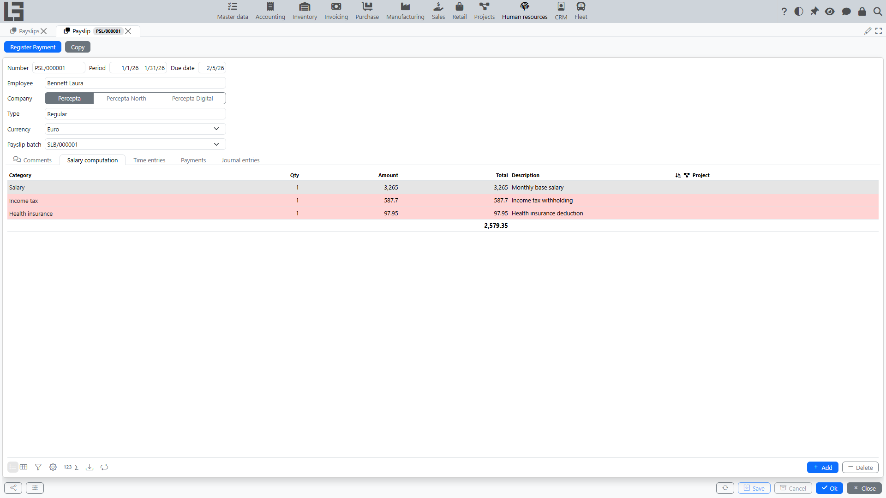

A payslip is an employee payroll calculation document for a period. It includes:

- the **“Salary computation”** lines (earnings and deductions);
- the **“Net wage”** total;
- (if used) source data details, e.g., a list of time entries.

## Payslip fields

Before reviewing the calculation, make sure the payslip correctly specifies:

- **Employee**;
- **Company**;
- **Period**;
- **Type** (for example, Regular);
- **Currency** and **Due date**.

If only one payslip type exists in the system, it is selected automatically by default.

## Salary computation

The **“Salary computation”** lines show **how the amount was formed**. A line usually has:

- **Category** (for example, Salary, Bonus, Tax);
- **quantity** (e.g., hours);
- **amount** (e.g., hourly rate);
- **total** — calculated as `quantity × amount` (the total can also be edited directly, and the amount is then back-computed).

Whether a line is an **earning** or a **deduction** is determined by its **category**: a category marked as a deduction decreases “Net wage”.

Manual lines are added with the **“Add”** button (the `Insert` key) and removed with the line **“Delete”** action.

### “Skip” and “Hide” flags

These flags belong to the **category**, not to an individual line:

- **“Skip”** — lines of this category do not participate in calculating “Net wage”.
- **“Hide”** — lines of this category are not shown in the table, but still participate in the calculation (unless the category is also marked “Skip”).

See the detailed rule in [How the “Net wage” total is calculated](net-wage.md).

## Copying a payslip

The **“Copy”** action creates a new payslip from the current one, copying the **period**, **employee**, **company**, **type**, and the manually entered payslip lines. The number is assigned anew; the due date, the payslip batch link, and the currency (reset to the default one) are not carried over. Earnings generated from project time entries are not copied; **“Generate”** is available only on a payslip batch, so to recalculate them link the new payslip to a batch (the **“Payslip batch”** field) and run **“Generate”** there — or enter the lines manually. After copying, verify the period.

## Where to check time entry data

If the organization calculates some earnings based on time entries from “Projects”, the payslip can include a **“Time entries”** tab.

It is convenient to check:

- which records got into the calculation;
- date, project, type and hours;
- the **“Salary per hour”** rate and the amount per record.

See: [Payment by time entries](payroll-time-entries.md).

## Register payment (if used)

If payment registration by payslips is enabled, the payslip has the **“Register Payment”** action.

Recommended flow:

1. Open the payslip and make sure **“Net wage”** is correct.
2. Run **“Register Payment”**.
3. Verify the payment amount and adjust it if needed (within the available balance).
4. Save the payment.

See: [Payroll payment and payment control](payroll-payments.md).
