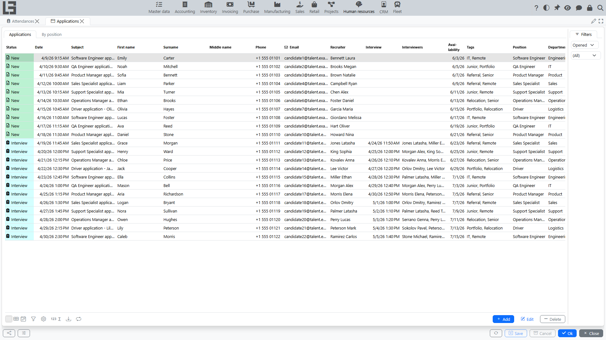
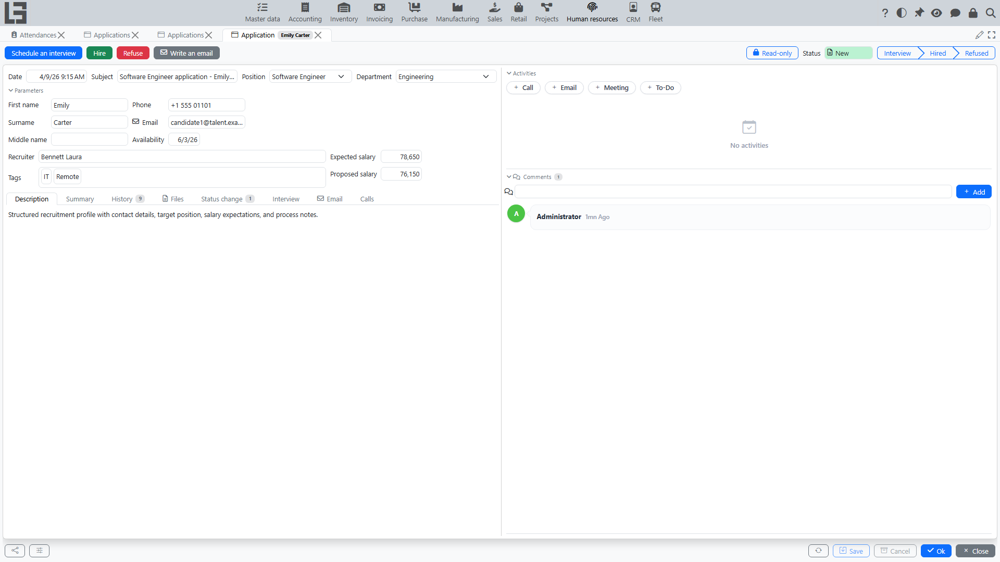

The “Recruitment” section is used to work with candidates: registering applications, storing files (resume, etc.), planning interviews, and recording decisions.

## Main objects

### Application

An application typically includes:

- creation date;
- candidate **first, middle and last name** and **contact details** (email, phone);
- **subject** and **description** (the description is filled automatically, e.g., from an incoming application email, and is shown read-only when present);
- a **summary** of the application;
- position;
- department (only a **company** department can be selected; it determines the company of the application);
- recruiter (responsible owner);
- expected and proposed salary;
- availability;
- tags (for classification);
- application files.

An application moves through four fixed statuses: **New**, **Interview**, **Hired**, and **Refused**. The status changes automatically as you work with the application — see the scenarios below.

The **Hired** and **Refused** indicators on the card can also be toggled directly, but this only changes the status: no employee is created, no refuse reason is asked, and no email is sent (when both are set, **Refused** wins). Use the **“Hire”** and **“Refuse”** actions for the complete workflow.

### Interview

An interview is used to record a recruitment stage:

- the participants are specified in the **“Interviewers”** field;
- a **summary** of the interview is filled.

Scheduling an interview moves the application to the **Interview** status.

## Typical scenarios

### Create an application manually

1. Open **“Human Resources” → “Operations” → “Applications”**.
2. Create an application.
3. Fill key details: subject, position, department, recruiter, contact details.
4. If needed, set expected/proposed salary and availability, and write notes in the **“Summary”** tab.
5. Attach candidate files.

### Attach materials to an application

You can store files (e.g., resume) and comments in the application:

1. Open the candidate application.
2. Add files.
3. Add a comment if needed.

### Schedule an interview

1. Open the application.
2. Run **“Schedule an interview”**.
3. Select the participants in the **“Interviewers”** field.
4. After the interview, fill the **summary** (brief notes and next steps).

The application automatically moves to the **Interview** status.

### Log a call

Calls with a candidate can be logged on the application:

1. Open the application.
2. Run the call action and record the call on the **“Calls”** tab.

### Write an email to a candidate

If email sending is configured, you can write an email from the application:

1. Open the application.
2. Run **“Write an email”**.
3. If templates exist, select a template — subject and body will be filled automatically.
4. Send the email.

Email templates are maintained in the **“Master data”** section settings (the **“Email templates”** tab); only templates matching the application’s current status are offered. If there are no suitable templates (or the selection is canceled), the system opens a new message to the candidate in your default mail client instead.

### Hire a candidate

Use “Hire” when the decision is to hire the candidate:

1. Open the application.
2. Run **“Hire”**.
3. The system creates an **employee**, copying the candidate’s name, contacts, position and department, and links the employee to the application. The company of the application department becomes the employee’s legal entity.
4. Review the created employee card and fill in any missing data.

The application automatically moves to the **Hired** status (and is closed); **Hire** is not available for an already closed application.

### Refuse a candidate

1. Open the application.
2. Run **“Refuse”**.
3. Select a **refuse reason**.

If the chosen reason has an email template, the system sends the refusal email to the candidate automatically. The application moves to the **Refused** status.

Note: **Hired** and **Refused** are closed statuses, and the applications list shows **“Opened”** applications by default — switch the filter to **“Closed”** to see processed applications (the **“By position”** view respects the same list filters).

## Control and convenience

To speed up work, the applications list provides:

- a **“By position”** view — a matrix of positions by application status;
- filters by status, tags, and other attributes;
- tags for quick classification;
- change history and comments;
- a per-application **“Read-only”** lock (the padlock toggle on the card) — it makes the application fields read-only regardless of the status-level setting described in [Settings](settings.md).