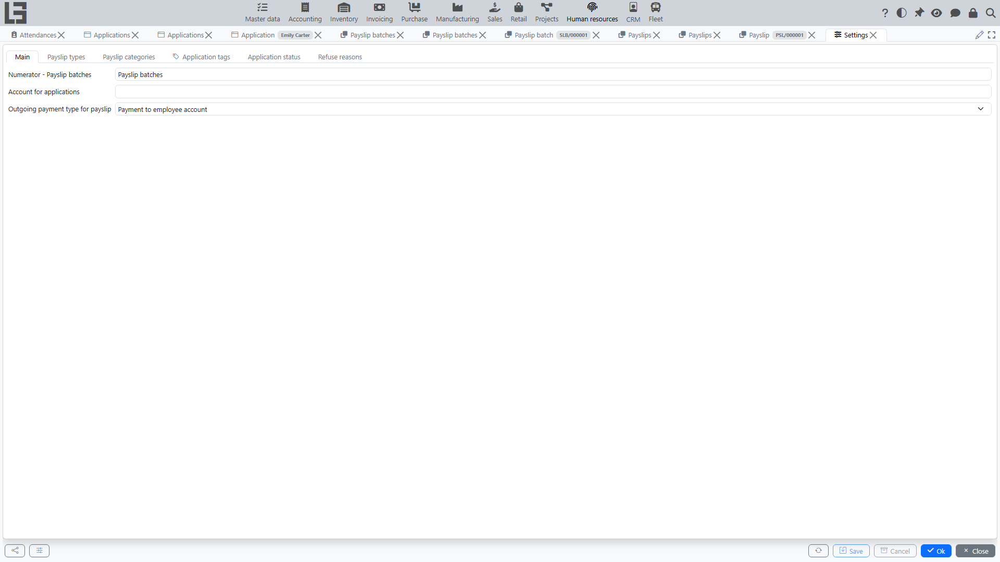

The “Settings” section contains parameters and directories that define Human Resources behavior: recruitment directories and statuses, and payroll calculation/payment parameters.

Available settings depend on your organization configuration and user permissions.

## Recruitment

Typically configured:

- **refuse reasons** — each with an optional email template sent when an application is refused for that reason;
- **application tags** for classifying applications;
- a mailbox for automatic processing of incoming application messages (if used).

**Email templates** for candidate communication are maintained in the **“Master data”** section settings (the **“Email templates”** tab).

The set of application statuses is fixed (New, Interview, Hired, Refused); on the **Application status** tab you can set the **“Read-only”** flag for a status — the main fields of applications in this status become read-only (the availability of actions is governed separately). The status color is predefined and shown for reference.

## Attendance

Attendance has no dedicated parameters on the “Settings” form:

- the permission to record attendance **without geolocation** is enabled individually, with the **“Attendance without geolocation”** option on the employee card;
- the kiosk photo is captured automatically if the kiosk device has a camera — no separate setting is required;
- employee badges are printed from the employee card; badge layouts are maintained as **employee print templates** on the **“Master data” → “Settings”** form.

## Payroll: calculation and payment

Typically configured:

- **payslip types** (for example, Regular) and their numbering;
- **payslip categories** — the earning and deduction categories used in payslip lines. The **“Editable”** flag allows entering the category total directly in the payslip batch table, and the **“Index”** defines the column order there. The category card also carries the **“Skip”** and **“Hide”** flags — see [How the “Net wage” total is calculated](net-wage.md);
- the **outgoing payment type** used when registering payslip payments (if your organization registers payments in the system).
