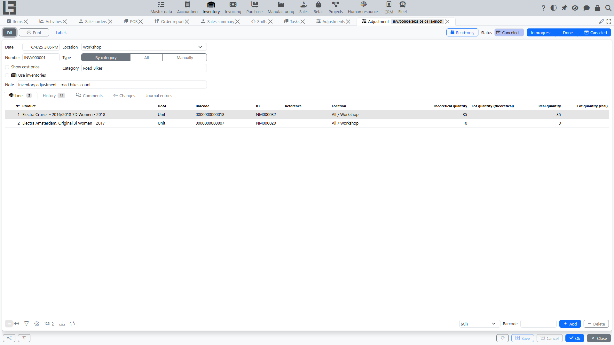

Adjustment (inventory counting) is used to compare the system stock with the actual quantity in a [location](locations.md).

Open **“Inventory” → “Operations” → “Adjustments”**.

The adjustment moves through the following statuses: **Draft** → **In progress** → **Done**, with **Canceled** as an alternative terminal state. The variance per line is recalculated automatically while the document is in **In progress** (as counted quantity minus theoretical quantity), and the corresponding inventory ledger postings are written when the document is moved to **Done**.

## Adjustment types

The **Type** field controls how lines are filled:

- **All** — the **Fill** action adds all products that have stock at the location;
- **By category** — an extra **Category** field appears in the header, and **Fill** adds only the products of that category;
- **Manually** — lines are entered manually; while the document is **In progress**, a **Search** tab is available with a location tree and quick entry of counted quantities (including barcode scanning).

## Quantities on a line

Each line carries two quantities:

- **Theoretical quantity** — the system stock at the moment the line was added (filled automatically);
- **Real quantity** — the counted quantity, editable while the document is **In progress**.

While the document is still in **Draft**, the real quantity is pre-filled with the theoretical one, so you only need to correct the lines where the physical count differs. The **Difference** column shows real minus theoretical; surplus lines are highlighted green and missing lines pink.

Quick line filters help the review: **Mismatch** (F10), **Surplus** (F9) and **Missing** (F8).

## Status transition actions

- **Mark as Todo** — moves the document from **Draft** to **In progress**;
- **Mark as Done** — moves it from **In progress** to **Done** and posts the variances;
- **Cancel** — moves the document to **Canceled**.

## Typical flow

Below is the recommended sequence of steps. It works both for a full location adjustment (counting) and for counting a zone/bin.

1. **Preparation**
   - Define the **scope**: [location](locations.md)/zone/bin, item groups, whether you need [lot/package](lots-and-packages.md) accounting.
   - Fix the “snapshot” moment:
     - if possible, complete any open **[receipts](receipts.md)/[shipments](shipments.md)/[transfers](transfers.md)** for the selected [location](locations.md);
     - agree on operational rules for the counting period (e.g., do not post documents for that location, or record operations separately).
2. **Create the document**
   - Create an **adjustment**, select the **type** (All / By category / Manually) and specify the **[location](locations.md)**.
   - If needed, set additional parameters (for example, enable [lots](lots-and-packages.md), **Show cost price** or **Use inventories** — see below).
   - Use **Fill** to populate the lines (for the All / By category types).
3. **Move to status `In progress`**
   - Move the adjustment to **`In progress`** (the **Mark as Todo** button).
   - After that, use the selected counting method: via counting lists (see below), the Search tab or manual entry.
4. **Enter actual quantities**
   - Fill in **real quantities** for items.
   - If lot/serial accounting is enabled, enter quantities **by [lot](lots-and-packages.md)** on the **Lots** tab (the same surplus/missing highlighting works per lot).
   - If bin-level storage is used, make sure you enter quantities for the **required zone/bin** (each line has its own sub-location).
5. **Review and reconcile**
   - The system continuously shows the **variance** for each line — counted quantity minus theoretical quantity — and provides quick filters for **Mismatch**, **Surplus** and **Missing** lines.
   - Check lines with zero/unexpected values.
   - If variances are large:
     - re-check **units of measure**;
     - verify that the selected **[location](locations.md)** matches the physical one.
   - If required, coordinate variances with the responsible person.
6. **Complete (move to Done)**
   - Move the adjustment to **Done**.
   - At that moment the system posts the variances to the inventory ledger so that stock balances match the counted quantities (within the accounting rules of your configuration). The **Changes** tab of a completed document shows exactly what was posted.

## Counting lists (Use inventories)

For large counts, enable the **Use inventories** flag on the adjustment — a separate “counting lists” mechanism becomes available on the **Inventories** tab:

- create one or more **lists** (each with its own number) and hand them out to the counting teams;
- each list records counted quantities per product and sub-location; barcode scanning is supported;
- the results from all lists are summed into the **real quantities** of the adjustment lines automatically;
- lists become read-only when the adjustment leaves the **In progress** status.

This decouples physical counting (several teams, several lists) from the variance calculation (one adjustment document).

## Surplus valuation (Show cost price)

If the **Show cost price** flag is enabled on the adjustment, lines show the **current unit cost** and allow entering a **unit cost** manually. The entered cost is used to value surpluses (inbound cost ledger entries); missing quantities are written off automatically by the item's costing method — see [item costing](costing.md).

## Bulk creation

The adjustments list has a **Create** tab that shows all active locations with the date, type and status of their last adjustment. From there you can create an adjustment for a location in one click (and see right away which products with stock it will cover). This is convenient for organizing cyclic counting location by location.

## Printing

- **Print** — prints the counting sheet / adjustment results using a configurable template;
- **Labels** — prints item labels with the counted quantities.

## Typical problems

- **Cannot complete** — counted quantities are not filled in or variances are not calculated.
- **Variances are too large** — check units of measure and the selected [location](locations.md).
- **Real quantities entered in lists are not visible on the lines** — make sure the lists belong to the current adjustment and the document is still **In progress**.
