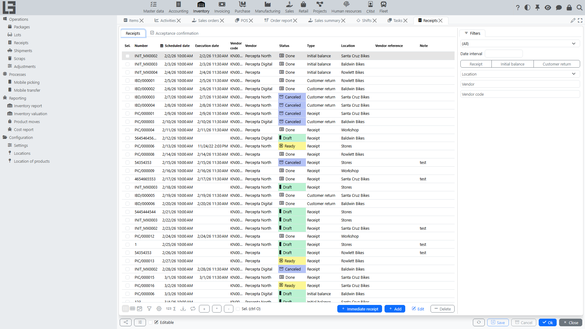

This documentation describes the **“Inventory”** section: locations, receipts, shipments, transfers, scrap, adjustments, picking tasks, lots and packages, as well as reports and ledgers.

## Contents

- [Quick start](#quick-start)
- [Navigation](#navigation)
- [Terms](#terms)

Sections:

- [Locations (warehouses and zones)](locations.md)
- [Receipts](receipts.md)
- [Shipments](shipments.md)
- [Transfers](transfers.md)
  - [Bulk transfer creation](transfer-bulk-create.md)
- [Scrap](scrap.md)
- [Adjustments](adjustments.md)
- [Picking tasks](picking.md)
- [Inventory SKUs](product-sku.md)
- [Lots and packages](lots-and-packages.md)
- [Reports and ledgers](reports-and-ledgers.md)
- [Item costing](costing.md)
- [Settings](settings.md)

## Quick start

Below is a typical warehouse cycle.

1. Create/review **[locations](locations.md)** (warehouse, zones, bins) if bin-level storage is required.
2. Create a **[receipt](receipts.md)**:
   - specify supplier (if used) and [location](locations.md);
   - add item lines and quantities;
   - move the receipt to execution and complete it.
3. Create a **[shipment](shipments.md)**:
   - specify customer (if used) and [location](locations.md);
   - add item lines and quantities;
   - run availability checks and reservation (if enabled);
   - perform picking (if [picking tasks](picking.md) are used) and complete the shipment.
4. If needed, perform a **[transfer](transfers.md)** between locations (warehouses/zones).
5. Use **[scrap](scrap.md)** to write goods off (damage, losses, defects, expiry, etc.).
6. Periodically run **[adjustments](adjustments.md)** (stock counting — it records both surpluses and shortages) and close them.

## Navigation

The "Inventory" section contains the following groups and forms:

- **Operations** — documents and directories: **Receipts** ([receipts](receipts.md)), **Shipments** ([shipments and transfers](shipments.md)), **Adjustments** ([adjustments](adjustments.md)), **Scraps** ([scrap](scrap.md)), **Packages** and **Lots** ([lots and packages](lots-and-packages.md)).
- **Processes** — mobile workflows: **Mobile picking** ([picking tasks](picking.md)) and **Mobile transfer** ([transfers](transfers.md#mobile-transfer)).
- **Reporting** — **Inventory report**, **Inventory valuation**, **Product moves** and **Cost report** ([reports and ledgers](reports-and-ledgers.md), [item costing](costing.md)).
- **Configuration** — **Settings** ([settings](settings.md)) with document types and cross-cutting parameters, **Locations** ([locations](locations.md)) and **Location of products**.

## Terms

#### [Location](locations.md)

A warehouse, zone or bin where items are stored.

#### [Receipt](receipts.md)

A document that records goods coming into the [location](locations.md).

#### [Shipment](shipments.md)

A document that records goods going out of the [location](locations.md).

#### [Transfer](transfers.md)

A document that moves goods between [locations](locations.md). Technically a transfer is a [shipment](shipments.md) whose **type** has the **"Is transfer"** flag set; "From location" and "To location" then both apply, and the system creates the corresponding cost ledger entries on both sides.

#### [Scrap](scrap.md)

A document for writing off goods (damage, losses, defects, expiry, etc.).

#### [Adjustment](adjustments.md)

A procedure for counting stock and recording variances.

#### [Lot](lots-and-packages.md)

A batch/serial identifier used for traceability.

#### [Package](lots-and-packages.md)

A packaging unit/container used for stock accounting.

#### [Inventory SKU](product-sku.md)

The base item in which the physical stock accounting is maintained.

#### [Number of packages](product-sku.md#alternative-accounting-in-packages-units-in-documents)

The quantity of an item expressed in packaging units (packages), used for convenience of data entry in documents.