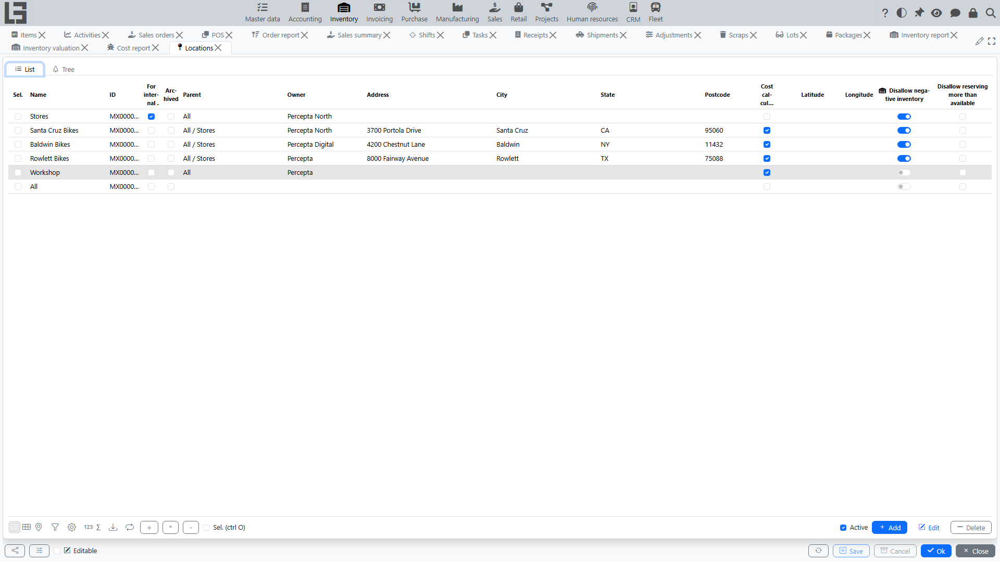

## Purpose

A location is a directory entry that describes **where goods are physically stored**. The system stores all of them as a single **Location** entity organized in a parent–child tree of arbitrary depth — there are no separate "warehouse" / "zone" / "bin" classes. The role of a given node is just how your organization decides to use it; typically:

- top-level nodes represent warehouses;
- their children represent zones;
- the leaf nodes represent bins (addressed storage).

## Where to find it

Open **“Inventory” → “Configuration” → “Locations”**.

## Where it is used

Locations are used in almost all Inventory documents:

- [receipt](receipts.md) — where goods are received;
- [shipment](shipments.md) — where goods are shipped from;
- [transfer](transfers.md) — where goods are moved from and to;
- [scrap](scrap.md) — where goods are written off from;
- [adjustment](adjustments.md) — where inventory counting is performed.

## Location structure

Locations are organized hierarchically via a single **Parent** field that points to another location. Any node can have children, so the depth is arbitrary; the typical pattern is two or three levels:

- top level — warehouse;
- inside — zones;
- inside zones — bins.

The system also shows a **Tree** view next to the list view, which is the easiest way to navigate the hierarchy.

Recommendations:

1. If bin-level storage is not used, it is enough to create locations at the "warehouse" level.
2. If bin-level storage is used, create zones and bins so that users can conveniently select them in documents.

Optionally, the **Prohibit multiple root locations** setting can be enabled in **Inventory → Configuration → Settings**. With this setting on, the system rejects attempts to leave more than one location without a parent — the first (root) location can still be created without a parent, but every subsequent location must be attached to the existing tree.

## Other fields on a location

In addition to **Name**, **ID** and **Parent**, a location has:

- **For internal use** — flags purely-internal nodes (for example, transit zones).
- **Archived** — hides the location from the default list (the list filter "Active" is on by default).
- **Owner** (company) — the company that owns the storage.
- **Address / City / State / Postcode** — addressing fields. If they are empty on a child node, the system uses the values inherited from the nearest filled-in parent (canonical address).
- **Cost calculation** — marks the location as a cost accounting location (see [item costing](costing.md)). Cost is maintained per the nearest ancestor with this flag (or per the root of the tree if no ancestor has it), so movements between sub-locations of one cost accounting location do not create cost postings.

## Ledger constraints (per location)

Two optional constraints can be turned on for a location (they are inherited by child locations — the nearest ancestor with the flag set wins):

- **Disallow negative inventory** — the system blocks operations that would drive the physical on-hand balance of an item at that location below zero.
- **Disallow reserving more than available** — the system blocks operations that would drive the available balance (*on hand − reserved + expected*, see [reports and ledgers](reports-and-ledgers.md#ledgers)) of an item at that location below zero.

When a posting violates an enabled constraint, it is rejected with an explanatory message.

## Coordinates

The location card has a **Coordinates** tab with **Latitude** and **Longitude** fields and a map. Coordinates can be entered manually or calculated automatically from the address (this requires a configured Google Maps API key). The tab is useful for distribution networks where locations are geographically dispersed.

## Access by employees

Location access can be restricted per employee:

- on the employee card there is a **Locations** tab where the location tree is shown with access checkboxes;
- the restriction applies to the document's own location field (the receipt location, the shipment source location, etc.): only accessible locations can be selected there, and document lists are filtered accordingly;
- if exactly one location is accessible to the user, it is pre-filled automatically in new documents;
- the **destination** location of a [transfer](transfers.md) is not restricted — moving goods to a location the user has no access to is allowed, but then the transfer requires [acceptance at the destination](shipments.md#acceptance-at-the-destination).

## Location of products

The form **“Inventory” → “Configuration” → “Location of products”** assigns a default **location** to products. Select a location and mark the products stored there — the assignment is also visible on the item card (the **Location of products** tab). It is used as a hint/default when products are added to documents.

## Import and export

For initial setup and data migration, locations can be exported to and imported from Excel (ID, name, parent, owner company, address fields, cost calculation flag). These actions are located on the data migration form rather than in the Inventory navigator; they are typically used by administrators.

## Typical rules

- When selecting a location in a document, make sure it matches your process (for example, a [shipment](shipments.md) should not be done from a "receiving zone" if it is disallowed by your procedures).
- If a document cannot be posted because of a missing location, check that the location in the document header is filled in.
- A location cannot be deleted while it has child locations.
