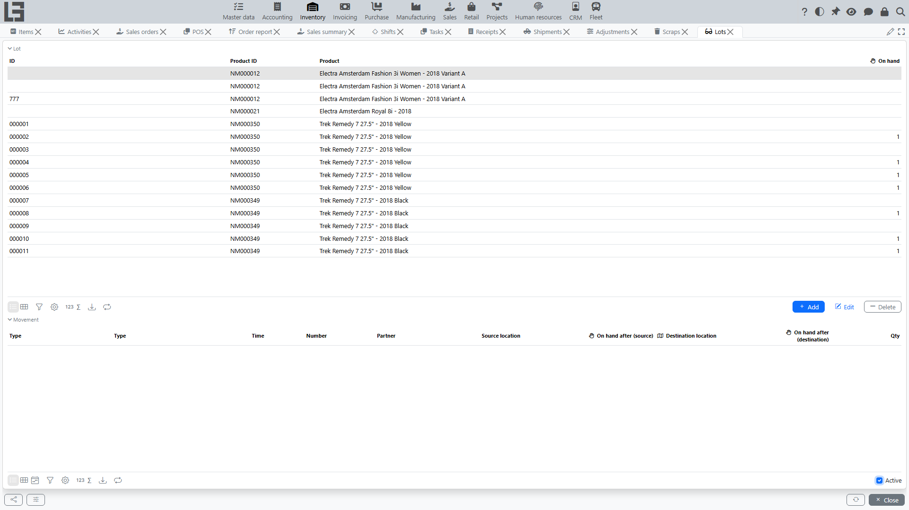
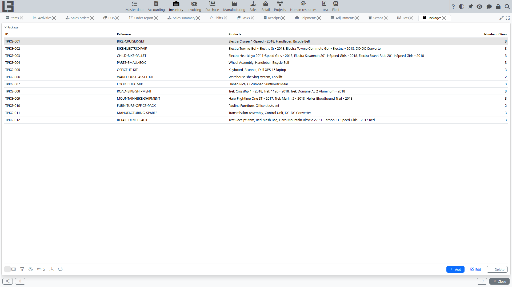

## Lots

A lot (batch/serial) is used for traceability. The lot directory is available at **“Inventory” → “Operations” → “Lots”**.

Lot tracking is controlled by several layers of settings:

- a **global toggle** (**Use lots**) in **Inventory → Configuration → Settings** that turns lot accounting on for the system as a whole;
- on each item category, a **Use lots** flag, **Serial numbers** flag, **numerator** and **ID prefix** for generating lot IDs. The category-level Use lots / Serial numbers / numerator / prefix settings are inherited by child categories and by products in the category;
- on each product, a **Use lots** override that lets you opt an individual product **in** to lot tracking even if its category is off. This product-level flag cannot disable lot tracking for a product whose category has it on — to switch lots off for such a product, turn the flag off at the category.

A lot record itself is minimal: it has an **ID** and the **Product** it belongs to. Expiration dates and similar attributes are not part of the base lot entity — they may be added by a configuration that extends the model.

### Lot ID generation

Lot IDs can be entered manually or generated automatically (the **Generate** action on [receipt](receipts.md) lines):

- the ID is composed of the **prefix** plus the next value of the **numerator** configured on the item category (for example, prefix `LOT-` and numerator value `000123` give `LOT-000123`);
- for products with **Serial numbers** enabled, one lot is generated **per unit** — each with quantity 1 (serial-number mode);
- otherwise a single lot is generated for the whole remaining quantity of the line (batch mode).

### Where lots are used

When lot accounting is enabled for a product:

- a lot can be specified on [receipt](receipts.md), [shipment](shipments.md), [transfer](transfers.md) (transfer is a shipment with the "Transfer" flag), [scrap](scrap.md) and [adjustment](adjustments.md) lines — the corresponding cards get a **Lots** tab with the per-lot breakdown;
- put-away on receipts and picking on shipments can be detailed by lot;
- [stock reports](reports-and-ledgers.md) can be built with a lot breakdown, and the lot card itself shows the movement history and current on-hand of the lot by location;
- in mobile / scanning workflows, the system resolves a scanned barcode directly to a lot; if the barcode is unknown, a new lot can be created automatically on the fly.

### Lot labels

Lot barcode labels can be printed: the print action is available both on the lot card and on document lines (receipts, shipments). Output formats include PDF, DOCX, XLSX, RTF and HTML; the label template is configurable.

## Packages

A package is a container/multi-item unit identified by an **ID** (and an optional **reference**) that has its own line list of product quantities. The package directory is available at **“Inventory” → “Operations” → “Packages”**.

> Package handling in the standard configuration is currently supported **only in [receipts](receipts.md)**: packages can be linked to a receipt, and a package line can be linked to a lot. Shipments, transfers, scrap and adjustments work with lots only — they do not have package-level support out of the box.

When package handling is used on a receipt:

- the package contents (products and their quantities) are recorded once on the package directory;
- the package is then linked to the receipt (the **Add to** action on the **Packages** tab) — its lines are shown on the receipt card for reference and traceability;
- each line of the package can be linked to a [lot](#lots) when lot tracking is enabled for the product — the **Lot** column is filled directly in the package card.

> Linking a package to a receipt is informational: stock is still posted from the receipt's own line quantities (the **Received** column), so the corresponding receipt lines must also be filled in.

> Do not confuse this with the **"Show packages"** option that can be enabled on a document type. That option turns on extra columns in document lines for entering a quantity in packaging units (boxes, pallets, etc.) and is described under [Number of packages](product-sku.md#alternative-accounting-in-packages-units-in-documents). It is independent from the Package directory described here.
