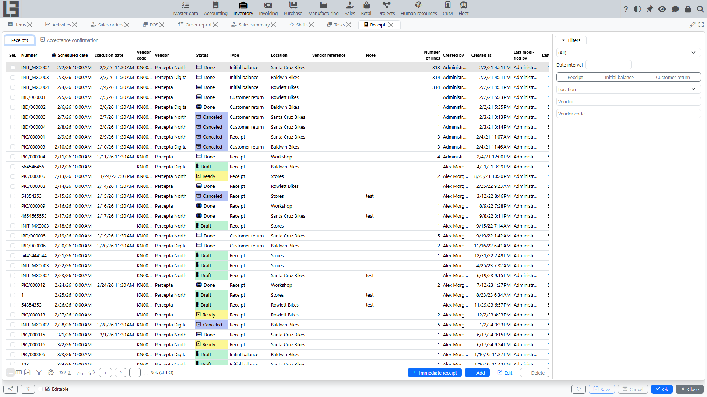
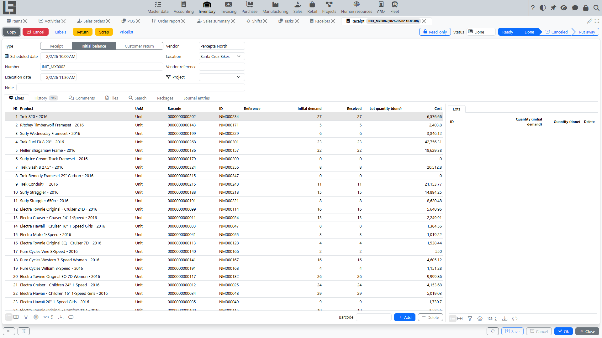

## Where to find it

Open **“Inventory” → “Operations” → “Receipts”**.

## Purpose

A receipt records goods coming into a [location](locations.md).

The document is used to:

- record planned and actual quantities to receive;
- receive goods into a specific [location](locations.md);
- if needed — put goods away into zones/bins (bin-level storage);
- create stock movements and (if enabled) costing movements.

## Receipt list

The list typically shows:

- number;
- scheduled date and time;
- receipt type;
- vendor (if used);
- [location](locations.md);
- note;
- line count.

Above the list there are filters by **date interval**, **type**, **location** and **vendor**.

### List actions

- **Create**, **open**, **delete** documents (if allowed by status and permissions).
- **Immediate receipt** — creates a receipt with the **Unplanned** flag set; such a receipt skips the **Ready** step and can be marked as done directly from Draft.
- Bulk actions on **selected** documents: **Mark as Todo**, **Mark as Done**, **Copy** (copies the selected receipts to a new date) and **Delete**.
- If transfers with destination confirmation are used, the list also has an **Acceptance confirmation** tab showing incoming [transfers](transfers.md) waiting to be accepted at your location (see [Shipments](shipments.md#acceptance-at-the-destination)).

## Receipt card

### Header fields

In the header you typically fill:

- **Type** — affects numbering, default [location](locations.md) and constraints;
- **Scheduled date** — planned receiving time;
- **Number** — generated by a numbering rule;
- **Vendor** (if used);
- **Location** — required;
- **Vendor reference** (e.g., supplier delivery note number — if used);
- **Note**.

The actual completion time (**Execution date**) is set automatically when the receipt is marked as done.

Practical tip: select type and [location](locations.md) first — then it is easier to add lines.

### Receipt lines

Lines contain items and quantities.

Typical line fields:

- **Item** — required;
- **UoM** — taken from the item;
- **Barcode** (if used);
- **Internal code** (if used);
- **Reference/SKU** (if used);
- **Cost** — shown when the receipt type has the **Show cost price** flag; lets you enter the inbound cost of the line manually (see [item costing](costing.md));
- packaging columns (**Type of packaging**, **Number of packages**, **Quantity in package**) — shown when the receipt type has the **Show packages** flag (see [Number of packages](product-sku.md#alternative-accounting-in-packages-units-in-documents)).

#### “Initial demand” field

For receipts that are not executed immediately, the **“Initial demand”** field is used:

- it is the planned quantity for the line (the actually received quantity goes to the **Received** column);
- the field can be highlighted in draft to remind to fill it.

Constraint:

- the value must be between `0` and the **maximum quantity** defined in the receipt type;
- if exceeded, the document cannot be saved.

#### “One line per item” constraint

For some receipt types, a rule can be enabled:

- the same item cannot be added in two lines;
- when adding a duplicate, the system shows an error.

### Search tab and barcode entry

The receipt card has a **Search** tab for fast line entry:

- products are searched by category and attributes, with live **on hand / expected / available** quantities shown;
- the initial demand or received quantity can be entered right from the search results — the corresponding line is created automatically;
- the **Lines** tab also has a barcode input field: scanning a product barcode adds a line (or increments the quantity of an existing one).

### Other tabs

Besides **Lines**, the card has **History** (change log: who and when changed status, dates and lines), **Comments** (rich-text comments with mentions) and **Files** (attachments). When the corresponding features are enabled, the **Lots** and **Put away** panels and the **Packages** tab appear (see below); with the Accounting module a **Journal entries** tab shows the document's postings.

## Statuses and stages

Below is the status set **as it follows from the source code**.

1. **Draft** — data entry.
2. **Ready** — the document is marked for execution.
3. **Done** — the receipt is confirmed; completion date is recorded.
4. **Put away** — put-away into child locations.
   - available **only if** the receipt type enables put-away;
   - the system checks that the target [location](locations.md) is a child of the document location and that the total put away does not exceed the received quantity.
5. **Canceled** — the document is Canceled.

### Status transition actions

The receipt card has the following action buttons that move the document between statuses:

- **Mark as Todo** — moves the document from **Draft** to **Ready** (also available as a bulk action in the receipt list). For receipt types with the **Increase available stock** flag, a receipt in **Ready** increases the *expected* quantity in the reservation ledger, so the incoming goods already count towards availability.
- **Mark as Done** — confirms execution and moves the document to **Done**; the execution date is set automatically. The button is shown when the document is in **Ready** (the usual flow is Draft → Mark as Todo → Ready → Mark as Done). For **immediate** receipts — those whose **Unplanned** flag is set on the receipt itself (also produced by the **Immediate receipt** action in the receipt list) — the same button is also shown directly from **Draft**, since these receipts skip the Ready step. A bulk action of the same name is available in the list. A helper command **Fill done** copies the initial demand into the received quantity for all lines at once. If the received quantity differs from the planned one, the system warns about the difference — unless the **Do not check received quantity** flag is set on the receipt type.
- **Put away** — for receipt types that support put-away, moves the document from **Done** to **Put away** after the put-away lines are filled in.
- **Cancel** — moves the document to **Canceled**.
- **Copy** — creates a new draft receipt with the same header and lines.

## Put away (bin-level storage)

If bin-level storage is used, after receiving you perform put-away into bins:

- the **Put away** tab lists, per line, into which child [locations](locations.md) the received quantity is placed;
- the **Put away (+)** helper fills the remaining quantity;
- when [lots](lots-and-packages.md) are used, put-away can be detailed by lot (the **Select** action pre-fills the lots from the received quantities).

Recommendation: complete the receipt first (confirm the fact), then do put-away — this makes variances easier to control.

## Lots on receipts

When [lot accounting](lots-and-packages.md) is enabled for a product, the receipt card gets a **Lots** tab:

- for each line you specify lots and their quantities;
- the **Generate** action creates lots automatically using the numerator and prefix configured on the item category. For products with **Serial numbers** enabled, one lot is generated per unit (quantity 1 each); otherwise a single lot receives the whole remaining quantity;
- scanning a lot barcode assigns the lot to the line; unknown barcodes create a new lot automatically;
- lot labels can be printed per line (see [lots and packages](lots-and-packages.md)).

## Packages on receipts

If the [package](lots-and-packages.md#packages) directory is used, the card gets a **Packages** tab where existing packages are linked to the receipt (**Add to** / **Remove**). The package lines are shown for reference and traceability; stock is still posted from the receipt's own line quantities.

## Returns to the supplier

If the receipt type is linked to a return [shipment](shipments.md) type (the **Return** section in the type settings), a **Return** action is available on active receipts:

- it opens a new return shipment pre-filled with the receipt's location and items;
- the **Returned** column on receipt lines shows the quantity already returned, and the **Refunds** dialog lists the related return shipments;
- with the **Check returned quantity** flag on the receipt type, the system forbids returning more than was received.

## Creating receipts from purchase orders

If the Purchase module is used and the purchase order type is linked to a receipt type, confirming a purchase order automatically creates a linked receipt in **Ready** status with the ordered lines. The receipt list then shows the source **Order**, and the order card shows its **Receipts**. Constraints can forbid locking orders that have active receipts or are not fully received.

## Printing

- **Print** — prints the receipt using a configurable template (templates are assigned per receipt type in the settings).
- **Labels** — prints item labels for the received lines (one label per received unit).

## Initial stock import

For system launch, initial on-hand balances can be imported from Excel (**Import on hand** on the data migration form): the file lists location, product and quantity (optionally cost), and the system creates initial receipts. The reverse **Export on hand** action exports current balances to Excel.

## Typical issues

- **Cannot save a line** — “Initial demand” is out of the limits defined in the receipt type.
- **Cannot add the same item in a second line** — “one line per item” is enabled in the receipt type.
- **Cannot complete** — [location](locations.md) is missing or there are lines without quantity.
- **Actual quantities do not match** — check line input and units of measure.
- **The system warns about a quantity difference on completion** — the received quantity differs from the planned one; either fix the quantities or enable **Do not check received quantity** on the type.
