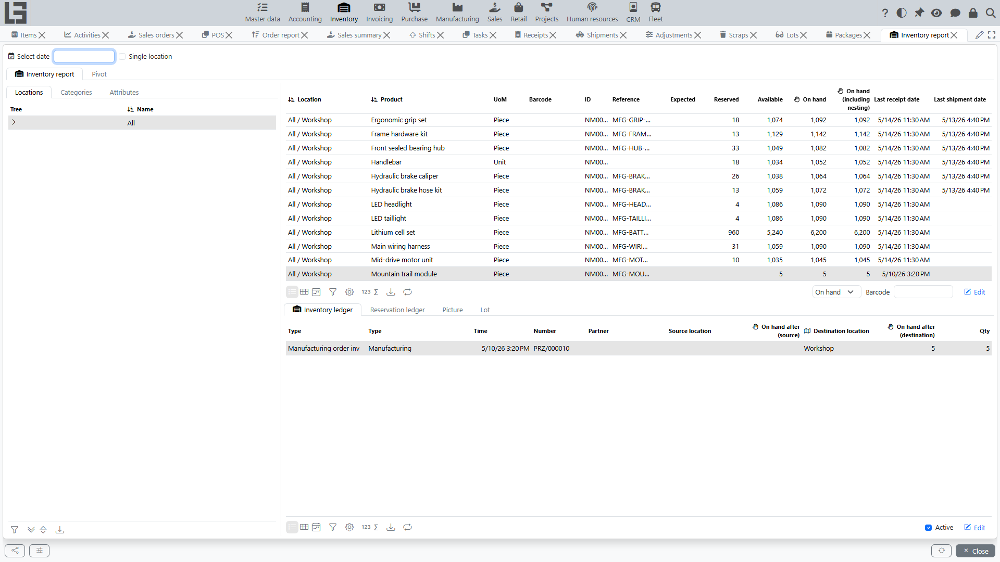

The reports live in **“Inventory” → “Reporting”**. Four forms are available: **Inventory report**, **Inventory valuation**, **Product moves** and **Cost report**.

## Inventory report

Stock on hand with filters and breakdowns.

- Filters: an optional date (**Select date** — the “as of” view), a **Single location** toggle, and **Locations** (tree), **Categories** and **Attributes** filter tabs.
- Columns per location/product: **Expected**, **Reserved**, **Available** (from the reservation ledger), **On hand**, **On hand (including nesting)** — i.e., together with child locations, on hand **as of the selected date**, and **Last receipt date** / **Last shipment date**.
- Next to the main table there is a **Pivot** tab.
- The bottom part shows the details for the selected product:
  - **Inventory ledger** tab — every movement (document class, type, time, number, partner, source/destination location, quantity) with the resulting on-hand after the operation;
  - **Reservation ledger** tab — reservations and expected quantities per document;
  - **Lot** tab (when [lots](lots-and-packages.md) are enabled) — on-hand broken down by lot;
  - **Picture** tab — the product image.

## Inventory valuation

Quantity, unit cost and total cost per item/location — see [item costing](costing.md) for details. Includes the **Recalculate cost** action, an optional “as of date” view, the inbound/outbound cost operation details and a pivot view.

## Product moves

Item movements between locations over a period: each row is a movement (document class, type, time, number, product, quantity, source and destination location with the resulting on-hand on both sides, partner). Useful for tracing where a balance came from.

## Cost report

Entries of the cost ledger (see also [item costing](costing.md)) in a pivot layout: quantity and amount signed by direction (inbound positive, outbound negative), with product categories and attributes available as dimensions and a date-interval filter.

## Ledgers

Under the hood, all reports are built on three ledgers:

- **inventory ledger** — physical stock movements; every completed [receipt](receipts.md), [shipment](shipments.md), [transfer](transfers.md), [scrap](scrap.md) and [adjustment](adjustments.md) writes entries here;
- **reservation ledger** — reservations (shipments being prepared) and expected quantities (receipts in Ready with the **Increase available stock** flag); *available = on hand − reserved + expected*;
- **cost ledger** — inbound/outbound cost entries (see [item costing](costing.md)).

Practical purpose of ledgers:

- explain where a balance comes from;
- show movement history;
- help find the cause of variances.

The ledgers are not separate menu items — they are shown as detail tabs of the reports (and of the item/lot cards).

## Integration

Current balances can also be queried by external systems through the HTTP API (`Inventory.getInventory`), which returns on-hand quantities as JSON, optionally filtered by category and location.

## Recommendations

1. Always set a date interval when analyzing movements.
2. For problematic items, use breakdown by [location](locations.md) and [lot](lots-and-packages.md).
