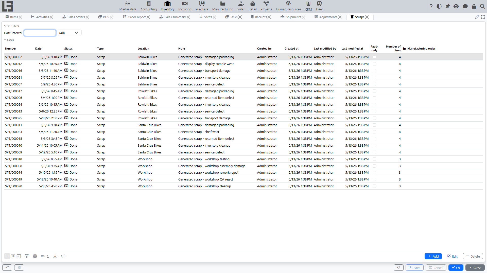

## Where to find it

Open **“Inventory” → “Operations” → “Scraps”**.

## Purpose

Scrap is used to record stock decreases for reasons not related to sales:

- damage;
- losses;
- defects;
- expiry;
- internal consumption.

The reason for the write-off is represented by the **type** of the document (a directory of scrap types — for example, "Damage", "Loss", "Expiry") rather than by a per-line field. Scrap types are configured in **Inventory → Configuration → Settings**; each type has its own **numerator** (numbering rule) and a default **location**.

The scrap document moves through the statuses **Draft → Done**, with **Canceled** as an alternative terminal state.

## Scrap card

In the header you fill in:

- **Type** — required; classifies the write-off reason and defines the numbering;
- **Date**, **Number**;
- **Location** — required; where the goods are written off from;
- **Note**.

Lines contain the **item**, its **UoM**, **barcode/ID/reference** and the **quantity** to write off.

Action buttons:

- **Mark as Done** — confirms the write-off (shown in Draft);
- **Cancel** — moves the document to Canceled;
- **Copy** — creates a new draft scrap with the same header and lines;
- **Print** — prints the document using a configurable template (templates can be assigned per scrap type);
- **Labels** — prints item labels.

Like other Inventory documents, the card has **Search** (product search by category with stock quantities and quick entry, plus a barcode input field), **History** and **Comments** tabs.

## Typical scenario

1. Create a scrap document.
2. Select the **Type** (this is what classifies the write-off reason).
3. Specify the [location](locations.md).
4. Fill lines: item and quantity. If [lots](lots-and-packages.md) are enabled for a product, also specify the lot per line — the **Lots** tab shows the per-lot breakdown, and lot barcodes can be scanned.
5. Move the document to **Done**.

## Effect on stock and cost

When the document is moved to **Done**:

- an outbound entry is written to the inventory ledger — the on-hand quantity at the location decreases;
- an outbound entry is written to the [cost ledger](costing.md) — the write-off amount is calculated automatically by the item's costing method (FIFO/average/planned).

## Relationship with other modules

Scrap can be created based on other documents:

- from a **[receipt](receipts.md)** — the **Scrap** action on a completed receipt opens a new scrap pre-filled with the receipt's location and items (useful for writing off goods damaged in transit);
- from a production order, if the corresponding scenario is enabled.
