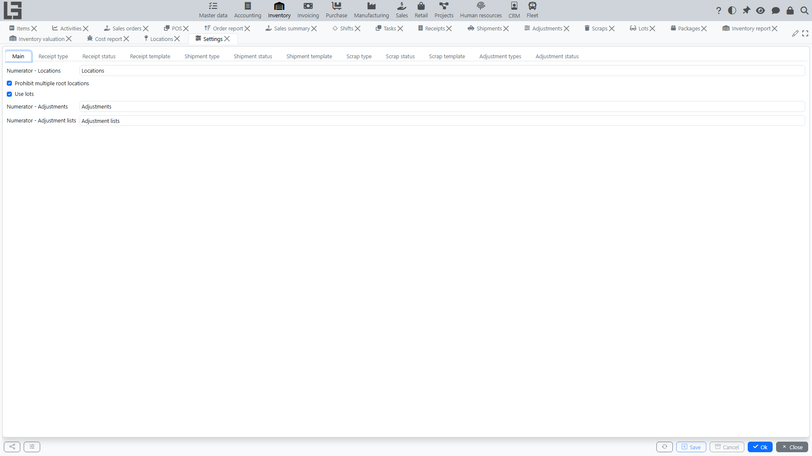

## Where to find it

Open **“Inventory” → “Configuration” → “Settings”**.

## What is typically configured

- [receipt](receipts.md) and [shipment](shipments.md) types (their numbering, default locations, maximum quantity and other flags);
- [transfer](transfers.md) usage (a [shipment](shipments.md) type with the **"Transfer"** flag);
- [scrap](scrap.md) types;
- whether **[lots](lots-and-packages.md)** are enabled (the global **Use lots** toggle), and per-category / per-product lot and serial-number options;
- cross-cutting flags such as **Prohibit multiple root locations**;
- the per-location toggles **Disallow negative inventory** and **Disallow reserving more than available** are set on the [location](locations.md) card itself (see ledger constraints below).

## Receipt types

Settings include a directory of **receipt types**. A receipt type defines how users work with the document.

A receipt type defines:

- **Numerator** — how the document number is generated;
- **Location** (default) — which [location](locations.md) is set in new documents;
- **Maximum quantity** — the upper limit for the “Initial demand” field in lines;
- **Only one line for one item** — forbids adding the same item in two lines;
- **Do not check received quantity** — allows completing a receipt whose received quantity differs from the planned one without a warning;
- **Put away** — enables the put-away step (see [receipts](receipts.md));
- **Show cost price** — adds a **Cost** column to receipt lines for manual entry of the inbound cost (see [item costing](costing.md));
- **Show packages** — adds packaging-unit columns to lines (see [Number of packages](product-sku.md#alternative-accounting-in-packages-units-in-documents));
- **Increase available stock** — receipts of this type in **Ready** status increase the *expected* quantity in the reservation ledger, so the goods count towards availability before they physically arrive;
- **Return** section — the [shipment](shipments.md) type used for returning goods to the supplier, and the **Check returned quantity** flag that forbids returning more than was received.

If the system has exactly one receipt type, it is substituted into new documents automatically.

## Shipment types

Settings include a directory of **shipment types**.

A shipment type defines:

- **Numerator**;
- **Source location** (default);
- **Destination location** (default; relevant for transfers);
- **“Transfer” flag** — enables the “source location → destination location” mode;
- **Maximum quantity** — the upper limit for the “Initial demand” field in lines;
- **Only one line for one item** — forbids adding the same item in two lines;
- **Do not check shipped quantity** — allows completing a shipment whose shipped quantity differs from the planned one without a warning;
- **Picking** — shows the **Picking** tab on the shipment card (availability/reservation by locations, see [picking](picking.md));
- **Picking task** — defaults the per-shipment “Picking task” flag that triggers creation of [picking tasks](picking.md);
- **Show packages** — adds packaging-unit columns to lines;
- **Return** section — the [receipt](receipts.md) type used for customer returns, and the **Check returned quantity** flag.

Validation:

- for transfers, the default source and destination locations cannot be the same.

## Scrap types

The directory of **[scrap](scrap.md) types** classifies write-off reasons (for example, "Damage", "Loss", "Expiry"). A scrap type defines its own **numerator** and a default **location**.

## Adjustment types

[Adjustments](adjustments.md) use a fixed list of types that control how lines are filled:

- **All** — count all products with stock at the location;
- **By category** — count only products of the selected category;
- **Manually** — lines are entered manually (or via the search/barcode tab).

## Ledger constraints (per location)

On each [location](locations.md) two optional constraints can be turned on:

- **Disallow negative inventory** — the system will not allow operations that drive the physical balance of an item at that location below zero.
- **Disallow reserving more than available** — the system will not allow the available balance (*on hand − reserved + expected*) of an item at that location to go below zero.

Both flags are inherited by child locations. When enabled, the corresponding postings to the inventory or reservation ledger are blocked with an explanatory message.

## Recommended setup order

1. Configure [locations](locations.md) (including the **Cost calculation** flag and ledger constraints).
2. Configure document types ([receipts](receipts.md)/[shipments](shipments.md)/[transfers](transfers.md)/[scraps](scrap.md)).
3. If needed, enable [lots](lots-and-packages.md) globally and configure per-category/per-product lot and serial-number options.
4. Review [reports and ledgers](reports-and-ledgers.md) and access rights (including per-employee [location access](locations.md#access-by-employees)).
