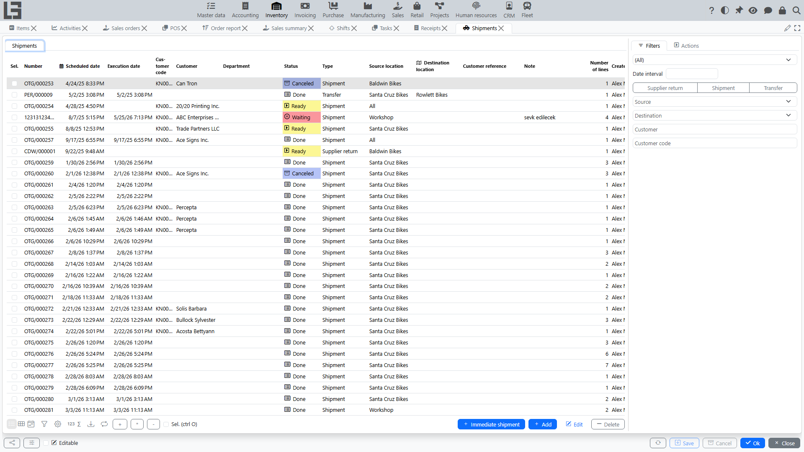
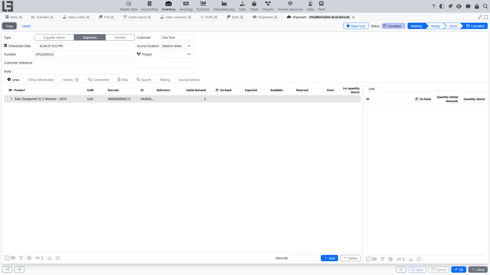

## Where to find it

Open **“Inventory” → “Operations” → “Shipments”**.

## Purpose

The **Shipment** document is used for:

- shipping goods from a [location](locations.md) (regular shipment);
- creating a [transfer](transfers.md) between [locations](locations.md) (if a type with the “Transfer” flag is selected).

The same form is used for both shipments and transfers — the behavior depends on the selected **type**.

## Shipment list

The list typically shows:

- number;
- scheduled date and time;
- type;
- customer (for a regular shipment);
- source [location](locations.md) and (for transfers) destination location;
- note;
- number of lines.

Above the list there are filters by **date interval**, **type**, **locations** and **customer**.

### List actions

Besides create/open/delete, bulk actions are available for **selected** documents: **Mark as Todo**, **Check availability**, **Mark as Done**, **Accept** (for transfers with destination confirmation), **Copy** and **Delete**. The **Create transfers** action bulk-creates transfer documents (see [Bulk transfer creation](transfer-bulk-create.md)).

### “Totals” tab in the list

If you **select** one or more shipments in the list, the **“Totals”** tab appears.

Purpose of the tab:

- show the list of items present in the selected shipments;
- show the total **planned quantity** per item across the selected documents;
- allow quickly adjusting the planned quantity for several shipments at once.

How editing works:

- the tab displays a table where **rows** are items, and **columns** are the selected shipments;
- you can **edit planned quantity** in a cell for the corresponding shipment and item;
- editing is available only for shipments in **Draft** or **Waiting**; for other statuses values are read-only.

Additionally, the tab may show hints about stock at the source [location](locations.md) and highlight if the total planned quantity exceeds available stock.

## Shipment card

### Document header

In the shipment header you typically specify:

- **Type** — affects numbering, default [locations](locations.md) and restrictions;
- **Scheduled date**;
- **Number**;
- **Customer** (for a regular shipment);
- **Source location** — required;
- **Destination location** — required for transfer;
- **Delivery address** (if used);
- **Customer reference** (if used);
- **Note**.

#### Shipment vs transfer

A shipment type can be marked as **Transfer** (i.e., the type has the “Transfer” flag enabled). In this case:

- the customer may be optional;
- destination location becomes required;
- the system does not allow selecting the same source and destination location.

### Shipment lines

Lines contain:

- **Item**;
- **Unit of measure**;
- **Barcode**, **internal code**, **reference/SKU** (if used);
- **Initial demand** (see below), plus reference columns **On hand**, **Expected**, **Available**, **Reserved** and **Done**;
- packaging columns (**Type of packaging**, **Number of packages**, **Quantity in package**) — shown when the shipment type has the **Show packages** flag (see [Number of packages](product-sku.md#alternative-accounting-in-packages-units-in-documents)).

#### “Initial demand” field

For shipments that are not executed immediately, the line uses **“Initial demand”**:

- this is the planned quantity to ship for the line (the actually shipped quantity goes to the **Done** column);
- the field may be highlighted in Draft.

Restriction:

- the value must be within `0` and the **maximum quantity** specified in the shipment type;
- if exceeded, the document cannot be saved.

#### “One line per item” restriction

For some shipment types, a rule can be enabled:

- the same item cannot be added by two lines.

### Search tab and barcode entry

Like the receipt, the shipment card has a **Search** tab (product search by category/attributes with on-hand and available quantities, quick quantity entry) and a barcode input field on the **Lines** tab. The card also has **Other information**, **History**, **Comments** and **Files** tabs, and — with the Accounting module — a **Journal entries** tab with the document's postings.

## Statuses (exactly as in the source code)

Below is the exact set of statuses defined in the source code.

1. **Draft** — data entry.
2. **Waiting** — the document is marked for processing (from Draft) and awaits availability.
3. **Ready** — availability/reservation is ensured for lines.
4. **Done** — the shipment fact is confirmed, completion date is recorded.
5. **Accepted** — [receipt](receipts.md) confirmation at the destination [location](locations.md).
   - this status is used when transfer requires destination confirmation;
   - after **Done**, the receipt confirmation action becomes available.
6. **Canceled** — the document is Canceled.

Important: there is no separate “Picking” status in the status list. Picking is implemented as a work mode by locations for shipment types with picking enabled (see below).

### Status transition actions

- **Mark as Todo** — moves the document from **Draft** to **Waiting**.
- **Check availability** — checks/reserves stock and moves the document from **Waiting** to **Ready**.
- **Mark as Done** — confirms the shipment and moves it to **Done**; the execution date is set automatically. A helper command **Fill done** copies the initial demand into the done quantity for all lines. If the shipped quantity differs from the planned one, the system warns — unless **Do not check shipped quantity** is set on the type.
- **Accept** — for transfers with destination confirmation, moves the document from **Done** to **Accepted**.
- **Cancel** — moves the document to **Canceled**.
- **Copy** — creates a new draft with the same header and lines.

### Immediate shipments

A shipment whose **Unplanned** flag is set (for example, one created by [Mobile transfer](transfers.md#mobile-transfer)) skips the intermediate steps: it can be marked as **Done** directly from **Draft**, without availability checks.

## Availability check and reservation

Before executing a shipment, the system typically checks availability by lines.

If reservation is enabled:

- some quantity can be reserved for the shipment;
- if stock is not sufficient, the shipment stays in **Waiting** until replenishment (it moves to **Ready** only when the reservation succeeds).

## Acceptance at the destination

For [transfers](transfers.md), the system supports two-party confirmation:

- when the current user has no access to the destination [location](locations.md), the **Acceptance confirmation** flag is set on the shipment automatically (it can also be managed manually);
- after such a shipment is marked **Done**, an **Accept** action becomes available to the staff of the destination location; it moves the document to **Accepted**;
- pending incoming transfers are visible on the **Acceptance confirmation** tab of the [receipts](receipts.md) list at the destination.

Until acceptance, the transferred quantity is not counted as on hand at the destination.

## Returns from the customer

If the shipment type is linked to a return [receipt](receipts.md) type (the **Return** section in the type settings), a **Return** action is available on active shipments:

- it opens a new return receipt pre-filled from the shipment;
- the **Returned** column on shipment lines shows the quantity already returned, and the **Refunds** dialog lists the related return receipts;
- with the **Check returned quantity** flag on the shipment type, the system forbids returning more than was shipped.

## Picking

If picking tasks are enabled:

- the shipment moves to a picking stage;
- tasks are created for a warehouse operator;
- based on completed tasks, the fact of picked quantity is recorded.

See details in [Picking tasks](picking.md).

### Picking by locations (shipment type mode)

The source code provides a shipment type flag that enables picking by specific locations.

How it looks to a user:

- the shipment card gets a “Picking” tab;
- for each line you can see availability and reservation by locations (including nested locations);
- you can specify from which locations the quantity is shipped;
- when [lots](lots-and-packages.md) are used, the picked quantity can be detailed by lot within each location.

At the same time, the document status remains one of the statuses listed above (e.g., Waiting, Ready, Done).

## Printing

The **Print** action prints the shipment using a configurable template (templates are maintained in the settings). When lots are used, lot labels can also be printed from the lines.

## Creating shipments from sales orders

If the Sales module is used and the sales order type is linked to a shipment type, confirming a sales order creates a linked shipment with the ordered lines. The documents then reference each other (the order shows its shipments, the shipment shows the source order).

## Typical problems

- **Cannot save a line** — the “Initial demand” value is out of range defined in the shipment type.
- **Cannot add the same item as a second line** — the “one line per item” rule is enabled for the shipment type.
- **Cannot move to execution** — not enough available stock or picking is not completed.
- **Cannot create a transfer** — the same source and destination location is selected.
- **The transfer is Done but the destination does not see the stock** — the document requires acceptance; check the **Acceptance confirmation** tab at the destination.
