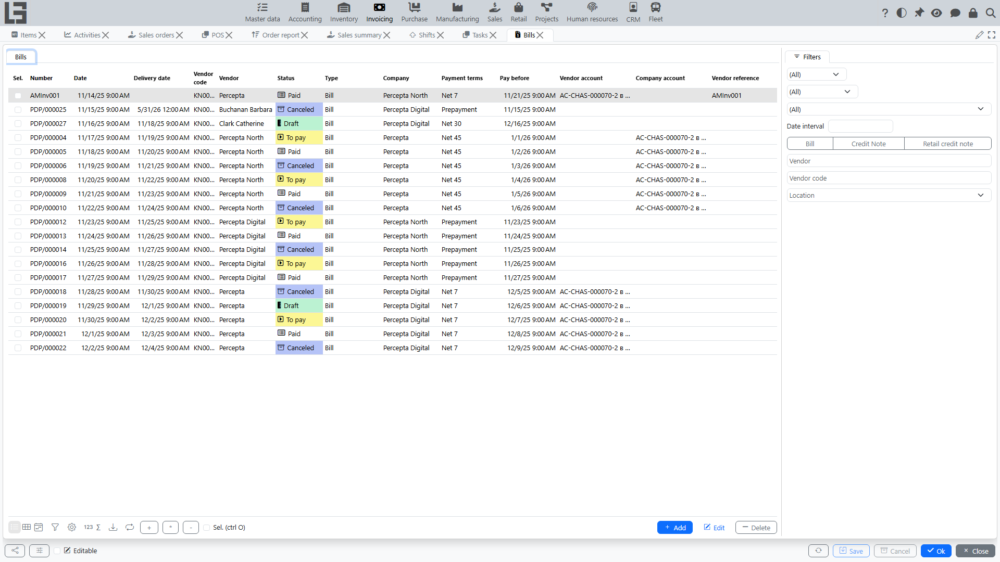
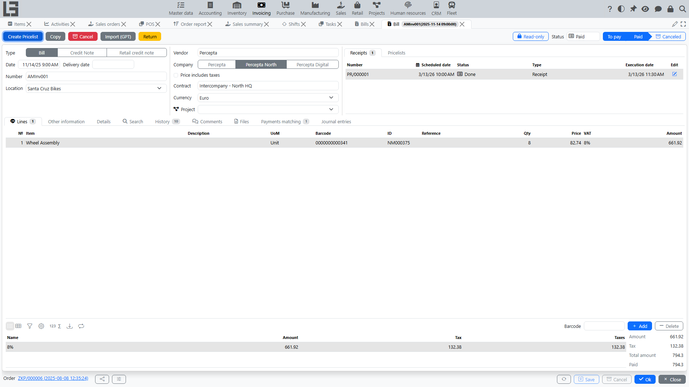

## Where to find it

Open **“Invoicing” → “Operations” → “Bills”**.

For the compact phone/tablet workflow, see [Mobile bills](mobile-bills.md).

## Purpose

A bill is used to:

- record receiving goods/services from a supplier;
- calculate [tax](taxes.md) and the document total;
- control supplier payment and [debt](debt-and-calendar.md).

A bill can be used as:

- a **basis for planning [outgoing payments](outgoing-payments.md)** (if the [payment calendar](debt-and-calendar.md) is used);
- a **control point for supplier [debt](debt-and-calendar.md)** (if debt accounting is maintained by bills).

## Bill list

The list shows, among others:

- **Number** and **Date**;
- **Delivery date** and **Pay before** (the due date);
- **Vendor** and the bill **Type**;
- **Company** and the **Payment terms**;
- **Vendor account** / **Company account** (the accounts used for settlement);
- **Vendor reference** (the vendor's internal code for the document);
- **Currency**;
- **Paid** — the amount already covered by matched payments;
- **Note**.

The list also has ready-made filter groups **Not paid** / **Paid** / **Partially paid** for quickly finding documents by settlement state.

## Bill card

### Main fields

In the bill header you typically fill:

- **Type** — the [bill type](settings.md); it presets defaults (numerator, default vendor, currency, payment type, whether the price includes taxes);
- **Date**, **Number**;
- **Delivery date** and **Execution date** (if used);
- **Vendor** — the supplier [partner](../masterdata/partners.md);
- **Contract** (if used);
- **Vendor account** / **Company account** — the settlement accounts. The vendor account must belong to the selected vendor, the company account to the company;
- **Payment terms** (if used);
- **Currency** — defaults from the bill type; the exchange rate feeds the currency base amount;
- **Vendor reference** — the supplier's own document code, useful for search;
- **Our representative** — defaults to the current user;
- **Note** and a rich-text **Details** field.

The card also has **Comments** and **Files** tabs (`Bill file`) for attaching the source document and discussing it.

#### Payment terms

**Payment terms** carry a number of **Days**; when selected, the system computes the **Pay before** date (`date + days`) and stores it on the document. That stored date then:

- drives the **payment calendar**;
- determines whether the document is **overdue**.

See: [Settings and directories](settings.md), [Debt and payment calendar](debt-and-calendar.md).

### Lines

Lines typically contain:

- [item](../masterdata/items.md)/service;
- quantity and price;
- **Amount** — the line base (`quantity × price`); when the bill type has **Price includes taxes** set, this amount is gross;
- **Taxes** — the [tax](taxes.md) applied to the line;
- optional **Reference**, **Barcode** and **Category** columns.

If taxes are configured, the tax is substituted automatically from the item/service (its **purchase** taxes) or from the document type. See [Taxes](taxes.md).

When the vendor is measured in a different [unit of measure](../masterdata/items.md) than the item's base unit, extra **partner UoM / partner quantity / partner price** columns appear so you can enter the document in the vendor's units.

If **lot/batch** tracking is used, each line can carry lot quantities, and a **barcode** field allows adding lines by scanning.

If a **default item** is set on the bill type, it is automatically substituted into a new line when the item is not yet specified (similar to how the **default vendor** is substituted into the bill header). This speeds up entry for bill types where the same item/service is typically used.

### Import from a file (GPT)

If the selected bill type has a configured prompt, the bill card shows an **"Import (GPT)"** action for importing data from a supplier document file with OpenAI.

#### What to prepare

- fill in the OpenAI API key and, if needed, create GPT configurations for model, reasoning, and additional prompt settings;
- configure the prompt in the bill type;
- check vendors, items, currencies, and taxes in master data in advance.

Preparation details: [Settings and directories](settings.md).

#### How to use it

1. Open a bill that is available for editing.
2. Make sure the current document changes are valid. Before import, the system tries to save the bill, and if validation fails, import does not start.
3. Start the import and select the supplier document file. If several GPT configurations exist, select the one to use. The standard scenario expects one document per file.
4. After import, review the header and lines of the bill and adjust the result manually if needed.

#### What is usually filled in

The system tries to determine from the file:

- in the header: number, date, delivery date, payment due date, vendor, and currency;
- in the lines: description, item/service, quantity, price, untaxed amount, and taxes.

#### Limitations and specifics

- New master data is not created automatically. OpenAI matches values only against data that already exists in the system.
- Item matching uses code, name, reference, and barcode. Vendor matching uses code, name, and address.
- If a value cannot be recognized or matched, the corresponding field may stay empty.
- When importing into a bill that already contains data, the header is overwritten with values from the file, and new lines are added to existing ones. Repeated import is more convenient into a new bill or after manual line cleanup.
- If the bill type does not have a configured prompt, the import action is hidden.
- If the OpenAI API key is missing or the external request fails, the system shows a message and does not perform the import.

### Statuses

A bill moves through the statuses:

- **Draft**;
- **To pay**;
- **Paid**;
- **Canceled**.

Statuses affect editing and printing availability. Under the hood these are cumulative flags rather than a single field, so the status shown is the "highest" one reached.

- in **Draft** you can freely change the header and lines. The **"Mark as Todo"** action (shown only in Draft) moves the bill to **To pay**;
- in **To pay** the document is confirmed for further actions (payment registration, printing, corrections). The **"Mark as Paid"** action closes it;
- in **Paid** the bill is considered settled. This status is also **set automatically** once matched payments fully cover the bill;
- **Cancel** excludes the bill from accounting and debt. Cancel is available in any status except Draft/Canceled.

You can also flip these flags directly with the toggle buttons in the status group, and lock a document against editing with the manual lock toggle on the card.

A **"Copy"** action creates a new Draft bill with the same vendor, company, type, note and lines (dates and accounts are not copied).

Bills can also be created programmatically through an HTTP JSON import endpoint (`importBill`), separate from the file/GPT import described above.

### Payment and debt

A bill can be linked to [outgoing payments](outgoing-payments.md). Based on matched payments the system calculates:

- paid;
- debt.

The card carries a **Payments matching** block with two sub-lists — **Matched** payments and **Available** ones. Double-click an available payment (or use the **"Match"** action) to net it against the bill; the matched amount reduces the remaining debt and, once the bill is fully covered, its status flips to **Paid** automatically. Matching is only possible between documents of the same partner and company.

#### Quick payment from the document

In some configurations you can create an outgoing payment directly from the bill.

Typical flow:

1. Move the document to status **“To pay”**.
2. Click **“Register Payment”**.
3. Review the created **[outgoing payment](outgoing-payments.md)** card and save it.

The system typically:

- substitutes the partner, company, accounts/cash registers and payment type (depending on settings);
- sets the amount equal to the current remaining amount due;
- immediately performs **payments matching** with this bill so that debt decreases.

See: [Outgoing payments](outgoing-payments.md).

#### Partial payment

If the payment does not fully cover the bill:

- **Paid** increases by the matched amount;
- **Debt** stays positive until full settlement.

#### Overpayment / advance

If the transferred amount is greater than the bill amount, behavior depends on matching rules:

- the overpayment can stay as a **not matched** part of the payment;
- or be treated as an **advance** by [partner](../masterdata/partners.md)/[contract](../masterdata/contracts.md).

See: [Payments](payments.md).

See also: [Debt and payment calendar](debt-and-calendar.md).

## Printing

If print forms are enabled in your configuration, the bill can be printed from the document card. The predefined layout is titled **"Invoice"**, and each bill type carries its own list of **Bill templates**.

Printing availability most often depends on:

- status (for example, printing is available from “To pay”);
- the presence of at least one enabled print template for the bill type.

See: [Reports and printing](reports-and-printing.md), [Settings and directories](settings.md).
