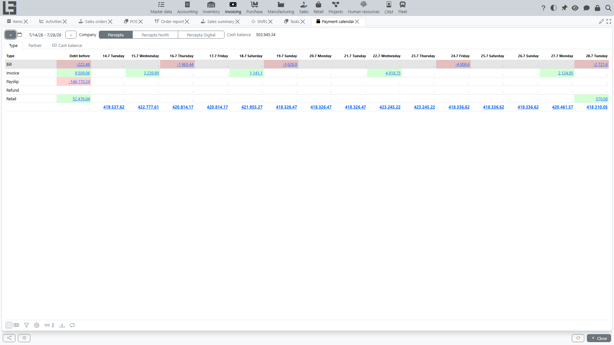

## Debt

In "Invoicing", documents and payments are all treated as **debt entries** with a sign: [bills](bills.md) and incoming payments create debt in one direction, [invoices](invoices.md) and outgoing payments in the other. There are two distinct figures:

- **Partner / contract debt** — the signed sum of all active documents for a [partner](../masterdata/partners.md) or [contract](../masterdata/contracts.md). This total exists as soon as a document exists; it does **not** depend on matching. Amounts are converted to the default currency (unless conversion is switched off in [settings](settings.md)).
- **Remaining (Left)** — for a single document, its amount minus the **matched** payments. This is what decreases when you match a payment.

Points worth understanding:

- a **Canceled** document is excluded from every debt calculation;
- **Overdue debt** is the part of the debt whose **Pay before** date is already in the past;
- matching only affects the document-level **Left**/**Paid** figures; the partner total already reflects the document from the moment it is entered.

The dedicated views **Partner debts** and **Contract debts** list each debt entry (type, number, date, **Pay before**, company, amount, **Left**, running **Debt**) with an **Overdue** filter, and show **Debt** plus **Overdue debt** totals per partner/contract.

## How debt is closed

1. Create a [payment](payments.md).
2. Match the payment with the document (or match with several documents). Matching can also happen **automatically** when the payment's **Reference** contains the document number.
3. Once matched, the document's remaining amount (**Left**) decreases; when it reaches zero the document is marked **Paid**.

If the payment is matched with several documents, the remaining amount decreases for each document by the corresponding amount.

## Payment calendar

The payment calendar (**Invoicing → Reporting → Payment calendar**) shows the outstanding balance spread across a date range, so you can see when money is due in and out.

Layout:

- pick the **Company** and a **date interval** at the top; **<** / **>** jump the interval one month back/forward. The interval starts as *today … today + 14 days*.
- **Cash balance** shows the current balance of the company's accounts.
- **Debt before** is the outstanding balance whose **Pay before** date falls before the interval starts.
- there is then **one column per date** in the interval; each cell holds the net debt change due that day. The column footer shows the **forecast cash** — the running balance (cash balance plus cumulative debt) through that date.
- cells are shaded green (positive) or red (negative).

The calendar has two breakdown tabs — **Type** and **Partner** — plus a cash-balance chart.

 The due date comes from each document's stored **Pay before** value (computed once from the payment terms at entry), not re-derived on the fly.

Clicking a **Debt before** or date cell drills down into the underlying documents (the **Debts** list filtered by company, type, partner and due date).

### What to check if the calendar is “empty” or dates are incorrect

Check:

- whether **payment terms / Pay before** are filled in documents;
- whether the chosen **date interval** actually covers the due dates;
- whether documents are excluded by status (for example, Canceled).

See parameters: [Settings and directories](settings.md).