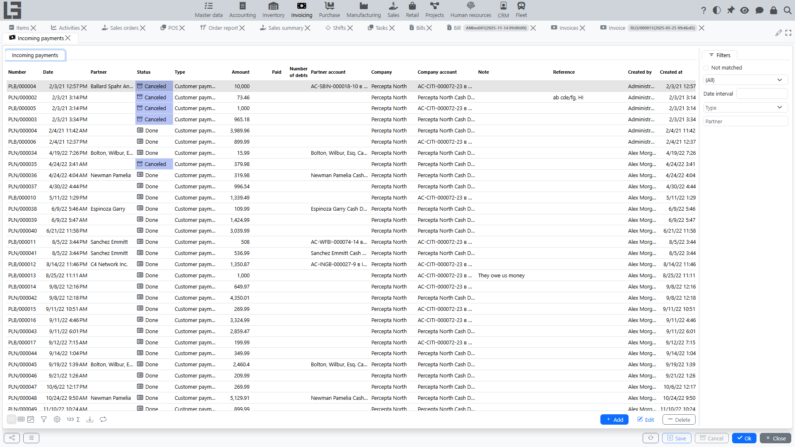

An incoming payment records **money received from a [partner](../masterdata/partners.md)** (for example, a customer) to a company **bank account** or **cash register**.

Incoming payments are typically used to:

- register the fact of money receipt;
- match payment with documents (close [debt](debt-and-calendar.md) by [invoices](invoices.md));
- see which documents are fully/partially paid and what [debt](debt-and-calendar.md) remains.

## Where to find it

Open: **“Invoicing” → “Operations” → “Incoming payments”**.

## Creating an incoming payment

1. Open the **“Incoming payments”** list.
2. Click **“Create”**.
3. Fill in the required fields (see below).
4. If needed, perform **payments matching** with documents.
5. Save the document.

### Creating an incoming payment from an invoice

If you register payments by [invoices](invoices.md), an incoming payment can be created directly from the invoice.

Typical flow:

1. Open the required **[invoice](invoices.md)**.
2. Move the document to status **“To pay”** (if it is still Draft).
3. Click **“Register Payment”**.
4. The created incoming payment card opens — verify the fields and save.

What is typically filled automatically:

- **partner** and its account/cash register;
- **company** and its account/cash register;
- payment **type** (depending on invoice type and settings);
- **currency** (if used);
- **amount** — usually equal to the current remaining amount due for the invoice.

What happens with matching:

 - the system immediately performs **payments matching** with this invoice so that debt decreases;
 - if you change the payment amount or you need a different matching, adjust it in **“Payments matching”**.

Important about statuses:

- the **“Register Payment”** action is available only when the invoice is in status **“To pay”**;
- the created incoming payment is created in status **“Done”** (i.e., it records the fact of money receipt).

An incoming payment created manually starts in **Draft**; use **"Mark as Done"** to post it. Incoming payments have no separate "To pay" stage — the flow is **Draft → Done → Canceled**.

## Main fields

The exact set of fields depends on configuration, but a typical incoming payment contains:

- **Type** — determines where the money came from (bank/cash) and which accounts can be selected.
- **Date and time** — when the receipt was recorded.
- **Number** — internal document number.
- **Amount** — receipt amount.
- **Partner** — who the money came from.
- **Partner account/cash register** (if used) — [partner](../masterdata/partners.md) details.
- **Company** — the organization receiving the money.
- **Company account/cash register** — where the money was received (bank account or cash register).
- **Currency** — derived from the company account/type.
- **Analytic account** (cash-flow item) — the analytic account allowed for the chosen payment type.
- **Note** — free text comment.
- **Reference** — a short reference string (for example, the payer's document number). If it contains a document number, the system **auto-matches** the payment against that debt (see below).

The built-in payment types cover the common cases — customer payment (bank/cash), supplier refund (bank/cash), internal transfer, and opening balance. A type flagged as **Internal payment** requires the partner to be one of your own companies.

### Accounts/cash registers selection notes

The payment type can restrict options:

- for some types only **bank accounts** are available;
- for others only **cash** is available.

If you select an account/cash register that does not match the payment type, the system may not allow saving the document.

## Payments matching and debt closure

To make an incoming payment decrease [debt](debt-and-calendar.md) for specific documents, you need to **match** it with these documents.

In the payment card there is a **“Payments matching”** section with:

- **Matched** — amounts already linked to documents;
- **Available** — documents that can be paid by this payment (for an incoming payment these are customer [invoices](invoices.md));
- **Match** action — link an amount to the selected document.

Matching is only allowed between documents of the **same partner and company**.

### How to match a payment

1. Open the incoming payment.
2. Go to **“Payments matching”**.
3. In the **“Available”** list select the document you want to pay.
4. Click **“Match”** (or simply double-click the row).
5. Verify that a line appears in **“Matched”** with the matched amount.

Tip: if you fill the **Reference** field with the invoice number, the payment matches that invoice automatically — no manual step needed.

### Partial payment

If the payment amount is less than the document amount:

- the document is paid **partially**;
- the remaining amount stays as **[debt](debt-and-calendar.md)**;
- you can close it with the next payments.

### One payment for multiple documents

If a [partner](../masterdata/partners.md) paid several documents at once, match the payment to several lines — one per document.

### Overpayment

If the payment amount is greater than the matched amount, the remainder stays **not matched** and can be applied to later documents from the same [partner](../masterdata/partners.md). (Prepayments that must be offset against a specific future sale are handled by **advance invoices** rather than by the payment itself — see [Invoices](invoices.md).)

## Linking to an outgoing payment

If the payment type has a linked outgoing type, a posted incoming payment shows a **"Create outgoing payment"** action (or creates one automatically when the type has **Automatically create outgoing payment** set). This drives internal transfers between your own accounts — an incoming "transfer in" paired with an outgoing "transfer out".

## Finding “not matched” payments

The incoming payments list has a **“Not matched”** filter — it helps quickly find payments that are not linked to documents yet and therefore do not close any specific document's remaining amount. (Such a payment still affects the partner's overall balance.)

## Printing

The predefined print form is titled **"Incoming payment"**; printing uses the **Incoming payment templates** configured for the payment type.

See: [Reports and printing](reports-and-printing.md).

## Typical situations and solutions

### The payment is entered, but debt did not decrease

Check:

1. Whether **payments matching** with documents was performed.
2. Whether the correct partner and company are selected.
3. Whether the document is Canceled (if cancellation is used in your configuration).

### Cannot select an account/cash register

The usual reason is a mismatch between the payment **type** and the account/cash register kind. Try:

- changing the payment **type**;
- selecting a different company account/cash register.

### I don’t see the “Register Payment” button in an invoice

This is usually caused by one of the following:

- the [invoice](invoices.md) is not moved to status **“To pay”**;
- a suitable incoming payment type is not configured for the invoice type;
- there is no remaining amount due for the invoice (already paid or amount due is zero).