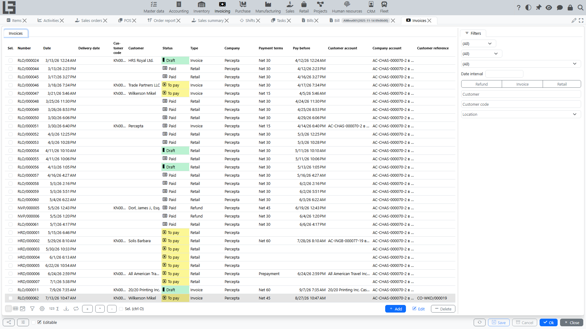
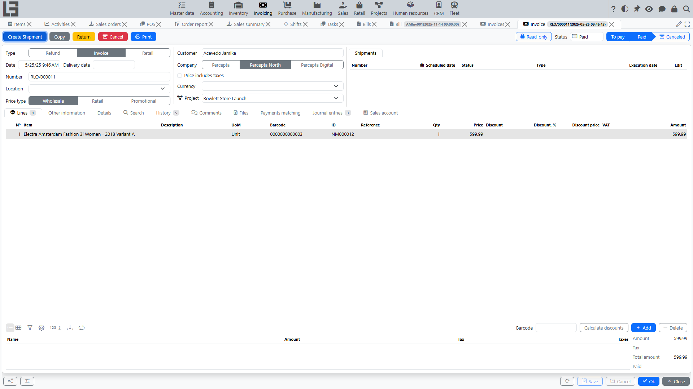

## Where to find it

Open **“Invoicing” → “Operations” → “Invoices”**.

## Purpose

An invoice records a sale in accounting:

- line amounts;
- taxes;
- customer debt;
- and, if the [Inventory](../inventory/inventory.md) contour is enabled — relationship with [shipments](shipments-from-invoice.md).

Depending on settings, an invoice can be:

- a document used to control **[debt](debt-and-calendar.md)** (if debt accounting is maintained by invoices);
- a basis for creating a **[shipment](shipments-from-invoice.md)** (if [Inventory](../inventory/inventory.md) is used);
- a document for printing primary forms (if print templates are enabled).

## Invoice card

### Main fields

- **Type** — the [invoice type](settings.md); presets the numerator, default customer, currency, payment type, whether the price includes taxes, and the shipment behaviour;
- **Date** and **Number**;
- **Delivery date** and **Execution date** (if used);
- **Customer** — the [partner](../masterdata/partners.md);
- **Contract** (if used);
- **Location** / delivery address (if [Inventory](../inventory/inventory.md) is used);
- **Payment terms** and the computed **Pay before** date;
- **Currency** — defaults from the invoice type; the rate feeds the currency base amount;
- **Our representative** (defaults to the current user) and **Customer reference**;
- **Note**.

The card also has **Comments**, **Files** (`Invoice file`) and a **status history** timeline (time spent in each status).

### Lines

- [item](../masterdata/items.md)/service;
- quantity and price;
- **Discount, %** / **Discount price** / **Discount amount** (if discounts are used);
- **Taxes** — the item's **sales** taxes are substituted automatically (see [Taxes](taxes.md));
- **Amount** — the line base (gross when the type has **Price includes taxes**).

When [Inventory](../inventory/inventory.md) is used and a shipment type is configured, the lines also show live stock figures — **On hand**, **Expected**, **Available** — with an **Available** filter, so you can check availability while composing the sale. If the customer uses a different unit of measure, extra **partner UoM / quantity / price** columns appear. **Lot** and **pack** tracking are supported when enabled on the invoice type.

### Advance invoices

An invoice type can be flagged as **Advance**; the flag then carries to the invoice. Advance invoices are used to receive prepayments and later offset them against regular sales:

- a regular invoice shows **To advance** / **Advanced** figures and an **Advance matching** tab with **Matched** / **Available** advance invoices;
- use the **"Match"** action there to apply an advance to the invoice;
- an invoice cannot be offset against itself, and only invoices marked **Advance** can be applied as advances.

The invoices list additionally shows **Advanced** and **To invoice** columns.

### Statuses

An invoice moves through **Draft → To pay → Paid**, and can be **Canceled** from To pay or Paid (implemented as cumulative flags, so the shown status is the highest one reached):

- in **Draft**, you can change the header and lines. **"Mark as Todo"** (shown only in Draft) moves the invoice to **To pay**;
- in **To pay**, the document is confirmed for further actions — printing, creating a shipment, registering payments. Only from this status is **"Register Payment"** available;
- in **Paid**, the document is considered settled. **"Mark as Paid"** sets it manually, and it is also **set automatically** once matched payments fully cover the invoice;
- **Cancel** excludes the document from the process and settlements (available in any status except Draft/Canceled).

Both **"Mark as Todo"** and **"Cancel"** are also available as bulk actions on the invoices list.

A **"Copy"** action creates a new Draft invoice with the same customer, company, type, note and lines.

### Relationship with shipment

If [Inventory](../inventory/inventory.md) is used:

- an invoice can create a shipment via the **"Create Shipment"** action, available only once the invoice is in **To pay** or later (a Draft invoice cannot create a shipment);
- a shipment can also be created automatically when the invoice reaches **To pay**, if the type has **Automatically create shipment** set.

See: [Shipments from invoice](shipments-from-invoice.md).

Practical tip: if the shipment is created automatically from the invoice, first verify the lines (items, quantities, location/address), and only then move the invoice to **To pay**.

## Payment

An invoice can be linked to [incoming payments](incoming-payments.md). [Debt](debt-and-calendar.md) is calculated based on matched payments.

The card carries a **Payments matching** block with **Matched** and **Available** sub-lists; double-click an available payment (or use **"Match"**) to net it against the invoice. If the payment amount is less than the invoice amount, it is a **partial payment**, and debt remains until full settlement; once fully covered, the invoice moves to **Paid** automatically. The invoices list shows a **Paid** column and **Not paid** / **Paid** / **Partially paid** filters.

### Quick payment from an invoice

In some configurations, an incoming payment can be created directly from an invoice.

Typical flow:

1. Move the invoice to status **“To pay”**.
2. Click **“Register Payment”**.
3. Review the created **incoming payment** card and save it.

The system typically:

- substitutes partner, company, accounts/cash registers and payment type (depending on settings);
- sets the amount equal to the remaining amount due;
- immediately performs **payments matching** with this invoice so that debt decreases.

See: [Incoming payments](incoming-payments.md).

## Printing

The predefined primary form is titled **"Invoice"**, and each invoice type carries its own list of **Invoice templates**. Depending on the configuration, the printout can additionally include the contract, the location, partner units of measure, and the paid/remaining amounts. Printing requires at least one enabled template for the invoice type; see [Reports and printing](reports-and-printing.md).

See also: [Payments](payments.md), [Debt and payment calendar](debt-and-calendar.md).