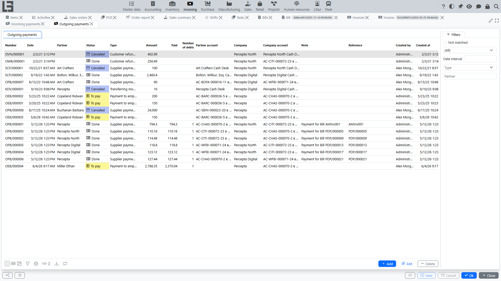

An outgoing payment records **money withdrawal** from a company bank account or cash register.

Typical scenarios:

- supplier payment;
- refund to a customer;
- other payouts to [partners](../masterdata/partners.md).

## Where to find it

Open: **“Invoicing” → “Operations” → “Outgoing payments”**.

## Creating an outgoing payment

1. Open the **“Outgoing payments”** list.
2. Click **“Create”**.
3. Fill in the fields.
4. If needed, perform **payments matching** with documents.
5. Save the document.

### Creating an outgoing payment from a bill

If you register supplier payments by documents, an outgoing payment can be created directly from the [bill](bills.md).

Typical flow:

1. Open the required **[bill](bills.md)**.
2. Move the document to status **“To pay”** (if it is still Draft).
3. Click **“Register Payment”**.
4. The created outgoing payment card opens — verify the fields, adjust the amount if needed, and save.

What is typically filled automatically:

- **partner** and its account/cash register;
- **company** and its account/cash register;
- payment **type** (depending on bill type and settings);
- **currency** (if used);
- **amount** — usually equal to the current remaining amount due for the bill.

What happens with matching:

 - the system immediately performs **payments matching** with this bill so that [debt](debt-and-calendar.md) decreases;
 - if a different matching is needed (partial payment, multiple payments), adjust it in **“Payments matching”**.

Important about statuses:

- the **“Register Payment”** action is available only when the bill is in status **“To pay”**;
- the created outgoing payment is created in status **“To pay”** (i.e., prepared for withdrawal confirmation). Confirm the actual withdrawal with **"Mark as Done"**.

An outgoing payment created manually starts in **Draft**. The full flow is **Draft → To pay → Done → Canceled**: **"Mark as Todo"** moves Draft to **To pay**, **"Mark as Done"** confirms the withdrawal.

## Main fields

Typically, an outgoing payment includes:

- **Type** — determines where the money is withdrawn from (bank/cash) and which accounts can be selected.
- **Date and time**.
- **Number**.
- **Amount**.
- **Partner** — who the money is paid to.
- **Partner account/cash register** (if used).
- **Company**.
- **Company account/cash register** — where the money is withdrawn from.
- **Currency** — derived from the company account/type.
- **Analytic account** (cash-flow item) — allowed for the chosen payment type.
- **Note**.
- **Reference** — a short reference string; if it contains a bill number, the payment **auto-matches** that bill.

## Payments matching and debt closure

If you maintain settlements by documents, match the outgoing payment with documents so it closes [debt](debt-and-calendar.md) for the selected documents.

In the outgoing payment card there is a **“Payments matching”** section:

- **Matched** — already linked amounts;
- **Available** — documents that can be paid (for an outgoing payment these are supplier [bills](bills.md));
- **Match** action (or double-click a row).

Matching is only allowed between documents of the **same partner and company**.

### Partial payment

If the payment amount is less than the document amount, the document [debt](debt-and-calendar.md) remains partially open — it can be closed by the next payments.

### One payout for multiple documents

An outgoing payment can be matched with several documents (for example, paying several [bills](bills.md) in one amount).

### Overpayment

If you paid more than matched with documents, the remainder stays **not matched** until it is applied to another document of the same [partner](../masterdata/partners.md).

## Linking to an incoming payment

If the payment type has a linked incoming type, an outgoing payment in **To pay** shows a **"Create an incoming payment"** action (or creates one automatically when the type has **Automatically create incoming payment** set). This is how internal transfers are recorded — a "transfer out" paired with a "transfer in".

## Finding “not matched” payments

The outgoing payments list has a **“Not matched”** filter — it helps find payments that are not linked to documents yet (they still affect the partner's overall balance, but do not close any specific document's remaining amount).

## Printing

The predefined print form is titled **"Outgoing payment"**; printing uses the **Outgoing payment templates** configured for the payment type.

See: [Reports and printing](reports-and-printing.md).

## Typical situations and solutions

### The payment is entered, but document debt did not change

Usually you need to perform **payments matching** with documents.

### Cannot select an account/cash register

Check that the payment **type** matches the selected account/cash register kind (bank/cash). If needed, change the type.

### I don’t see the “Register Payment” button in a bill

This is usually caused by one of the following:

- the [bill](bills.md) is not moved to status **“To pay”**;
- a suitable outgoing payment type is not configured for the bill type;
- there is no remaining amount due for the bill (already paid or amount due is zero).