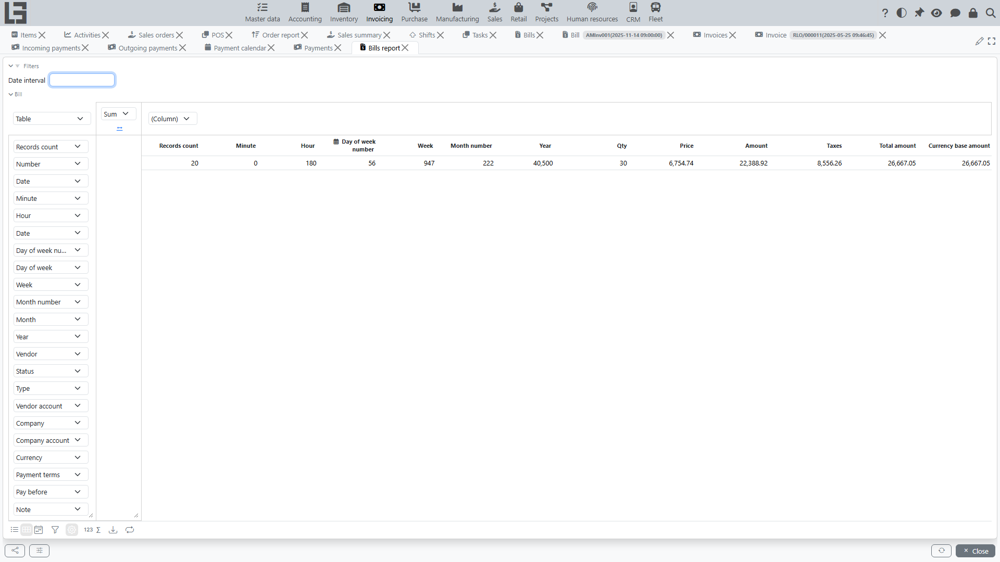
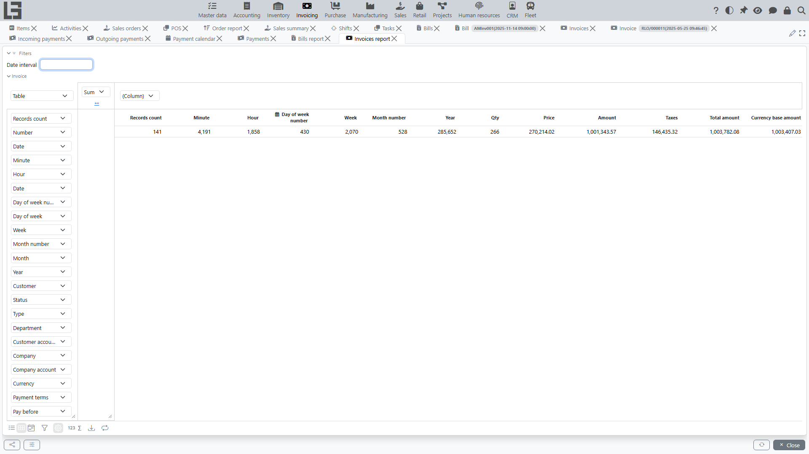
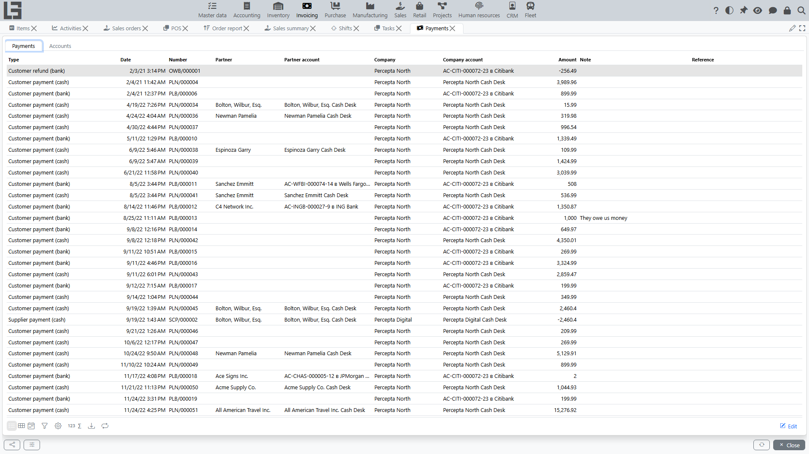

## Document printing

In “Invoicing”, print forms are typically available for:

- [bills](bills.md);
- [invoices](invoices.md);
- [payment documents](payments.md).

Printing availability depends on configuration and templates.

### Configuring print templates

The same print-template mechanism works identically for [bills](bills.md), [invoices](invoices.md), and both incoming and outgoing [payments](payments.md) — each document type carries its own list of templates (**Bill templates**, **Invoice templates**, **Incoming/Outgoing payment templates**). The steps below use invoices as the example; bills and payments are configured the same way.

#### What is a print template

A print template is a print form that the system generates when you click **“Print”** in the **[Invoice](invoices.md)** card.

For each **invoice type**, you can enable one or more templates. If there are several templates, the user selects the required one when printing (see [Settings and directories](settings.md)).

A template can be:

- **predefined** (a built-in layout delivered with the system);
- **custom** (you upload your own layout file).

#### When printing is available in an Invoice

The **“Print”** button is shown in the [invoice](invoices.md) card only if at least one print template is enabled for its type.

#### Where the settings are performed

Printing setup consists of two steps:

1) **Create/configure an invoice template** — set its name and source (built-in layout or uploaded file).

2) **Enable the template for a specific invoice type** — link the template to the type so it appears in printing.

These actions are typically performed in the [Settings](settings.md) section:

- **Invoice templates** list (create/edit templates);
- **Invoice type** card (enable templates for a specific type).

> Menu placement may differ depending on configuration, but the logic is the same: templates are stored separately, and enabling is done in invoice types.

---

#### 1) Creating and configuring an invoice template

Open the **Invoice templates** list and create a new template (or open an existing one).

Fields and actions in the template card:

- **Name** — how the form will be named in the selection list when printing.
- **Template file name** — used for predefined layouts (when no file is uploaded).
- **Open** — opens the current template for viewing (predefined or uploaded).
- **Upload** — upload your layout file (after upload, it will be used).
- **Reset** — delete the uploaded file and return to the predefined layout (if it is specified).
- **Format** — determines how the printing result is generated: **PDF**, **DOCX**, **XLSX**, **RTF**, **HTML**, or **Printer** (sends the result straight to a printer without producing a file).
- **Export file name** — file name when saving the result (used by the file formats; hidden for the **Printer** format).

Recommendations:

- If you want to **replace the standard form** with your version — use **Upload**.
- If you need to **return to the standard form** — use **Reset**.

---

#### 2) Enabling a template for an invoice type

Open the **Invoice types** list, select the required type and open the tab with templates.

Then:

1. Find the required template in the list.
2. Enable it for the current type with the **"Incl."** checkbox.

You can enable multiple templates — then when printing, the system will ask to select one.

---

#### 3) Printing from an Invoice card

Open the required [invoice](invoices.md) and click **“Print”**.

Two options are possible:

- **One template enabled** — printing starts immediately using it.
- **Multiple templates enabled** — a selection window opens and you choose the template.

If the selected format generates a file, the system will offer to open/save the result, taking into account the **Export file name** field.

---

#### Typical problems and how to fix them

**1) There is no “Print” button in the invoice.**

Check:

- the invoice has the correct type selected;
- at least one template is enabled for that type;
- the template has a predefined layout specified or an uploaded file.

**2) The wrong form is printed.**

Check:

- which invoice type is set in the document;
- whether multiple templates are enabled for that type (in this case you need to select the correct one when printing).

**3) You need to restore the standard print form.**

Open the template and click **Reset** (if a file was uploaded earlier).

---

#### Examples of predefined forms

Depending on the delivery, typical predefined print forms for an invoice may be available (for example, delivery note, invoice, universal transfer document, proforma invoice). You can use them as-is or replace them with your own files using **Upload**.

## Reports

The base configuration ships four forms in **Invoicing → Reporting**:

- **Bills report** — a **pivot** over [bill](bills.md) lines. Document columns include number, date, vendor, status, type, accounts, currency, payment terms and Pay before; line columns include item, its categories, dynamic item-attribute columns, quantity, price and taxes; the pivot **measures** are untaxed amount, tax amount, amount and currency amount. A **Filters** panel and a **Date interval** filter let you scope the data, and you arrange the grouping yourself in the pivot.
- **Invoices report** — the same pivot over [invoice](invoices.md) lines, with **Customer** and **Department** in place of the vendor fields.
- **Payments** — a unified view of all incoming and outgoing payments with type, date, number, partner, accounts, company and signed amount; the same form also has an **Accounts** tab that shows current account balances and, with a **Select date** picker, the balance as of a chosen date.
- **[Payment calendar](debt-and-calendar.md)** — outstanding balance and forecast cash across a date range, with **Type** and **Partner** breakdown tabs.

[Debt](debt-and-calendar.md) figures are also visible directly on the **Bill** and **Invoice** cards (matched payments and remaining debt) and through the dedicated **Partner debts** / **Contract debts** views.

Recommendations:

1. Use the **Date interval** filter.
2. For debt analysis, use the **Partner debts** / **Contract debts** views and their **Overdue** filter.