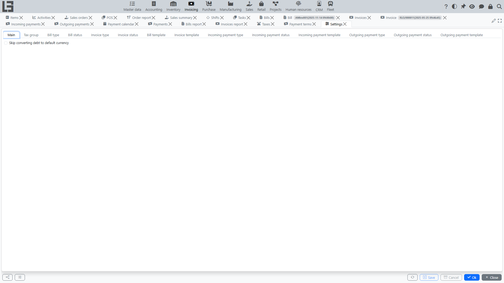
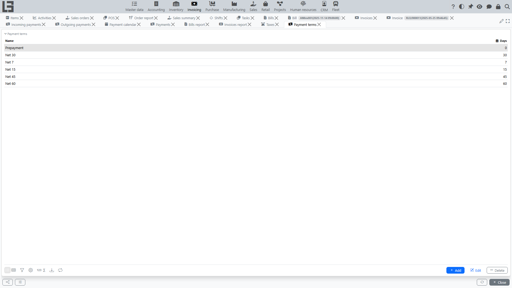

## Where to find it

Open **"Invoicing" → "Configuration" → "Settings"**.

## The Settings form

The **Settings** form itself (**Configuration → Settings**) holds:

- the **document-type** directories — **Bill types**, **Invoice types**, **Incoming payment types**, **Outgoing payment types** — each with its numerator, default partner, whether the **price includes taxes**, the payment/shipment behaviour, and (for returns) the **Return** flag and its linked **Return type** described in [Refunds and corrections](refunds-and-corrections.md);
- the **Tax groups** directory;
- the **Skip converting debt to default currency** switch — when turned on, debt figures are kept in each document's own currency instead of being converted to the default currency.

Each document type can also define a **default currency** that is substituted into its documents. This is separate from the system-wide **default currency**, which is the one debt figures are converted to (unless the switch above is on).

## Configuration directories (separate navigator items)

Alongside the Settings form, the **Configuration** group contains these directories as their own menu items:

- **[Taxes](taxes.md)** — taxes and tax rates;
- **Payment terms** — see below;
- **Banks** — the bank reference;
- **Accounts** — a single directory holding both **bank accounts** and **cash accounts** (added via the respective buttons);
- **Analytic accounts** (cash-flow items) — used to classify payments; allowed per payment type.

Payment types additionally carry an **Internal payment** flag and an **allowed account types** setting (cash / bank, at least one required).

[Cost allocation bases](bill-cost.md) for distributing service costs are set on the service items, and print templates are configured per document type (see [Reports and printing](reports-and-printing.md)).

## Payment terms

Payment terms carry a number of **Days**; assigned to a partner (separately for sales and purchase) and copied onto documents, they drive:

- the **Pay before** date calculation;
- [payment calendar](debt-and-calendar.md) generation;
- overdue control.

## Bill file import

If your configuration uses bill recognition from files, prepare two groups of settings in advance:

- in the global OpenAI integration settings, fill in the API key. To control the model, reasoning, or common additional instructions, create GPT configurations (see [OpenAI and GPT configurations](../administration/openai.md)). If neither the request nor the configuration specifies a model, `gpt-5` is used;
- in the **bill type** card, fill in the recognition **prompt**. For the initial setup, it is convenient to load the **default** text first and then adjust it to your documents if needed.

If several GPT configurations are available, the import action asks which configuration to use before sending the file. With one configuration, it is selected automatically.

Before starting recognition, also check your master data:

- vendors and [items](../masterdata/items.md) must already exist and be active;
- [currencies](../masterdata/currencies.md) and [taxes](taxes.md) must already exist in the system.

The import action appears on the bill card only for bill types with a configured prompt.
