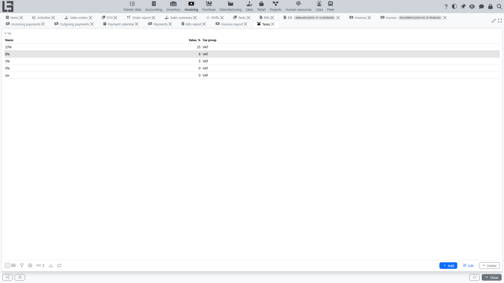

In "Invoicing", taxes are used to calculate line amounts and document totals.

## Directories

The configuration uses two directories:

- **Taxes** — each tax has a **name**, a rate in the **"Value, %"** field, and belongs to a **tax group** (mandatory). For example: "VAT 20%" with value 20 in the "VAT" group.
- **Tax groups** — taxes are grouped so that only **one tax per group** can be applied to a given document line at the same time. This is the standard way of expressing mutually-exclusive tax variants (e.g., a "VAT" group containing rates 0%, 5%, 10%, 20% — only one can be selected per line). A tax group has a name and a short **ID** used as the key for import.

## Taxes on items

Each [item](../masterdata/items.md)/service keeps **two** independent tax sets — **sales** taxes and **purchase** taxes:

- when an item's line is added to an [invoice](invoices.md), its **sales** taxes are substituted; on a [bill](bills.md), its **purchase** taxes;
- item tax sets are inherited by default from the item's **category**, so setting the category pre-fills the taxes; you can then override them per item;
- sales and purchase tax sets can be bulk-loaded and unloaded through **Import / Export sales (purchase) taxes** on the data-migration form.

## Computation

Tax amounts are computed automatically per line by the system; the user does not type them in directly. The mode is determined by the document type's **"Price includes taxes"** flag:

- **Price includes taxes = off** (default for B2B): the line **price** is the net (tax-exclusive) price, the line **Amount** is `price × quantity`, and the tax is added on top: `taxAmount = Amount × rate / 100`.
- **Price includes taxes = on** (typical for retail / cash sales): the line **price** is gross, the line **Amount** is the gross total, and the tax is extracted from within it: `taxAmount = Amount × rate / (100 + rate)`.

At the document level a **Netto amount** (total minus tax) is available, and a per-tax summary table breaks the document down by tax (untaxed amount / tax amount / amount per tax).

## Usage in documents

A tax can be set:

- automatically — based on the [item](../masterdata/items.md) settings (sales/purchase) or on the document type;
- manually in a line — by ticking the appropriate tax of the right group.

Because of the per-group rule, picking a different tax of the same group automatically unticks the previous one for that line.

## Restrictions

- a tax that has been used in line calculations is protected from deletion;
- taxes from the same group cannot coexist on one line.

## What is **not** modeled out of the box

The base configuration uses a single tax dimension (rate × base). It does **not** ship dedicated VAT declarations/reports as standalone forms — tax totals are visible in the per-tax summary table on each document and as measures inside the [bills](bills.md) and [invoices](invoices.md) reports.
