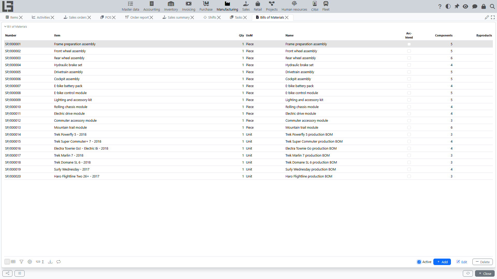
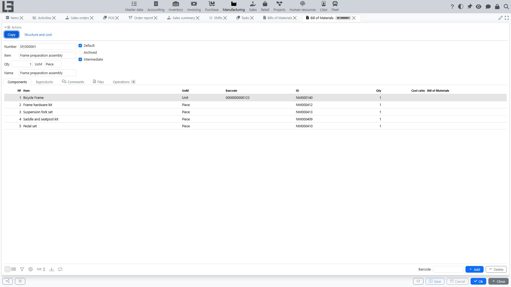

A Bill of Materials describes an item structure: which materials and in what quantities are required for production, as well as which by-products are generated.

In the system, a Bill of Materials is used as a source of planned norms: based on it, material and output lines are generated automatically in a manufacturing order.

## Location

The Bills of Materials list is available in **"Manufacturing" → "Operations" → "Bills of Materials"**.

The list shows the **Number**, **Item**, **Qty**, **UoM**, **Name**, the **Archived** flag and the **Components** / **Byproducts** line counters. By default the **Active** filter hides archived Bills of Materials.

The directory of BoM operations is a separate item in **"Manufacturing" → "Configuration" → "Operations"**.

## What a Bill of Materials is used for

A Bill of Materials is used for:

- automatically filling material lines in a manufacturing order;
- calculating planned consumption and planned output;
- generating by-products during production;
- defining operation templates for work orders (work center, start time, duration);
- unbuild (disassembly) — usually using the same Bill of Materials;
- analyzing the item structure and planned norms and cost.

## Bill of Materials card: main fields

In the Bill of Materials card you typically set:

- **Number** — Bill of Materials identifier (required, generated by a numerator);
- **Item** — the item the Bill of Materials applies to (required);
- **Qty** and **UoM** — the base quantity for which norms are defined (for example, 1 pc, 10 pcs, 100 kg);
- **Name** — a free name/comment;
- **Default** — indicates that the Bill of Materials should be selected automatically in a manufacturing order for this item;
- **Archived** — indicates that the Bill of Materials is no longer used;
- **Intermediate** — marks the Bill of Materials of a semi-finished item as intermediate: when a parent order is generated, such an item is expanded into its own components instead of being consumed as a whole (see “Nested Bills of Materials” below).

Important:

- a Bill of Materials marked as **Default** must be active (not archived);
- if an item has no explicitly chosen default Bill of Materials, the most recently created active one for the item is used as the default;
- the card also has **Comments** and **Files** tabs.

## Bill of Materials structure: tabs

### Components

The **“Components”** tab contains material lines (what is consumed during production).

Each line contains:

- **№** — the line number;
- **Item** (material/component) with the reference **UoM**, **Barcode** and **ID** columns;
- **Qty** — the consumption norm for the base quantity of the Bill of Materials;
- **Cost ratio** — the cost distribution coefficient, used when the Bill of Materials is used for unbuild (see below);
- **Bill of Materials** — the nested Bill of Materials of the component (see “Nested Bills of Materials” below); by default the component’s default Bill of Materials is shown.

#### How to read component quantity

Component quantity is defined for the base quantity of the Bill of Materials.

Example:

- Bill of Materials quantity = 10 pcs;
- component A = 2 kg.

This means: to produce 10 pcs of the item, you need 2 kg of component A.

If the manufacturing order is for 25 pcs, the component plan will be calculated proportionally: 2 × 25 / 10.

### Byproducts

The **“Byproducts”** tab defines by-products that are generated during production.

Each line contains:

- **№** — the line number;
- **Product** (what is additionally produced) with the **UoM**, **Barcode** and **ID** columns;
- **Qty** — the norm for the base quantity of the Bill of Materials.

How by-product quantities are calculated in the order — see [By-products](by-products.md).

### Operations

The **"Operations"** tab defines planned production steps used to create work orders.

Each line typically contains:

- **Name** - operation name;
- **Work center** - where the operation is performed;
- **Start time** - planned time of day;
- **Duration** - planned duration in hours.

You can also copy operations from another Bill of Materials directly on this tab. Use **Copy existing operations**, select one or more rows in the dialog, and confirm. The selected operations are added to the current Bill of Materials.

## Nested Bills of Materials

A component line can reference its own **Bill of Materials** (by default, the component item’s default one; the component’s Bill of Materials must match the component item).

Whether a nested Bill of Materials is expanded is controlled by its **Intermediate** flag:

- if the nested Bill of Materials is marked **Intermediate**, the component is treated as a semi-finished good produced “on the fly”: when order lines are generated, the component itself is **not** added as a material — instead, its own components are added (recursively, with quantities recalculated through the nesting chain);
- if it is not marked Intermediate, the component is consumed as a regular material.

[Work orders](work-orders.md) are also generated from the operations of nested intermediate Bills of Materials, so the full processing chain is planned in one order.

## Structure and cost

The **Structure and cost** action on the card opens a form with the full (multi-level) component tree of the item:

- components are shown indented by nesting level, with the nested Bill of Materials, the effective **Qty** per base quantity;
- **Product cost** — the accounting cost of the component quantity;
- **Components cost** — the roll-up cost of the underlying components;
- the form has its own **Print** action.

This is a convenient way to estimate the planned cost of an item from the current component costs before any production takes place.

## Using the Bill of Materials in a manufacturing order

### Bill of Materials auto-selection

If an item has a default Bill of Materials, the system selects it automatically when you choose the item in a manufacturing order.

### Item consistency check

In a manufacturing order, the system enforces that:

- the order item must match the Bill of Materials item.

If they do not match, the order cannot be saved.

### Generating lines from the Bill of Materials

In the manufacturing order card there is an action to generate lines (**“Create Lines”**, available in the Draft status).

For regular production:

- Bill of Materials components generate material lines (components with a nested intermediate Bill of Materials are expanded into their sub-components);
- the order item generates an output line;
- Bill of Materials by-products are added to output lines;
- work orders are generated from Bill of Materials operations, including operations from nested intermediate Bills of Materials.

For unbuild (disassembly):

- Bill of Materials components generate output lines;
- the order item generates a material line;
- Bill of Materials by-products are added to material lines;
- work orders are generated from Bill of Materials operations, including operations from nested intermediate Bills of Materials.

Important: when the order lines are generated or recalculated, work orders are rebuilt from the current Bill of Materials operations, and generated work orders keep a link to the originating Bill of Materials.

For details about unbuild, see [Unbuild (disassembly)](unbuild.md).

## Cost ratio in the Bill of Materials

Component lines in the Bill of Materials can store a **Cost ratio** — a cost distribution coefficient.

It is used for unbuild:

- when unbuild lines are generated, coefficients from Bill of Materials components are copied to output lines;
- then the total unbuild cost is distributed across output lines using these coefficients.

For details about cost distribution, see [Costing: how it is calculated](costing.md).

## Versioning and relevance

Recommendations:

1. Do not edit archived Bills of Materials.
2. When the item structure changes, create a new Bill of Materials (new number) and make it the default.
3. Archive the old Bill of Materials so it is not selected for new orders.

## Copying a Bill of Materials

When you copy a Bill of Materials (the **Copy** action), the system copies:

- the main fields, including the **Intermediate** flag;
- components (including the nested Bill of Materials links and cost ratios);
- by-products;
- operations (including work center, start time, and duration).

## Mass entry via tables (import/export)

The system provides actions to import/export Bills of Materials and their lines to a spreadsheet file (they are located on the data migration form, not on the Bill of Materials card).

Separate operations are available:

- export/import Bills of Materials;
- export/import components;
- export/import by-products.

Typical scenario:

1. Export a template.
2. Fill in lines in the table.
3. Import the file back.

Important: during import the system validates that items and Bills of Materials exist for the provided codes. If unknown codes are specified, the import is canceled.

## Common mistakes

- **The Bill of Materials is not selected automatically** — the item has no active Bill of Materials (all are archived). If a wrong one is substituted, set the **Default** flag explicitly on the right Bill of Materials.
- **The order cannot be saved after selecting a Bill of Materials** — the order item does not match the Bill of Materials item.
- **The norms in the order are “not what expected”** — check the base quantity of the Bill of Materials (often it is defined not for 1, but for 10/100 units).
- **A semi-finished component appears in materials instead of its components** — the component’s nested Bill of Materials is not marked **Intermediate**.
