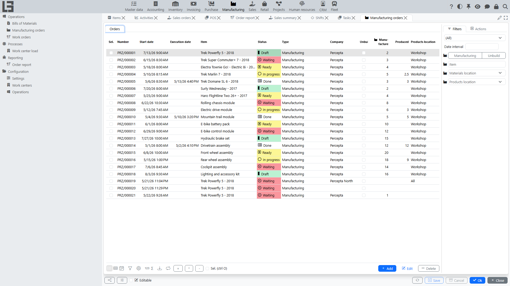

The documentation describes how the **“Manufacturing”** section works: maintaining [Bills of Materials](bom.md), creating and executing [manufacturing orders](orders.md), reserving materials, producing finished goods, recording **[Scrap](scrap.md)**, printing and reports.

## Contents

- [Quick start](#quick-start)
- [Navigation](#navigation)
- [Terms](#terms)

Related documents:

- [Bills of Materials](bom.md)
- [Manufacturing orders: list and card](orders.md)
- [Creating manufacturing orders from sales orders](sales-orders.md)
- [Manufacturing order process and statuses](workflow.md)
- [Production and consumption](production-and-consumption.md)
- [Costing: how it is calculated](costing.md)
- [Unbuild (disassembly)](unbuild.md)
- [By-products](by-products.md)
- [Lots and printing](lots-and-printing.md)
- [Scrap](scrap.md)
- [Work centers and work orders](work-orders.md)
- [Reports](reports.md)
- [Manufacturing settings and directories](settings.md)

Related integrations:

- [Autodesk](../masterdata/autodesk/autodesk.md) — link Autodesk Platform Services (APS) 3D models to Bills of Materials and manufacturing orders.

## Quick start

Below is a typical scenario “from [Bill of Materials](bom.md) to [production and consumption](production-and-consumption.md)”.

1. Make sure a **Bill of Materials** exists for the item (see [Bill of Materials](bom.md)).
2. Create a **[Manufacturing order](orders.md)**:
   - select the order type;
   - specify the item to produce;
   - set the planned start date;
   - if needed, select a [Bill of Materials](bom.md).
3. Fill in planned quantities — run **Create Lines** and enter the quantity to produce; material and output lines are generated from the Bill of Materials.
4. Run **Mark as Todo**, then check material availability and reserve:
   - run the **Check availability** action;
   - if the check is successful, the order moves to the ready state.
5. Run **Manufacture** (move the order to **In progress**) and record output.
6. Run **Mark as Done** and specify the **Products location** (finished goods storage location).

## Navigation

The section is located in the navigation tree as **"Manufacturing"** and usually contains four groups:

- **Operations** — **"Bills of Materials"** ([BOM list](bom.md)), **"Manufacturing orders"** ([orders](orders.md)) and **"Work orders"** ([work orders](work-orders.md)).
- **Processes** — dashboards, in particular the **"Work center load"** [board](work-orders.md).
- **Reporting** — the **"Order report"** ([manufacturing reports](reports.md)).
- **Configuration** — directories and parameters: the **"Settings"** form (with [order types](settings.md) and status flags), **"Operations"** ([BoM operations](bom.md)) and **"Work centers"** ([work centers](work-orders.md)).

## Terms

#### [Manufacturing order](orders.md)

A document where you plan and record production of an item (or [unbuild/disassembly](unbuild.md), if the corresponding type is selected).

#### [Bill of Materials](bom.md)

A description of an item structure: which materials and in what quantities are required for production.

#### Material reservation

A procedure where the system records that the required quantity of materials will be used for a specific manufacturing order.

#### [Production and consumption](production-and-consumption.md)

Production is recording the produced quantity. Consumption is recording the actually consumed materials.