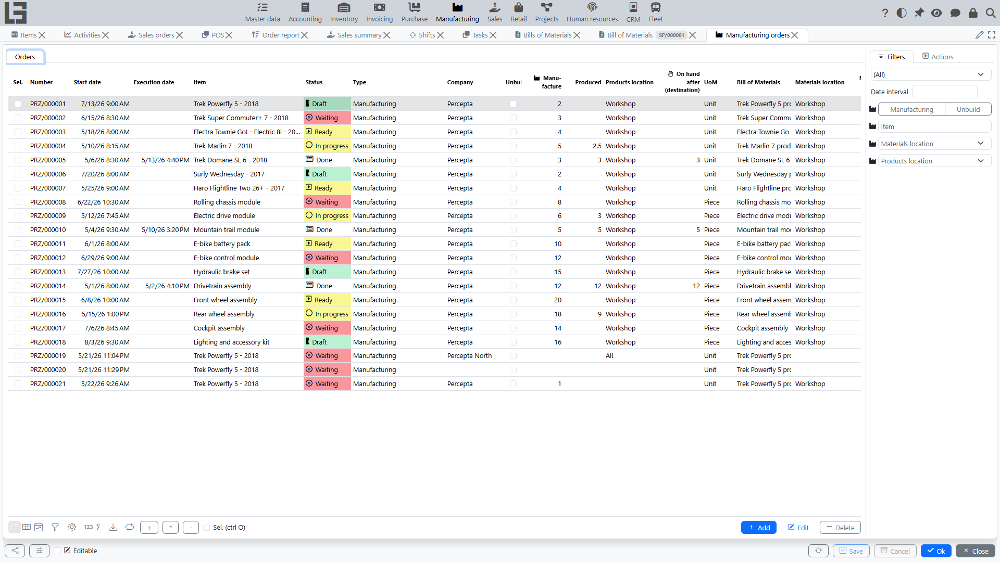
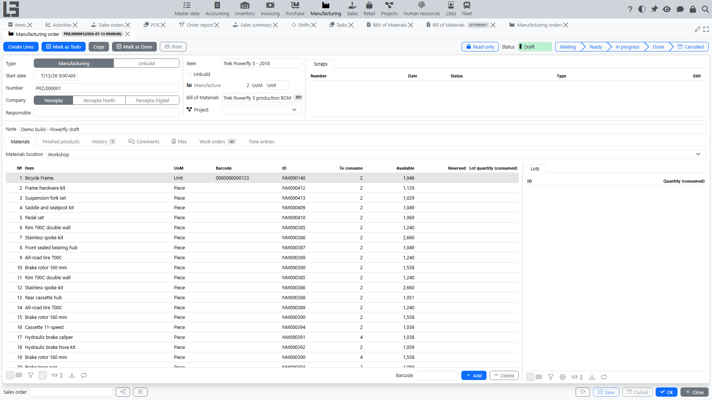

## Location

Open **“Manufacturing”** → **“Operations”** → **“Manufacturing orders”**.

## What a manufacturing order is used for

A manufacturing order is the main manufacturing document. It is used to:

- record **what** has to be produced (or [unbuilt/disassembled](unbuild.md));
- set the **planned quantity**;
- specify the **[Bill of Materials](bom.md)** (item structure) that is used to calculate materials;
- perform an **availability check** and reserve materials;
- record **actual production** and **actual consumption**;
- specify the **Products location** when the order is **Done**;
- monitor [work order](work-orders.md) statuses directly from the order card.

## Manufacturing orders list

The list is used to control current orders and quickly open the order card.

Typical columns:

- **Number**;
- **Start date** (planned) and **Execution date** (filled in when the order becomes **Done**);
- **Item** — what is produced;
- **Type** and **Unbuild** flag (comes from the [type](settings.md));
- **Company**;
- plan and actual: **Manufacture** (planned quantity) and **Produced** (actual), with the **UoM**;
- **Products location** and the calculated **On hand after (destination)** — the expected stock of the item at the products location after execution;
- **Bill of Materials**;
- **Materials location**;
- line counters: **Material lines** and **Product lines**;
- cost columns (see [Costing](costing.md)): **Cost**, **Extra cost**, **Total cost**, plus **Labor cost** and **Service cost** when the corresponding contours are used;
- **Sales order** — a link to the source sales order, if the order was created [from a sales order](sales-orders.md).

The row background reflects the order status (see [statuses](workflow.md)).

### Filters

- a **status filter group**: **Waiting**, **Ready**, **In progress**, **Done** (plus the option to show all);
- a **date range** filter by the start date;
- right-pane filters by **Type**, **Item**, **Materials location** and **Products location**.

### Selection and the Total tab

List rows can be selected with checkboxes. For the selected orders:

- bulk status actions are available: **Mark as Todo**, **Check availability**, **Manufacture**, **Mark as Done**;
- the **Total** tab appears: it aggregates the materials of all selected orders — one row per item with **To consume**, **Consumed** and **Cost**, and, for the selected item, the underlying material lines with their orders.

### Create orders (bulk creation)

The **Create orders** action creates several manufacturing orders at once:

1. Select a **Type** in the right-pane filter (otherwise the action reports “No production order type selected”).
2. The **Product selection** dialog opens with all items that have a default [Bill of Materials](bom.md).
3. Enter the **Manufacture** quantity for the required items; if needed, change the **Bill of Materials** per item.
4. If a **Products location** filter is set, the dialog also shows the current **On hand** at that location, and the **Fill negative** action fills the quantities for items with negative stock.
5. On confirmation, one manufacturing order is created per item, with the type, Bill of Materials, materials/products locations from the filters, and generated lines.

### Create purchase orders for materials

From the manufacturing orders list you can also create [purchase orders](../purchase/orders.md) for the materials required by the selected manufacturing orders. The corresponding action (also captioned **Create orders**) appears once at least one order is selected.

1. In the filters, set **Materials location** — only manufacturing orders for this location will be processed (otherwise the action reports “No materials location selected”).
2. Select the manufacturing orders you want to procure materials for.
3. Run the action.

The system:

- aggregates required materials (only consumption lines that are not yet linked to a purchase order) across the selected manufacturing orders;
- groups items by their default [vendor](../masterdata/partners.md) and creates one purchase order per vendor;
- creates an additional purchase order (without a vendor) for items that have no default vendor;
- sets the chosen materials location as the location of each new purchase order;
- links every processed consumption line to the corresponding new purchase order line, so the relation between the manufacturing order and the purchase order is preserved;
- opens each created purchase order for review.

### Manufacturing demand in purchase auto order

When purchase order auto filling is enabled, manufacturing demand is included in the purchase order **Auto order** calculation.

In the purchase order item grid, the system shows:

- **Awaiting consumption** — material quantities from manufacturing orders waiting for execution;
- **Consumed** — material quantities from Done manufacturing orders in the selected order period.

These quantities increase the suggested **Auto order** amount together with shipment demand, so purchase orders can cover both sales shipment needs and manufacturing material needs.

## Manufacturing order card

The manufacturing order card is used to run the process step by step.

### Main fields

- **Type** — defines behavior (for example, [unbuild](unbuild.md)) and defaults; required;
- **Start date** — planned start date and time (defaults to the current moment);
- **Number** — required; generated by the numerator of the type;
- **Company**;
- **Responsible** — defaults to the current user;
- **Execution date** — appears when the order is **Done**;
- **Item** — the item being produced, with the read-only **Unbuild** flag of the type;
- **Manufacture** — the planned quantity, with the **UoM**; when the order is in progress, the actual **Produced** quantity is shown next to it;
- **[Bill of Materials](bom.md)** — item structure; the default Bill of Materials of the item is substituted automatically;
- **Note**.

The current status is shown as a chain of stages (Waiting → Ready → In progress → Done, plus Canceled); the actions that move the order between statuses are described in [the workflow](workflow.md).

### Tabs

- **Materials** — the **Materials location** field and the material lines: **№**, **Item**, **Description**, **UoM**, **Barcode**, **ID**, **To consume**, plus the availability columns **On hand** / **Expected** / **Available** / **Reserved** and, when the order is in progress, the actual **Consumed**. If [lots](lots-and-printing.md) are used, a per-line lot panel is shown.
- **Finished products** — the **Products location** field and the output lines: **№**, **Item**, **UoM**, **Barcode**, **ID**, **Manufacture** (planned), **Cost ratio** and, when the order is in progress, the actual **Produced**. A per-line lot panel is shown for lot-tracked items.
- **Work orders** — the [work orders](work-orders.md) of the order with their statuses.
- **Comments**, **Files** (attachments), and the status **History**.

When the Project Management contour is used, the card additionally shows the **Project** field and the **Time entries** tab (labor recorded on the order — see [Costing](costing.md)).

The header also shows the linked **Scraps** block (see [Scrap](scrap.md)) and, in the footer, the **Sales order** link when the order was created [from a sales order](sales-orders.md).

### Bill of Materials item consistency check

If a [Bill of Materials](bom.md) is selected, the system checks that the item in the Bill of Materials matches the order item. If the items do not match, the order cannot be saved.

### Create Lines

In the **Draft** status, the primary action **Create Lines** generates the lines: it asks for the quantity (defaults to the current planned quantity) and fills the material and output lines from the [Bill of Materials](bom.md), including components of nested intermediate Bills of Materials. At the same time, [work orders](work-orders.md) are generated from Bill of Materials operations, including operations from nested intermediate Bills of Materials.

Note: re-running the action deletes the existing lines and generates them anew.

### Copy

The **Copy** action creates a new order in the **Draft** status with the same type, item, Bill of Materials, company, materials/products locations and lines (planned quantities only). Work orders are copied as well.

### Print

The **Print** action prints a simple production job form: order number, start date, item and quantity, and the list of materials with quantities and the source location.

## Typical scenarios

### Create an order and prepare it to start

1. Create a new manufacturing order.
2. Fill in the type, item, and start date.
3. Select a [Bill of Materials](bom.md) (usually substituted automatically).
4. Run **Create Lines** to generate material and output lines (work orders are generated at the same time).
5. Run **Mark as Todo**, then **Check availability** to reserve materials.

### Manufacture and mark as Done

1. Run **Manufacture** and enter the produced quantity (the system distributes production and consumption proportionally).
2. Manage work order execution (optional): on the **Work orders** tab use **Start** and **Mark as Done** to track operation progress.
3. Adjust actual **Produced** / **Consumed** on the lines if needed.
4. Run **Mark as Done** and specify the **Products location**.
