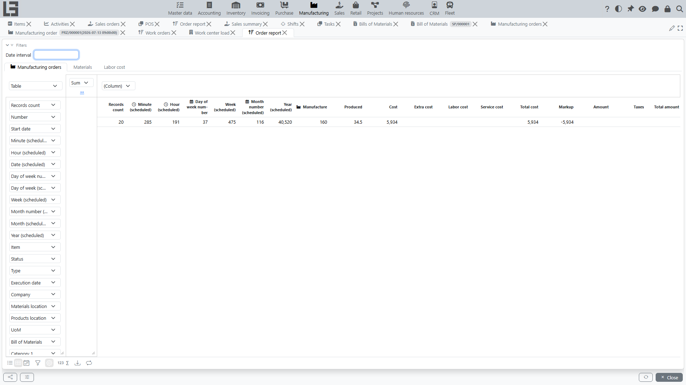

The reporting section is used to analyze [manufacturing orders](orders.md). Open **"Manufacturing" → "Reporting" → "Order report"**.

## What the report shows

The report is a pivot view with the following tabs:

- **Manufacturing orders** — one row per order: number, dates (start/execution), item, status, type, company, locations, Bill of Materials, and the measures: planned vs actual output (**Manufacture** / **Produced**) and the cost columns (**Cost**, **Extra cost**, **Total cost**, plus **Labor cost** and **Service cost** when the corresponding contours are used). For orders created [from sales orders](sales-orders.md), the sales measures (**Amount**, **Taxes**, **Total amount**, **Markup**) are also available;
- **Materials** — one row per material line: the material and its order attributes, and the measures **To consume**, **Reserved**, **Consumed** and **Cost**;
- **Labor cost** — one row per time entry: employee, project, and the measures worked hours, rate and labor amount. This tab is available when the Project Management contour is used.

## Filters and grouping

- the **Filters** panel at the top sets the date range by the order start date;
- rows can be grouped by any dimension columns: item, item categories (**Category 1**–**Category 4**, **Canonical group**), item attributes, status, type, company, locations;
- the start date can be aggregated by standard periods (year/quarter/month/…) for time-series analysis.

## What is usually analyzed

- number of orders for a period;
- planned vs actual output;
- material availability and consumption;
- cost of produced goods;
- **Done** and **Canceled** orders.

## Usage recommendations

1. Set a date range.
2. Group by item or category to see the production structure.
3. Compare planned and actual quantities to analyze deviations.
