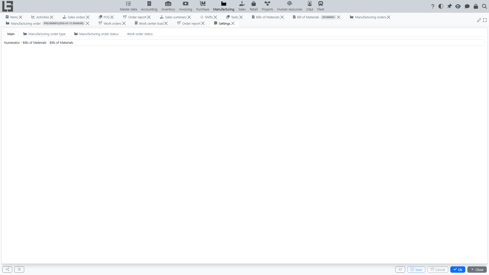

## Location

Open **"Manufacturing"** → **"Configuration"** → **"Settings"**.

The form is organized into tabs:

- **Main** — general parameters, in particular the **Numerator - Bills of Materials** (number generation for [Bills of Materials](bom.md));
- **Manufacturing order type** — the directory of order types (see below);
- **Manufacturing order status** and **Work order status** — the status lists with their **Read-only** flags (see below).

## Manufacturing order types

The **Manufacturing order type** tab contains the directory of manufacturing order types. The type card defines:

- **Name**, **ID** and **Numerator** (number generation);
- in the **Default** block — the **Materials location** (the default storage location for materials, substituted into new orders of this type);
- in the **Other information** block — the **Unbuild** flag: orders of this type perform [disassembly](unbuild.md) instead of production;
- in the **Scrap** block — the **Scrap type**: the type of [scrap](scrap.md) document created from an order of this type.

If exactly one type exists, it is substituted into new orders by default.

If [creation from sales orders](sales-orders.md) is used, the manufacturing order type is also referenced from the sales order type (the **Manufacturing** block with the **Manufacturing order type** field and the **Automatically create a production order** flag).

## Statuses and the "Read-only" flag

The set of manufacturing order statuses is fixed — Draft, Waiting, Ready, In progress, Done, Canceled (see [workflow](workflow.md)) — you cannot add new ones. However, the **Manufacturing order status** tab shows the list of statuses, and each status has an editable **"Read-only"** flag: when it is on, any order in that status becomes non-editable (header and lines locked). This is how administrators usually lock, for example, Done and Canceled orders.

The **Work order status** tab provides the same **Read-only** flags for the [work order](work-orders.md) statuses (Ready, In progress, Done).

In addition, each individual manufacturing order has its own **"Read-only"** flag that locks just that document regardless of its status.

## Other directories in Configuration

The **Configuration** group also contains:

- **Operations** — the directory of [BoM operations](bom.md) (name, Bill of Materials, work center, start time, duration) that are referenced from Bills of Materials;
- **[Work centers](work-orders.md)** — the directory of work centers (name, ID, description) used by work orders and BoM operations.

## Recommended setup order

1. Create manufacturing order types and configure their numerators and materials locations.
2. If you use [disassembly](unbuild.md), create a type with the **Unbuild** flag.
3. If you record [scrap](scrap.md), set the **Scrap type** on the relevant order types.
4. If you use [work orders](work-orders.md), create work centers (operations are usually entered directly in Bills of Materials).
5. If orders must be locked after completion, enable the **Read-only** flag for the Done and Canceled statuses.
