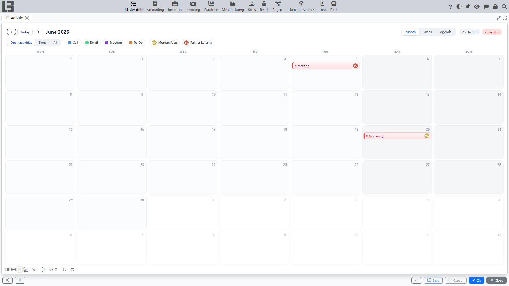

The **“Activities”** section is used to plan and track tasks, meetings, calls, and other actions.

## Activities and Types

An activity can have a **Type** (e.g., Call, Meeting, Task). The type determines which time fields are shown: a type can use only a date, a date with a start **Time**, or a date with both **Time** and **Till**.

Activity types are configured on the **Settings** form, on the **“Activity types”** tab.

## Creating an Activity

To create a new activity:
1. Open the **Activities** section.
2. Hover over the required day in the calendar and click the **+** button (*New activity on this day*) — the selected date becomes the due date.
3. In the activity window, fill in the details:
   - **Type**: The kind of activity (e.g., Call, Meeting, Task).
   - **Name**: A brief description or title of the activity.
   - **Due date**: The planned completion date. When you create the activity from a calendar day, it is that day; for activities created in other ways it defaults to 7 days from today.
   - **Time** and **Till**: Start and end times (if enabled for the selected type).
   - **Assigned to**: The employee responsible for the activity. It defaults to the current user (when the current user is an employee).
   - **Attendees**: Partners participating in the activity (display-only).
   - **Object**: A link to a related document or record (e.g., a specific Lead or Order).
   - **Description**: Detailed information about what needs to be done.

## Working with the Activity List

The **Activities** form provides a convenient view of all tasks:
- **Views**: **Month** and **Week** calendar views, plus **Agenda** — a chronological list of activities.
- **Filters**: By default, only **Open activities** are shown; you can switch to completed or all activities. You can also filter by **Type** and by assignee using the colored chips above the calendar.
- **Navigation**: Hover over an activity to show its popup card — from there you can open the edit form, jump to the linked **Object**, mark the activity as done, or reassign it (the picker offers active employees that already have open activities). Double-click an activity to open the edit form directly; drag it to another day to change the due date.

## Completing an Activity

When you finish a task:
1. Click the **Done** button.
2. In the feedback window, enter the results of the activity (**Feedback**).
3. The activity will be marked as completed.

Completed activities are highlighted in the list and are hidden when the "Open activities" filter is active.

## Activities in Other Records

Activities can be managed directly from the cards of other objects (like Leads, Tasks, or Orders):
- New activities are created with the buttons named after activity types at the top of the tab.
- The dedicated tab lists the related activities that are not completed yet; already completed ones can be reviewed in the main **Activities** form or in the record’s comment history (where enabled).
- The list shows the type, due date, status, and how many days are left to complete the task.
- A badge on the tab shows the number of pending activities.
- When an activity is completed, a comment with the description and feedback may be automatically added to the record's history.
