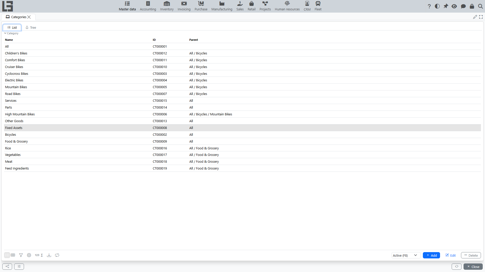

The **“Categories”** directory is used to group items. Categories can be hierarchical (a tree): a category can have a parent category.

## List and tree

Two views are usually available:

- **List** — a flat list of categories;
- **Tree** — a hierarchy of categories.

## Category card

Typical fields:

- **Name**;
- **ID** (can be generated automatically);
- **Parent** — required: every category except the root has a parent category;
- **Archived**.

The card has a name **Prefix** field — it is prepended to the composed **Name (full)** of all items of this category. The **“Default values”** tab holds a default **Unit of measure**: it is prefilled (taking the nearest ancestor category that has one) when an item is assigned the category while its own unit is still empty; it does not change items that already have a unit, and changing the default later does not update existing items.

## Creating a subcategory

In the **Tree** view, select the parent category and click the **Category** button on the toolbar — the new category is created as a child of the selected one. In the **List** view, create a new entry and specify the parent manually.

## Restrictions

If a category is used in other categories (as a parent) or in items, deletion may be forbidden. In this case, use archiving.