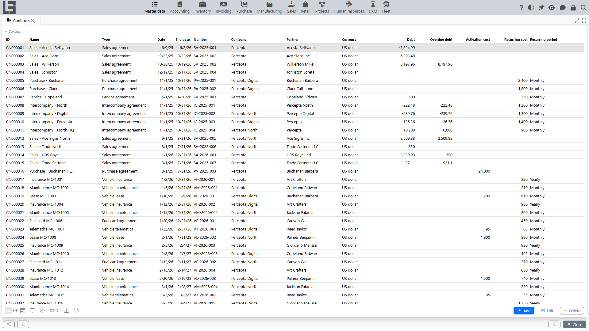

The **“Contracts”** directory is used to register contracts with partners and then select a contract in documents (if the process implies it).

## Contract card

Typical fields:

- **ID** (can be generated automatically);
- **Number**;
- **Date**;
- **End date** (if applicable);
- **Name** (if used);
- **Type** — the contract type (if used);
- **Company**;
- **Partner**.

If the contract type has the **“Cost”** option enabled, the card also shows a **“Cost”** block with **Activation cost**, **Recurring cost** and **Recurring period**.

## Consistency checks

If a document allows selecting a contract, the system may check that:

- the document **company** matches the contract company;
- the document **partner** matches the contract partner.

If the selected contract is cleared after changing the company/partner, this is expected behavior that helps avoid errors.