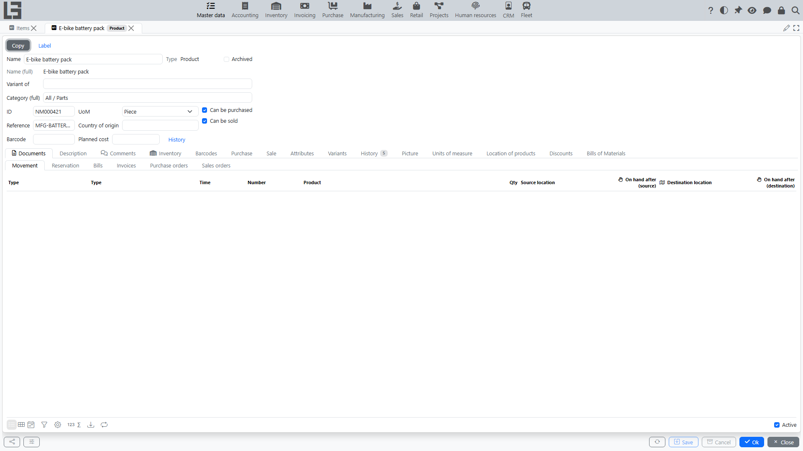

The **“Items”** directory contains products and services that are used in document lines (orders, shipments, invoices, bills, etc.).

## Products and services — what is the difference

Items are divided into two main types:

- **Products** — material items that usually participate in inventory accounting.
- **Services** — work and services that do not require storage and do not create stock.

The separation is needed to:

- correctly perform inventory operations (if the inventory contour is enabled);
- store product-specific attributes (e.g., weight, volume, country of origin — if used);
- simplify selection in documents and analysis.

#### When to create a “product”

Create a **product** if the item:

- is received into inventory and/or shipped from inventory;
- requires stock control, reservation, lots/serials (if used);
- has physical characteristics important for logistics (weight/volume).

Examples: raw materials, components, finished goods, consumables.

#### When to create a “service”

Create a **service** if the item:

- is work/service and is not stored in inventory;
- must not create inventory movements;
- is accounted for in documents as a service (the quantity unit is “hour”, “service”, “job”, “shift”, etc.).

Examples: delivery, installation, repair, consulting, rent.

## Before creating items

It is recommended to fill in advance:

- **Units of measure** (at least basic ones);
- **Categories** — every item requires a category, so make sure at least the root category exists; categories are also used to group items.

## Product import from file with OpenAI

If the product import prompt is configured, the item list shows **Import (GPT)** on the toolbar for the category tree. The action is intended for initial filling or expansion of product catalogs from a supplier file, spreadsheet, PDF, image, or another attached file that OpenAI can read.

#### What to prepare

- fill in the OpenAI API key and, if needed, create GPT configurations for model, reasoning, and additional prompt settings in the global integration settings;
- open **Master data → Settings** and on the **Items** tab fill **Import (GPT) → Prompt**. Use **Default** to load the standard prompt, then adjust it to your catalog files if needed;
- check that units of measure have stable IDs, because import does not create new units of measure;
- review existing categories and products in the selected branch: they are sent to OpenAI as reference data so duplicates can be excluded.

#### How to use

1. Open **Master data → Items**.
2. Select the category whose branch should be used as the reference scope for duplicate checking.
3. Click **Import (GPT)** and select the source file. If several GPT configurations exist, select the one to use.
4. In the preview window, review newly detected categories and products. You can edit fields and delete rows that should not be created.
5. Confirm/save the preview to create the remaining categories and products, or close/cancel it to discard the result.

#### What is created

- categories with name and parent category;
- products with name, category, reference, and unit of measure.

IDs for new categories and products are generated by the system.

#### Limitations and specifics

- The action is hidden while the prompt is empty.
- Existing categories and products are not updated; the scenario only creates the entries returned by OpenAI. The system itself does not re-check the returned rows against existing data — duplicate avoidance relies on the prompt and the reference data sent to OpenAI, so always review the preview and delete unneeded rows.
- New units of measure are not created automatically. If OpenAI does not return an existing unit ID, the product unit may remain empty.
- Category matching uses existing category IDs or names of categories created in the same preview. If the category cannot be matched, the system places the row under the root category.
- Always review the preview before saving: OpenAI recognition depends on the file quality and the configured prompt.
- If the OpenAI API key is missing or the request fails, the system shows a message and does not import anything.

## Item list

The list typically shows:

- **Name (full)**;
- **ID**;
- **Type**;
- **Category**;
- **UoM** (unit of measure);
- **Reference**.

If archiving is available, use the **“Active”** / **“Archived”** filter.

## Item card

Typical fields:

- **Name** — the editable item name;
- **Name (full)** — composed automatically (category prefix + name + attribute prefixes/suffixes); read-only;
- **Type** — **Product** or **Service**, defined by the kind of item; read-only;
- **Category (full)** — the category with its full hierarchical path;
- **UoM** — the unit of measure;
- **ID** — generated automatically;
- **Reference** (if used);
- **Planned cost** — the cost effective today; the **History** link opens the list of dated cost values, where new values can be added starting from a given date;
- **Description**;
- **Archived**.

### Inventory settings

Product cards (services do not have these fields) have an **Inventory** tab with additional parameters:

- **Unit weight, kg** and **Unit volume, m3**;
- **Unit length, cm**, **Unit width, cm** and **Unit height, cm**;
- if the inventory contour is enabled — **SKU** and **Coefficient** (used for automatic recalculation and accounting of the current item's stock through another base item). For more details, see the [Inventory SKUs](../inventory/product-sku.md) section.

Also, conversion coefficients for packages can be configured for items (on the **Units of measure** tab), and default packages can be selected on the **Purchase** and **Sale** tabs. This allows for the use of the packaging accounting mechanism directly in documents.

### Other tabs

Depending on enabled modules and item settings, the item card can also have additional tabs — for example, **Barcodes**, **Attributes**, **Picture**, and **Documents** (related documents). The **Purchase** and **Sale** tabs appear only when the **“Can be purchased”** / **“Can be sold”** flags are set; the **Sale** tab also contains the **Sales price**.

### Attributes

The **Attributes** directory (**Master data → Attributes**) defines additional item properties (e.g., brand, color, size). For each attribute you can set the categories it applies to, the list of allowed values, and the **Required** flag. Values are filled on the **Attributes** tab of the item card; required attributes without a value are highlighted. An attribute can also participate in the composed item name: its value (with an optional prefix/suffix) is appended before or after the name according to the attribute's **Sequence** and **Before name** settings.

### Variants

An item can have **variants** — separate items that represent the same product in different versions (e.g., colors or sizes). Variants are created from the **Variants** tab of the parent item card with the **Variant** button. A variant keeps its own ID and barcodes, while its name, category, unit of measure, archived flag, and the attribute values already filled on the parent are synchronized from the parent and are read-only on the variant. The item list has **Main** (F10) / **Variants** (F9) filters, and the card shows the parent in the **Variant of** field.

### Filling recommendations for products

- Make sure **Category** and **Unit of measure** are selected (e.g., “pcs”, “kg”, “m”).
- If your configuration has **Weight**, **Volume**, **Length/Width/Height**, **Country of origin** — fill them for products when those attributes are used in logistics, marking or reporting.

### Filling recommendations for services

- Choose a unit of measure that reflects the service scope (e.g., “hour”, “service”, “job”).
- It is convenient to include the delivery format/composition in the name (e.g., “City delivery”, “Installation (1 hour)”) so the service is unambiguous when selecting.

## Comments and history

If comments/history are enabled in the configuration, the card may contain a tab with comments and/or change history. This is useful for recording agreements and reasons for adjustments.

## Maintenance practice

- Use a consistent naming style for active items.
- If an item is no longer sold/purchased, archive it so it does not appear in selection for new documents.

## Typical mistakes

#### A service was created as a product

As a result, the service may start behaving like an inventory item (e.g., stock expectations or incorrect logic in documents).

Recommendation: create a correct item as a **service**, switch processes to it, and move the incorrect item to **Archived**.

#### A product was created as a service

As a result, you may miss stock control and inventory operations.

Recommendation: create a correct item as a **product** and use it in documents where inventory accounting is required.
