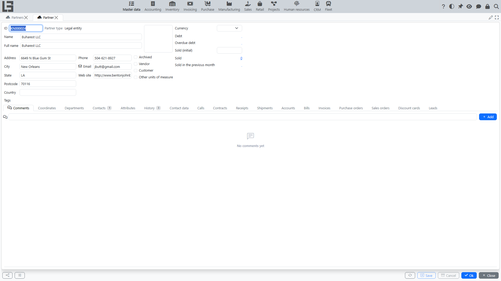

The **“Partners”** directory is used to maintain customers, suppliers, other organizations and individuals (depending on configuration). Partners are selected in sales, purchase, and invoicing documents, as well as in contracts and departments.

## Where it is used

- sales and purchase documents;
- invoices, bills and payments;
- contracts;
- partner departments (branches/locations).

## Partner list

The list typically shows basic data: **Name**, **ID**, **Partner type**, **Address**, **Phone**, **Email**.

If archiving is used, the list usually has a switch:

- **Active** — working entries;
- **Archived** — entries hidden from everyday selection.

## Partner types: legal entity, company, individual

In the system, the same “partner” can be of different types. This is important because **different types store different sets of data** and are **used differently in processes**.

#### Legal entity (external organization)

Use **“Legal entity”** for external counterparties that are organizations:

- customers and suppliers;
- contractors;
- carriers;
- banks and other organizations.

Typical data:

- **Name** and, if needed, **Full name**;
- contact data and address;
- if needed — **Web site**;
- the **“Legal data”** tab (if enabled in your configuration).

Additionally, legal entities may have a list of **contacts** (see “Individual” below).

#### Company (our company)

The **“Company”** type is used for **your own legal entities** on behalf of which documents are created.

When it is needed:

- you maintain accounting for **several of your companies** in one database;
- in documents, it is important to choose **which company** sells/buys, accepts payments, and is a party to the contract.

Practical note: if there is **exactly one company** in the system, it is often **prefilled by default** in documents (depends on settings and the specific process).

#### Individual

Use **“Individual”** when you need to store data about a specific person:

- a contact person of an external organization (e.g., supplier manager, customer accountant);
- a private customer.

Typical data:

- **First name**, **Surname**, **Middle name**;
- **Legal entity/company** the person represents;
- **Position** (if used);
- phone and email.

Employees of your own company are a special kind of individual — see [Employees](#employees) below.

## Partner card

Typical fields:

- **ID** — can be filled automatically;
- **Name**;
- **Partner type** — the partner kind (e.g. legal entity, company, individual, employee); it is set by the type of entry you create and is shown read-only;
- **Address** (including country — if used);
- **Phone**, **Email**;
- **Archived** — a flag to exclude the partner from active use.

### Vendor purchase settings

If purchase automation is enabled and the partner is marked as **Vendor**, the partner card contains a **Purchase** tab with **Order period**.

**Order period** is the number of days used by purchase order auto filling to build the default demand analysis period for this vendor. If it is empty, purchase orders use 7 days. The value only fills **Date from** and **Date to** by default; the user can still change the period in the purchase order.

## Employees

An **employee** is an individual of your own company that is also a system user. Unlike regular individuals, employees are maintained in a separate directory — **Master data → Employees** — and can be assigned to activities and other work.

The employee card contains:

- **Login**, the **Change password** action, and the **Locked** flag — the user account;
- **Roles** — the user's permission roles;
- **Legal entity** — must be one of your companies (prefilled when there is exactly one);
- **Department**, **Position**;
- name, contacts, address, birthday;
- **Photo** and **Avatar** (the avatar is generated automatically from the photo).

### How to choose the right type

Use a simple rule:

- if you describe **the deal party as an external organization** (customer/supplier/contractor) — create a **legal entity**;
- if you describe **your own organization** (on behalf of which documents are created) — create a **company**;
- if you need **a specific person** — create an **individual**; for a contact, specify the legal entity the person represents; for an unaffiliated private customer, the legal entity can stay empty;
- if you need **an employee of your own company** (a system user, an activity assignee) — create the entry in **Master data → Employees** (see [Employees](#employees)).

### Typical situations and examples

- **Customer is an organization** → create a **legal entity**.
- **Supplier is an organization** → create a **legal entity**.
- **Customer is a private person** → create an **individual**.
- **Supplier contact** (e.g., “John Smith, manager”) → create an **individual** and link it to the supplier legal entity.
- **Accounting for two own legal entities** → create two **company** entries and select the appropriate company in documents.

## Recommendations for filling

- Fill contact data and address immediately — this reduces errors in documents.
- If a partner is no longer used, archive it instead of deleting.

## Typical mistakes and how to avoid them

#### Duplicate partners

A common situation is when the same partner is created multiple times (for example, with different spelling).

Recommendations:

- agree on a single naming standard;
- move “extra” entries to **Archived** so they are not selected in new documents;
- before creating a new partner, use search in the list.

#### Confusing “legal entity” and “company”

If an external partner is created as a “company” (or vice versa), it leads to errors in selecting the contract party and company in documents.

Recommendations:

- create a correct entry of the required type;
- gradually switch processes to the correct entry;
- move the incorrect entry to **Archived** (deletion is often not possible due to links to documents).
