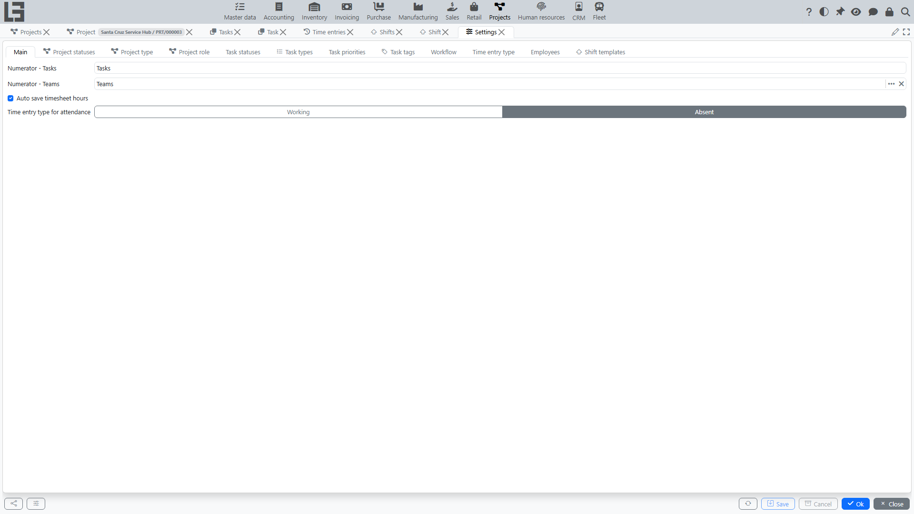

This page describes typical settings for the **Projects** section. The exact set of directories and parameters depends on configuration and user permissions.

Open **Projects → Configuration → Settings**.

## What is usually configured

#### Project types

A project type is used to classify projects and defines the numbering rules: the numerator is set on the type card (see [Numbering](#numbering)).

Recommendation: keep the list of project types short and clear for users.

#### Project statuses

Project statuses reflect the project lifecycle. Each status has a **Closed** flag that marks it as a closing status; a project in such a status is considered closed.

Typically, the list at minimum includes:

- active statuses (for example, “in progress”);
- a closing status (with the **Closed** flag set).

Recommendation: agree on when a project is moved to a closed status and formalize the rule in your internal routine.

#### Task types

A task type helps separate tasks by purpose (for example, development, approval, control). The **allowed statuses** are ticked on the type card; if none are ticked, all statuses are allowed for the type. The type also participates in the **[workflow](#workflow)** rules.

#### Task statuses

Task statuses reflect execution stages (for example, “new”, “in progress”, “done”). Each status has:

- a **sorting order** that controls how statuses are ordered in the UI (in particular, this defines the order of columns in the **[Kanban](tasks.md#kanban)** view);
- a **Closed** flag — tasks in a status with this flag are considered closed.

The set of statuses is selected based on the team’s workflow.

#### Workflow

The workflow is configured per **project role** and **task type**: allowed transitions are ticked in a “from status → to status” matrix. The matrix is filled in three variants:

- **allow** — the transition is available to any employee with the specified project role;
- **allow author** — the transition is available to the author of the task;
- **allow assignee** — the transition is available to the employee assigned to the task.

Workflow rules answer:

- which transitions between statuses are allowed for a given task type;
- in what order a task goes through stages;
- who can perform a specific transition.

How the rules are applied:

- if no rules are defined for a role and task type, transitions are not restricted for that role;
- the rules are checked only for users who have at least one direct project assignment (participation only as a member of an assigned team does not enable the check).

The system also prevents saving a task in a status that is not allowed for its type (it shows the message “Status is not allowed for the selected type”), and when the type is changed, the status may be reset to the first allowed status of the new type.

Recommendations:

- avoid excessive statuses;
- make sure each status has a clear next step;
- restrict “sharp” transitions (for example, from “new” directly to “done”) if this is important for control.

#### Priorities and tags

Priorities help plan workload, and tags help conveniently group tasks by topics. Both priorities and tags can have a **colour**: the priority colour highlights rows in the task list, and the tag colour is used for labels on cards.

Recommendations:

- use 3–5 priority levels so users do not get confused;
- introduce tags only for real needs (otherwise they stop being useful).

#### Time entry types

A time entry type defines the kind of work for effort tracking (for example, “Working”, “Absent”). The type card contains:

- the **Default** flag — this type is filled into new time entries and offered in timesheets;
- a **colour** — used for highlighting in timesheets; a **symbol** — a short designation of the type;
- the **Project required** flag — a time entry of this type cannot be saved without a project;
- **hours templates** — typical hours values (with a name and a colour) for quick input in timesheets and time entries.

#### Numbering

Project numbering uses a numerator tied to a project type — change the numerator on the type to switch the format or the counter. Task IDs are generated automatically when a task is created.

Recommendation: do not change numbering rules without necessity to preserve continuity and keep the history understandable.

#### Timesheet behaviour

The settings form also contains parameters that affect **[timesheets](timesheets.md)** — in particular, the **“Auto save timesheet hours”** option. When it is enabled, changes in timesheet cells are saved immediately; clearing a day in the supervisor timesheet then asks for confirmation (copying — when the target day already has records).

#### Shift templates

A **shift template** is a predefined time interval used to quickly create shifts on the **Schedule** view (see **[Shifts](shifts.md)**). On the **“Shift templates”** tab, add the intervals your organization uses (for example, a morning and an evening shift).

## Check after changing settings

After changing directories and rules, it is recommended to:

1. Create a test project and a test task.
2. Check that statuses and transitions work as expected.
3. Ensure that the required actions are available to users with different roles.