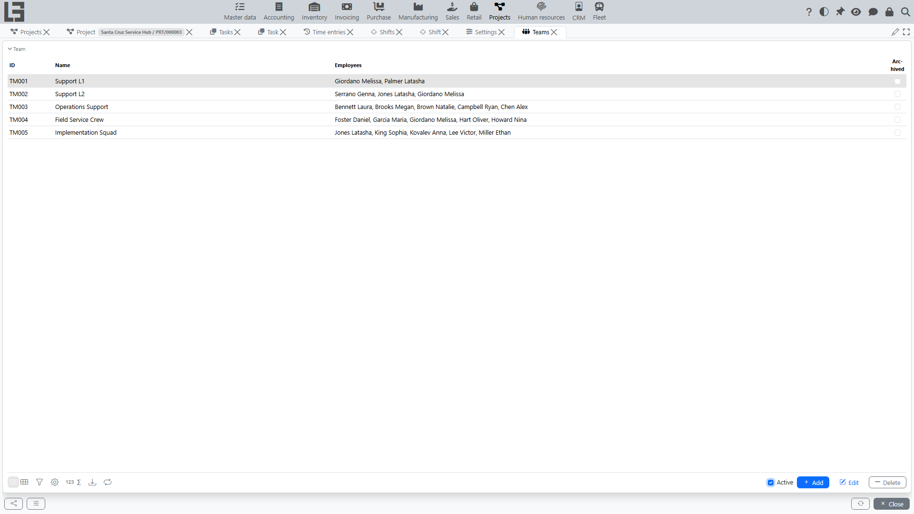

This page describes how to work with project participants: teams, roles, and assignments.

It is recommended to maintain the team and roles from the first days of the project: this simplifies task assignment, workload control, and participation reporting.

## Team

A team is a separate list of employees that can be assigned **to multiple projects at the same time**. Teams are maintained in **Projects → Configuration**.

This is convenient when the same group works on different projects or on several areas within the organization.

Important considerations:

- if you add/remove an employee from a team, the list of employees assigned to the project will change **in all projects** where this team is assigned;
- if participation period matters, specify participation dates in the project assignment (see the “Assignments” section).

#### How to assign a team to a project

Assigning a team is done via the **assignments** list in the project card.

1. Open the required project.
2. Go to the assignments section (project participants list).
3. Add a new assignment.
4. In the **Employee** field, select a **team** (the field accepts both an employee and a team; the participant type is shown in the “Type” column).
5. If needed, specify the role and participation period (start/end dates).
6. Save the changes.

After saving, all employees included in the selected team will be considered project participants (taking into account the participation period and your access permissions).

#### What happens when the team composition changes

If a team is already assigned to a project and you change its composition (the team remains a single row in the assignments list):

- new employees will appear in the project participants list (the **Employees** tab of the project card);
- removed employees will no longer be considered participants (if there are no other assignments for them to this project).

It is recommended to coordinate team composition changes with the project manager and record reasons in project or task comments.

## Project roles

A project role reflects a participant’s function (for example, manager, assignee, observer — the exact list depends on configuration). Roles are maintained in **Projects → Configuration** and are used for:

- separating responsibilities;
- **[workflow](settings.md#workflow)** rules (who is allowed to move a task from one status to another);
- analytics on employee participation.

Project visibility does not depend on the role: access is granted by the active assignment itself (see **[access to projects](#access-to-projects)**).

Recommendations:

- agree on the meaning of roles in advance (what “assignee”, “observer”, etc. mean);
- if roles affect access permissions, change roles consciously and in agreement.

## Assignments

An assignment links a **participant** (an employee or a team) to a **project** and records the participation terms. Assignments are maintained on the project card.

An assignment contains:

- participant (employee or team);
- project role;
- participation period (date from / date to — “date to” is optional, meaning open-ended).

The list of assignments on the project card has an **Active** filter that shows only assignments whose participation period covers the current date.

It is recommended to keep assignments up to date:

- add participants when work starts;
- close assignments (set the “date to”) when an employee no longer participates;
- align project roles with actual responsibilities.

> Tasks do not have their own separate assignment records. A task is linked to a single **assignee** (employee or team) via the **Assigned to** field on the task. Visibility of the task for that user is controlled by the project-level assignment.

## Access to projects

By default, a user sees only the projects where they are assigned (directly, or as a member of an assigned team). For users who must see everything (for example, a department head or an administrator), the employee card has the **“Access to all projects”** flag. Enabling it lifts the project-based access filter for that user.

> A user who has **no direct assignments at all** (to any project) also sees all projects: the assignment-based filter starts to apply after the first assignment where the participant is the employee themselves. Participation only as a member of an assigned team does not enable this filter.

## Typical scenarios

#### Project start

1. Assign the project manager.
2. Form the initial team composition.
3. Assign roles (if used).
4. Create tasks and assign assignees from the team.

#### Adding a new participant

1. Add the employee to the project team.
2. Assign a role.
3. Provide context: project description, current tasks, and status rules.
4. Assign tasks and due dates.

#### Replacing an assignee on a task

1. Clarify the reason for replacement and leave a comment on the task.
2. Assign the new assignee.
3. Check due dates and dependencies.
4. If needed, adjust the plan and inform the team.

## Frequently asked questions

#### Why an employee does not see an assigned task

The system does not prevent assigning a task to an employee without access to the project — but such a task will not be visible to them. The reason is usually one of the following:

- the employee does not have access to the project (no active assignment — directly or as a member of an assigned team — and no “Access to all projects” flag);
- filters in the task list hide the task.