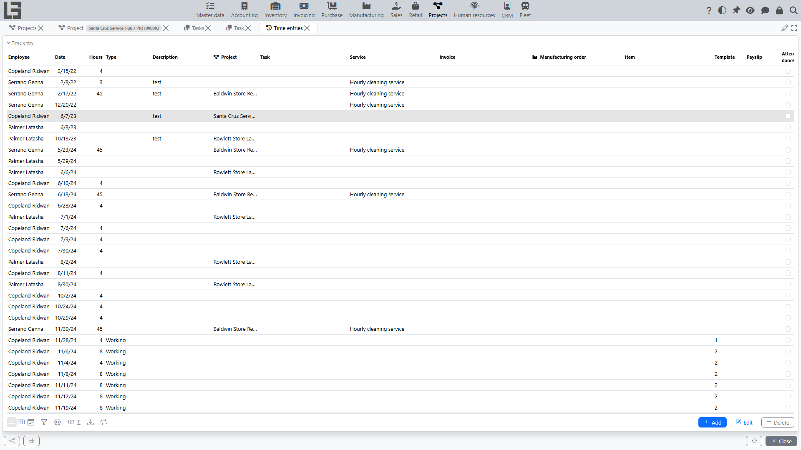

This page describes effort tracking via time entries: why it is needed, how to enter records correctly, and how to handle typical errors.

## Why time entries are needed

Time entries allow you to:

- record actual time spent on tasks and projects;
- form data for effort reporting;
- compare planned expectations with actuals and improve planning.

In addition to managerial control, time entries are often used for internal reporting and employee workload analysis.

## How to add a time entry

Typical scenarios:

- From the **project or task card** — open the card, find the time entries section, and create a new record. The project (and task, where applicable) is filled in automatically.
- From the **general time entries list** — open **Projects → Operations → Time entries** and create a record manually; in this case select the project and/or task explicitly.
- Via a **[timesheet](timesheets.md)** — enter hours in a daily grid; the system creates or updates the corresponding time entries.

Steps:

1. Specify the date, the number of hours, and the time entry type.
2. Link the record to a project and, if applicable, to a task.
3. Save the record.

> If the employee is assigned to exactly one project, that project is filled in automatically when a time entry is created.

#### Filling recommendations

- record time as it happens, as close as possible to the work date;
- do not “accumulate” time entries until the end of the month — this increases the risk of mistakes;
- if you worked on several tasks, record time as separate entries;
- if your organization uses time entry types, choose the type that matches the nature of the work;
- if **hours templates** are configured for the selected type, you can quickly insert a typical hours value instead of typing it manually.

## Checks and restrictions

Depending on configuration, restrictions may apply:

- some time entry types have the **Project required** flag set — without a project the record will not be saved (the system shows the message “No project selected for the time entry”);
- you cannot save a time entry whose **task** belongs to a project different from the one specified on the entry (the system shows the message “The time entry task does not match the project”).

## Common situations

#### Cannot add a time entry

Check:

- that the project/task for tracking is selected (required for time entry types with the “Project required” flag);
- that the user has permission to create time entries.

#### Message “No project selected for the time entry”

The message appears when a time entry is saved without a project while the selected time entry type has the “Project required” flag set.

What to do:

1. Open the required project or task.
2. Create the time entry from the project/task card.
3. If you enter the time entry from the general list, explicitly select the project and/or task.

#### Message “The time entry task does not match the project”

If the time entry is linked to a task that belongs to another project, the system forbids saving.

What to do:

- check which project the task belongs to;
- if needed, fix the project on the task or select the correct task.