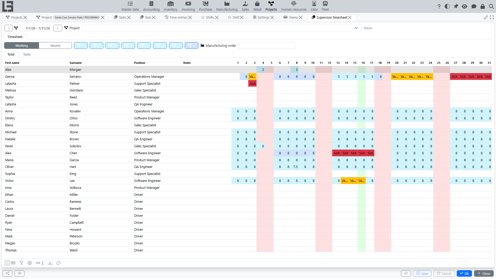
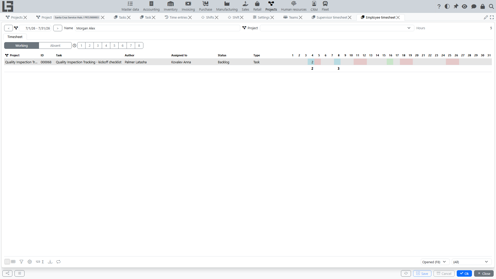

This page describes the timesheet forms:

- **Supervisor timesheet** — to control and adjust employees’ effort by days within the selected project.
- **Supervisor timesheet mobile** — a simplified one-day variant of the supervisor timesheet for a phone.
- **Employee timesheet** — to enter and view effort by tasks (usually within the selected project).

Timesheets work based on **time entries** data. If your organization tracks time strictly by tasks and projects, timesheets help you quickly fill in/check hours without switching to separate lists.

> For details about the time records themselves, see [Time entries](time-entries.md).

## General principles

The desktop forms (the supervisor and employee timesheets) use common elements:

- **Period** — a date interval (typically a month). The header usually contains buttons to move to the previous/next month. The mobile timesheet works with a single day instead of a period.
- **Project** — limits tracking and viewing hours to a specific project.
- **Time entry type** — a work type (for example, “Development”, “Analysis”, “Support” — the exact list depends on settings).
- **Hours template** (if used) — allows quickly inserting a typical hours value during input.

### How hours are entered

Hours are entered directly in the table.

Two options are typically available:

1. **Manual input** — you enter the number of hours for the selected day.
2. **Quick input using a template** — if an hours template is selected, the system inserts its value. Applying the same template again to a filled cell deletes the record.

If you clear the hours value (make it empty/zero), the corresponding time entries for that day may be deleted (depending on tracking rules).

If the **autosave hours** setting is enabled (“Auto save timesheet hours”, configured in **Projects → Configuration → Settings**), cell changes are saved to the database immediately — this applies to both timesheet forms.

### Day highlighting

For easier control, the table usually uses highlighting:

- the current day is highlighted separately;
- weekends may be highlighted with a different color;
- if an employee has time entries of different types on the same day, the day may be highlighted as “requires attention”.

## Supervisor timesheet

Open **Projects → Processes → Supervisor timesheet**.

### Purpose

The form is intended for supervisors and managers who need to:

- control whether employees fill in their time;
- quickly see workload by days;
- if needed, adjust hours within the project.

### What is displayed

The timesheet displays a table:

- rows — **employees**;
- columns — **days of the selected period**;
- values — **hours**.

Additionally, the employee row may show position and project roles (if roles are maintained).

### Employee list limitation

The employee list in the timesheet is typically formed from:

- **active** participants assigned to the selected project in the selected period;
- employees who already have hours/time entries for the selected project in the selected period (regardless of their active status);
- if the selected project has no assignments at all — all **active** employees (for a user with all-projects access: the “Access to all projects” flag or no direct assignments — see **[access to projects](team-and-roles.md#access-to-projects)**).

### Input and actions

When you edit a cell (day/employee), the system:

- creates/updates a time entry of the required type — if a **time entry type** is selected on the form (and a project is selected, or the existing entry for that day is not yet linked to a project);
- opens a form with the list of time entries for that day and employee — in other cases (primarily when no time entry type is selected).

If **hours templates** are configured for the selected type, template buttons are shown next to the type — clicking one puts the template hours into the selected cell.

#### Copying and clearing hours (context menu)

In the supervisor timesheet, day actions are usually available via the context menu on a day cell:

- **Copy** — first clears the selected day, then copies into it all time entries from the nearest previous day with records. The employee, project, type, and hours are carried over; the task link, hours template, and description are not copied.
- **Clear** — deletes all time entries for the selected day.

> The actions apply to the **whole day** — to all employees within the selected project (or to entries without a project when no project is selected), not to an individual cell.

If the **autosave hours** setting is enabled (see above), changes are saved immediately, so **Clear** always asks for confirmation, and **Copy** asks when the target day already has records (they will be deleted).

#### Entering hours by task

The employee table in the supervisor timesheet has two tabs: **Total** and **Tasks**. On the Tasks tab you can select a specific task (an open one belonging to the selected project) and enter hours for it; the cells then show the hours for the selected task against the employee’s total hours for the day.

### Typical situations

#### Entering hours opens a time entry list

The list of time entries opens if **no time entry type is selected on the form** (and also if no project is selected while the day’s records are already linked to a project). This is usually needed when there are already records for the selected day and more detailed information is required (for example, distribution by tasks).

What to do:

1. Open the time entry list shown by the system.
2. Check which work/tasks already have records.
3. If needed, adjust hours or the type/project of the record.

## Supervisor timesheet mobile

Open **Projects → Processes → Supervisor timesheet mobile**.

A simplified variant of the supervisor timesheet for working from a phone:

- a **single day** is selected; buttons move one day or one week back/forward;
- the list shows **active** employees assigned to the selected project **as of the current date** (or all active employees — for a user with all-projects access — when the project has no assignments);
- hours are entered per employee for the selected day (when a time entry type is selected);
- **hours template** buttons and the day **Copy** / **Clear** actions (with confirmation) are available;
- changes are saved immediately.

## Employee timesheet

Open **Projects → Processes → Employee timesheet**.

### Purpose

The form is intended for employees and helps to:

- enter hours for tasks daily;
- see which tasks have time entered and on which days;
- control timesheet completeness for the month.

### What is displayed

The employee timesheet shows a task list and an hours table:

- rows — **tasks**;
- columns — **days of the selected period**;
- values — **hours by task**.

Task details may also be shown (name, author, assignee, status, type). If no project is selected, the task project may also be shown.

> The period total and the daily footer sums are calculated over **all** of the employee’s time entries, not only the selected project, so the total can be larger than the sum of the visible rows.

### Employee selection

Usually, the current user is selected by default. A user with all-projects access (the **“Access to all projects”** flag or no direct assignments) can switch the employee (for example, to help fill in the timesheet or for control).

### Task selection

The timesheet shows tasks that:

- belong to the selected project (if a project is selected);
- belong to projects the employee is assigned to in the selected period, or already have hours entered by the employee for the period;
- tasks of projects with no assignments at all are additionally visible to a user with all-projects access;
- match filters by state and ownership.

Typically available filters:

- **Opened / Closed** — by task state;
- **My tasks** — where the employee is the author;
- **Assigned to me** — where the employee is the assignee.

### Entering hours

When you edit a cell (day/task), the system creates or updates a time entry.

Recommendations:

- select the project first (if time tracking is strictly project-based);
- then work with tasks of that project;
- enter time as close as possible to the actual work date.

## Permissions and restrictions

Timesheet availability depends on permissions:

- an employee usually sees only their own timesheet;
- a supervisor/manager may see the timesheet for employees of the project;
- “all projects” access expands the data set available for viewing and (in some cases) editing.

If you do not see the required project, employees, or tasks, check:

- the selected period;
- the selected project;
- the assignment to the project and whether the participation period is valid;
- filters on the form;
- access permissions.