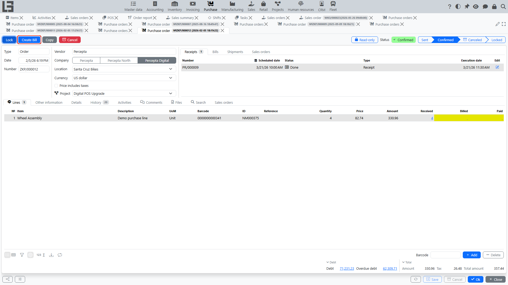
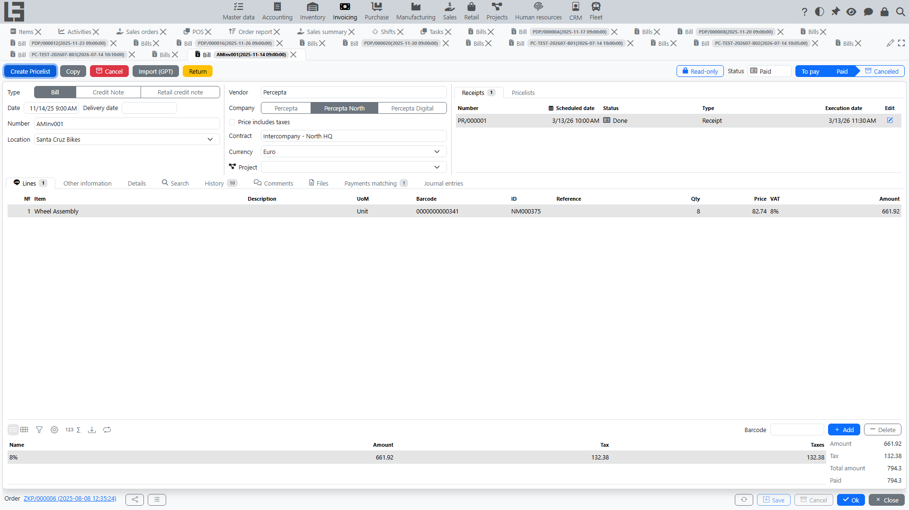

A bill records a purchase in accounting and the amount payable to the [vendor](../masterdata/partners.md). In practice, a bill is often created from a purchase order so that header fields and lines are carried over automatically.

## Where to find

Bills are usually available in **[“Invoicing”](../invoicing/invoicing.md) → “Operations” → “Bills”**.

If linking to purchase orders is enabled in your configuration, you can also create a bill from a **[purchase order](orders.md)** card.

## Link to a purchase order

A bill can be created based on a confirmed purchase order. In this case:

- header fields ([company](../masterdata/partners.md), [vendor](../masterdata/partners.md), [currency](../masterdata/currencies.md), [payment terms](../invoicing/settings.md#payment-terms), etc.) are usually filled in from the purchase order;
- bill lines are created from purchase order lines;
- based on this link, the system calculates how much has already been covered by bills and how much remains.

Practical meaning: one purchase order can be covered by **multiple bills** and **in parts**.

## When creating a bill from a purchase order is available

Typically, a bill based on a purchase order is used when the financial flow ([“Invoicing”](../invoicing/invoicing.md)) is enabled and you need to record the amount payable to the [vendor](../masterdata/partners.md).

The **“Create Bill”** action appears on the order card when:

1. The purchase order is in the **“Confirmed”** status.
2. There is a remaining quantity to invoice on the order lines.

The bill type and the bill-control mode configured for the [order type](settings.md) do not affect the availability of the action — they only determine what is pre-filled in the new bill (see below).

### Bill control mode

The **“Bill control”** field of the order type sets which quantity is transferred from order lines into the new bill:

- **“Ordered quantity”** — the new bill is pre-filled with the ordered quantity minus what has already been billed by active bills. This mode is also used when the bill-control field is left empty.
- **“Received quantity”** — the new bill is pre-filled only with quantities that have been physically received (taken from active linked receipts). When the inventory contour is enabled, order types are initialized to this mode. For goods lines the “Create Bill” action appears only after at least some quantity has been received; service lines can be billed without a receipt. The created bill inherits the location from the order, and the receipt lines are linked to the bill lines, which prevents billing the same receipt twice.

### Per-line tracking

Order lines show two helper fields:

- **“Billed”** — quantity covered by active bills (not canceled, status “to pay” or beyond);
- **“Paid”** — quantity covered by fully paid bills.

Lines are highlighted when “Billed”/“Paid” is less than the ordered quantity; clicking the field opens the list of related bills.

In the orders list, aggregated **“Receipt status”** and **“Bill status”** columns show the statuses of the documents linked to each order, and the **“Create Bill”** quick filter selects orders awaiting billing.

## How to create a bill based on a purchase order

1. Open the [purchase order](orders.md).
2. Run the **“Create Bill”** action (if it is available in your configuration).
3. In the opened bill, check the header fields (usually filled in automatically from the purchase order):
   - [company](../masterdata/partners.md);
   - [vendor](../masterdata/partners.md);
   - [currency](../masterdata/currencies.md);
   - [payment terms](../invoicing/settings.md#payment-terms);
   - vendor references / note (if they were filled in the purchase order).
4. Check bill lines:
   - [item](../masterdata/items.md) and description;
   - quantity (usually the “to be covered” quantity: ordered quantity minus what has already been covered by other bills);
   - price.
5. If needed, adjust quantities/prices to match the vendor documents.
6. Move the bill to the required status according to your configuration rules (for example, “to pay”).

## Multiple bills for one purchase order (partial coverage)

If delivery and/or vendor documents arrive in parts, multiple bills for one purchase order are possible:

- the first bill covers part of lines/quantities;
- the next bill is created for the remaining part;
- in the purchase order you can usually control “how much has already been covered” and “how much remains”.

## Paying a bill

The usual chain is:

1. **Bill** — records the amount payable to the [vendor](../masterdata/partners.md).
2. **Outgoing payment** — records payment and reduces debt (after [payment allocation](../invoicing/payments.md)).

See also: [Bills](../invoicing/bills.md), [Outgoing payments](../invoicing/outgoing-payments.md), [Payment allocation](../invoicing/payments.md).

## Restrictions when closing/locking a purchase order

In some configurations, a rule may apply: “a purchase order cannot be closed/locked unless it is paid in full”.

If you encounter such a restriction:

1. Check whether bills have been created for all lines.
2. Check whether outgoing payments have been allocated to bills.
3. Make sure bills and payments are not Canceled.

See also: [Settings](settings.md).