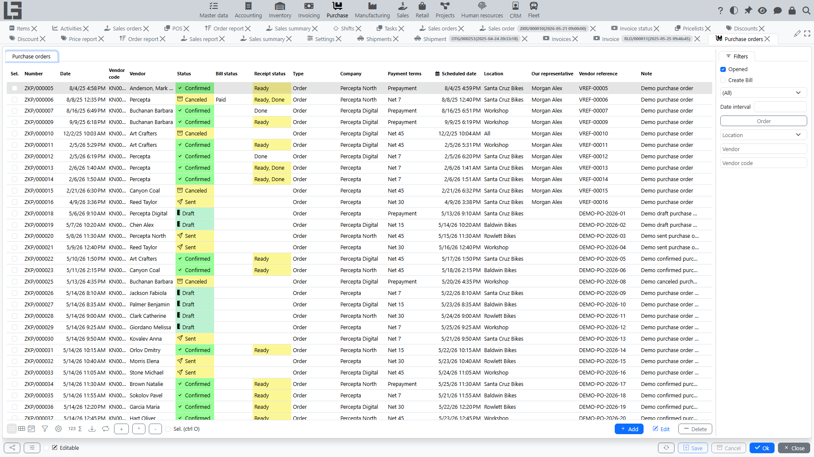
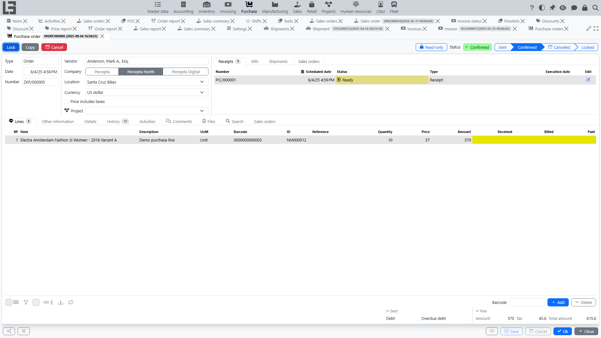

## Where to find

The main forms for working with purchase orders are usually located at **“Purchase” → “Operations” → “Purchase orders”**.

The list has a default **“Opened”** filter that hides locked orders. Status actions (**“Send”**, **“Confirm”**, **“Cancel”**, **“Lock”**) can also be applied to several selected orders at once.

## Purpose

A **purchase order** records an agreement with a [vendor](../masterdata/partners.md) and is used for:

- planning purchases and delivery lead times;
- agreeing price and quantity;
- controlling fulfillment (how much has already been received/registered/paid — depending on enabled flows);
- creating related documents (bills, receipts, etc. — if the corresponding modules are enabled).

## Creating and filling in

When creating a purchase order, you typically fill in:

- **[vendor](../masterdata/partners.md)**;
- **[company](../masterdata/partners.md)**;
- **[location](../inventory/locations.md)** (if [Inventory](../inventory/inventory.md) is used);
- **[currency](../masterdata/currencies.md)** (if multi-currency is used);
- **[payment terms](../invoicing/settings.md#payment-terms)** (if used);
- **scheduled date** (expected delivery);
- **note** and **vendor reference**.

The card footer shows the vendor **“Debt”** and **“Overdue debt”**; clicking a value opens the detailed vendor debt breakdown.

### Order lines

In lines, you specify:

- [item](../masterdata/items.md);
- quantity (the [unit of measure](../masterdata/uom.md) is shown from the item);
- price;
- amount (usually calculated automatically);
- [taxes](../invoicing/taxes.md) (if used).

If the [order type](settings.md) has **“Show packages”** enabled, the lines additionally show package columns. For vendors with **“Other units of measure”** enabled, the lines get editable columns in the vendor unit of measure.

### Selecting items

The item selection grid shows helper columns: stock at the order location (**On hand**, **Expected**, **Available**), the **Previous order** quantity, and the vendor pricelist price with an **“In pricelist”** filter. Line prices are filled in automatically from the vendor [pricelist](pricelists.md) or, when there is no pricelist price, from the item cost.

### Automatic order filling

If inventory shipment planning is enabled, the purchase order card can calculate suggested purchase quantities in the item grid.

1. Select **Vendor**, **Location**, and **Date**.
2. Check **Date from** and **Date to** above the item grid. When you select a vendor, the system fills this period from the order date: the vendor **Order period** days back through the day before the order date. If the vendor has no order period, 7 days are used. You can adjust the period manually before filling the order. If you change the order date afterwards, review these dates before running **Auto order**.
3. Use the **Auto order** filter to show only items with a suggested quantity.
4. Run **Auto order**.

The item grid shows reference columns:

- **Planned** and **Shipped** — shipment quantities for the selected period;
- **Awaiting shipment** — current shipment demand not yet shipped (not limited to the period);
- **Auto order** — suggested quantity to purchase, rounded up to the item purchase pack when a pack is configured.

The **Auto order** action adds lines only for items that are currently visible in the item grid, have a positive **Auto order** value, and are not already present in the order. Existing line quantities are not overwritten.

If manufacturing is enabled, the same calculation also considers material demand: **Awaiting consumption** from manufacturing orders waiting for execution and **Consumed** materials from Done manufacturing orders in the selected period.

## Statuses and actions

Purchase orders typically use the following lifecycle:

1. **Draft** — the order can be edited freely; default status for a new order.
2. **Sent** — the order has been marked as sent via the **“Send”** action. The email to the vendor is sent only when a **“Default template”** is configured in the [order type](settings.md) (subject, body, the printable form attached, and copy-to address are configured there as well; the copy-to address receives a hidden copy); otherwise the action only changes the status. Reachable from “Draft”; from “Sent” you can go directly to “Confirmed”.
3. **Confirmed** — the order is confirmed for fulfillment. Reachable from “Draft” or “Sent”. In this status the **“Create Bill”** action becomes available (when there is a remaining quantity to invoice), and a receipt is auto-created/updated (when a **“Receipt type”** is set in the order type).
4. **Locked** — the order is closed for further work (e.g. after full fulfillment). Reachable only from “Confirmed” via the **“Lock”** action. The [order type](settings.md) can enable restrictions that forbid locking while there are active receipts, incomplete receiving, or unpaid amounts.
5. **Canceled** — the order is excluded from further processing. Reachable from any status except “Draft” and “Canceled”.

Status behavior may differ depending on settings. Usually, after confirmation there are more restrictions on changes.

### Sending a purchase order to a vendor

If sending is configured in your system, the purchase order card provides the **“Send”** action:

- a print form is generated using the selected template;
- an email is sent to the vendor;
- the purchase order is switched to **“Sent”**.

### Confirming a purchase order

The **“Confirm”** action records that the purchase order is ready for further operations.

After confirmation, related documents (for example, a receipt or a bill) and line-level fulfillment control can become available.

### Canceling a purchase order

The **“Cancel”** action marks the purchase order as Canceled.

Usually, Canceled purchase orders are excluded from further automatic operations and process selections.

## Related documents and fulfillment control

The set of related documents depends on enabled modules.

### Receipts (if [Inventory](../inventory/inventory.md) is used)

For a confirmed purchase order, the system may:

- show **how much has already been received** per line;
- maintain a list of related **receipts** in the purchase order card;
- create a receipt in the **“Ready”** status so that the warehouse can start receiving goods.

For details, see: [Receipts for purchase orders](receipts.md).

### Bills and payment (if [“Invoicing”](../invoicing/invoicing.md) is used)

The purchase order card may show a list of related **bills**.

A bill can be created from a purchase order (if this is enabled in your configuration). For details, see: [Bills for purchase orders](bills.md).

The chain is usually as follows:

1. **Bill** — records the amount payable to the [vendor](../masterdata/partners.md).
2. **Outgoing payment** — records payment and reduces debt (after allocation).

See also: [Bills](../invoicing/bills.md), [Outgoing payments](../invoicing/outgoing-payments.md), [Payment allocation](../invoicing/payments.md).

### Sales orders (if [Sales](../sales/orders.md) is used)

The purchase order card has a **“Sales orders”** tab where you can add lines of confirmed [sales orders](../sales/orders.md): the purchase order lines are created or updated for the required quantities, and the purchase order fulfills the linked sales demand.

## Additional capabilities

### Attachments

You can attach files to a purchase order (for example, bills of materials, correspondence, quotations) and view them in the document card.

### Copying a purchase order

To speed up work, you can create a new purchase order by copying an existing one and then adjusting the header fields and lines.
