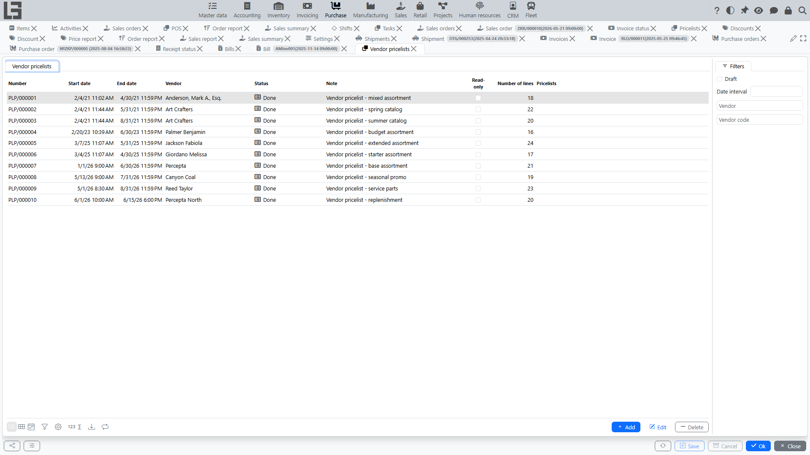
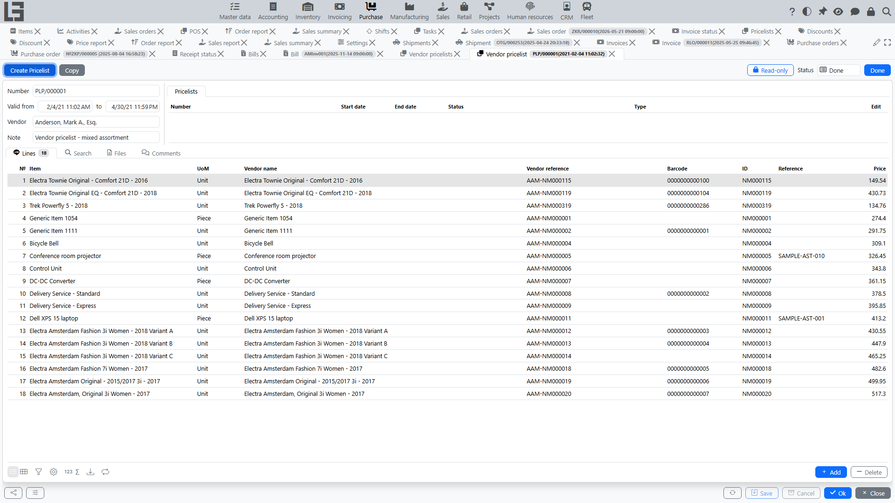

## Where to find

Forms for working with pricelists are usually located at **“Purchase” → “Operations” → “Vendor pricelists”**.

## Purpose

A **pricelist** stores [vendor](../masterdata/partners.md) prices and is used for:

- preparing purchase prices;
- filling in prices when creating [purchase orders](orders.md) and [vendor bills](bills.md);
- recording price changes by periods.

## Pricelist structure

In a pricelist, you typically specify:

- [vendor](../masterdata/partners.md);
- validity period (start/end date);
- note.

### Pricelist lines

In lines, you specify:

- [item](../masterdata/items.md);
- price;
- if needed — the vendor's own item name and code (columns **“Vendor name”** and **“Vendor reference”**).

Lines can also be added on the **“Search”** tab of the pricelist card: it shows the category tree and the item list with an editable **“Price”** column — enter a price for an item to add it to the pricelist.

If the vendor is flagged **“Other units of measure”**, the lines also show a **“UoM (partner)”** column. This unit of measure is carried into purchase orders, and the price is recalculated by the ratio between the item's unit and the vendor's unit.

## Comments and files

The pricelist card may contain a comment feed:

- add comments to record agreements and the source of prices;
- view the date/time and author of comments.

The **“Files”** tab stores files attached to the pricelist (for example, the source file of an import).

## Pricelist statuses

A pricelist usually goes through two statuses:

1. **Draft** — price values can be edited; the pricelist list can be filtered by the **“Draft”** filter.
2. **Done** — the pricelist is in effect; prices become a source for substitutions into purchase orders.

The transition to “Done” is performed via the **“Mark as Done”** action on the pricelist card.

A pricelist becomes read-only if its status is marked **“Read-only”** in the [purchase settings](settings.md) (**“Purchase” → “Configuration” → “Settings”**); in addition, any pricelist can be locked manually with the lock toggle on its card.

## How prices are applied

When prices are filled into documents:

- only pricelists in the “Done” status whose validity period covers the document date are considered;
- if several pricelists match, the one with the latest start date is used;
- if no pricelist price is found, the item cost is used as a fallback.

Prices are substituted into [purchase orders](orders.md) and [vendor bills](bills.md). The current pricelist also defines the default vendor when purchase orders are created automatically for items to be ordered.

## Importing prices from an external source

If a **pricelist import type** resolves for the [vendor](../masterdata/partners.md) (its own or the default one), the pricelist card for this vendor shows an **“Import”** action:

1. In **“Purchase” → “Configuration” → “Settings”**, create/select a pricelist import type and define its script (for example, an XLSX/CSV parser or an external-API call).
2. On the import type edit form, open the **“Vendors”** tab and check **“Incl.”** for this vendor.
3. Create a pricelist for this vendor and click **“Import”** — the script populates the lines automatically.

The **“Import”** action appears whenever an import type resolves for the pricelist — the vendor's own type or the default one; for a read-only pricelist the action is disabled.

## Importing a pricelist

You can import pricelist lines from an external file using configurable **import types**.

### Import types

Open **“Purchase” → “Configuration” → “Settings”** and use the **Pricelist import types** block to manage import types. For each type you can specify:

- **Name** — what users see when selecting the type;
- **Script** (the “Script” tab) — optional script executed by the **“Import”** action; the **“Generate”** action builds a ready-made XLS import script from the column letters and the start row;
- **Prompt** (the “Import (GPT)” tab) — instructions sent to GPT (filled with a sensible default via the **“Default”** action).

On the import type edit form you can also:

- mark the vendors that should use this type (the **“Vendors”** tab, **“Incl.”** checkbox) — each vendor can have only one import type at a time;
- mark the type as **Default** (switch) — this is the fallback used for vendors that do not have their own import type assigned.

### Default import type

If a pricelist's vendor has no import type assigned, the system uses the import type marked as **Default** on the import type edit form. The **Import** button on the pricelist card appears whenever an import type (vendor-specific or default) is available.

### GPT-based import

When the import type has a GPT **Prompt** defined, the regular **“Import”** action additionally runs the GPT import (“Import (GPT)” is the tab on the import type form where the prompt is defined). The action:

- opens a dialog to select an item category — reference data is limited to that category;
- asks you to choose the source file;
- sends the file together with reference data (current vendor, other vendors, items, and previously used vendor names/SKUs) to [OpenAI](../administration/openai.md);
- reads the returned JSON and creates pricelist lines; besides the lines, it can fill header fields (validity period, vendor) from the file;
- attaches the source file to the pricelist (the “Files” tab).

The default prompt instructs the model to include **every** line from the source file in the output, even when an item cannot be matched — in that case the `item` field is left empty while `vendorReference`, `vendorName`, and `price` are still filled. This way you do not lose lines that need manual item mapping after import.

## Copying a pricelist

If you need to quickly create a new pricelist based on a previous one (for example, for a new period), use copying:

- a new pricelist is created;
- header fields and lines are copied;
- then you can update the validity period and adjust prices.

## Creating a sales pricelist

For a pricelist in the “Done” status, the card shows a **“Create Pricelist”** button (available when a sales pricelist type is set in the [purchase settings](settings.md), field **“Type of price list for sale”**). It creates a [sales pricelist](../sales/pricelists.md) from the pricelist lines; the linked sales pricelists are shown on the **“Pricelists”** tab of the card.

## Related views

- the **“Purchase”** tab of the [vendor](../masterdata/partners.md) card lists the vendor's pricelists;
- the **“Purchase”** tab of the [item](../masterdata/items.md) card shows the item's pricelist history (prices, periods, vendors).
