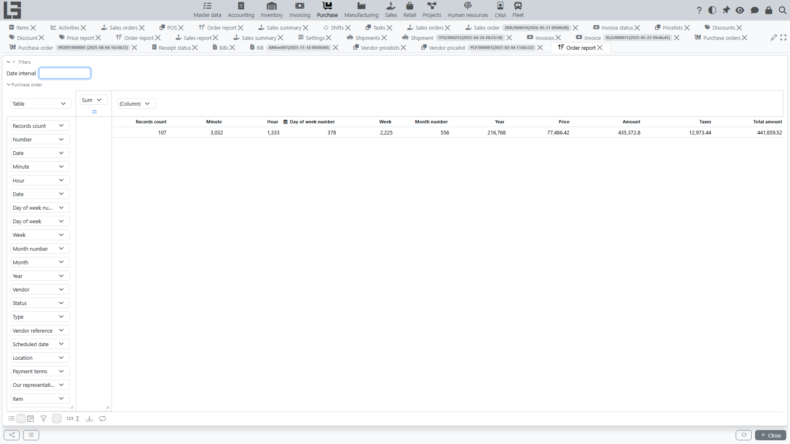

## Where to find

Purchase reporting consists of a single report — the **“Order report”**, located at **“Purchase” → “Reporting” → “Order report”**.

## Order report

The report allows you to analyze purchase orders by:

- [vendors](../masterdata/partners.md);
- statuses;
- dates;
- [items](../masterdata/items.md) and categories (if classification is used);
- item attribute columns (see [items](../masterdata/items.md));
- purchase order fields (type, [payment terms](../invoicing/settings.md#payment-terms), “Scheduled date”, “Vendor reference”, “Our representative”, etc.).

The report shows only orders whose location the user has access to (as well as orders without a location).

### Date filters and grouping

The report provides:

- a date interval filter;
- ready-made date columns in the pivot table — day of week, week, month, year, etc. — which can be used for grouping.

### What to use it for

The report is useful for:

- controlling “what has been ordered” and “from whom it has been ordered”;
- analyzing scheduled delivery dates;
- preparing reconciliations with vendors.