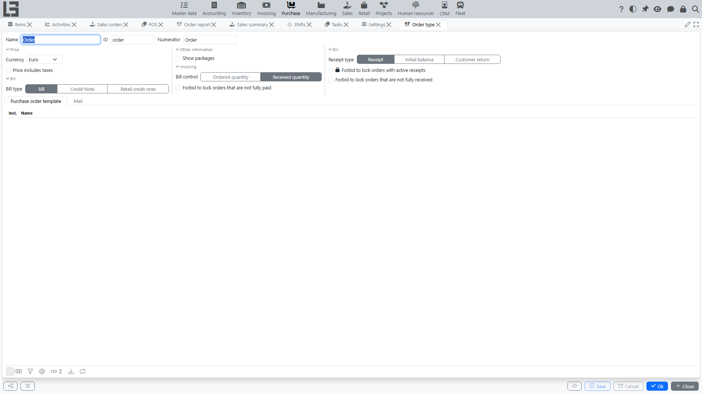

## Where to find

Settings are usually located at **“Purchase” → “Configuration” → “Settings”**.

## Purchase order type

Most purchase behavior is configured on the **purchase order type**. For each type you can set:

### Basic fields

- **numerator** — number format and counter for orders;
- **default currency** and the “price includes taxes” flag;
- **“Show packages”** flag — adds packaging-unit columns to order lines (see [Number of packages](../inventory/product-sku.md#alternative-accounting-in-packages-units-in-documents)).

The location and payment terms are not set on the order type: the location is specified on each order, and the payment terms default from the vendor card.

### Links to other documents

- **Receipt type** — which document is created as a reserve receipt when the order is confirmed (see [Receipts for purchase orders](receipts.md));
- **Bill type** — which document is created by the “Create bill” action (see [Bills for purchase orders](bills.md));
- **Bill control** — “Ordered quantity” or “Received quantity”; defines which quantity is transferred to the bill.

Purchase orders do not create manufacturing orders; it works the other way around — manufacturing demand can feed purchase auto-ordering (see [Automatic order filling](orders.md#automatic-order-filling)).

### Sending a purchase order to a vendor

Fields used by the **“Send”** action:

- **“Default template”** — the printable form attached to the email;
- **Topic** — email subject;
- **email body**;
- **“Copy to”** — an address that receives the email as a hidden copy (Bcc).

The **“Send”** action is always available on the order card in the “Draft” status. If a template is configured, an email with the attached printable form is sent to the vendor; otherwise the action simply moves the order to “Sent”.

### Lock restrictions

Three independent flags affect the **“Lock”** action (it moves the order to the “Locked” status):

- **“Forbid to lock orders with active receipts”** — prevents locking while a reserve receipt is in “Ready”;
- **“Forbid to lock orders that are not fully received”** — prevents locking while there is a remaining quantity to receive;
- **“Forbid to lock orders that are not fully paid”** — prevents locking while not all quantity is paid.

Without these flags, locking proceeds without checks (and the reserve receipt is simply deleted).

## Pricelist import type

A separate **Pricelist import type** (with a script) is configured globally; it powers the **“Import”** action on a vendor’s pricelist card. See [Vendor pricelists → Importing prices](pricelists.md#importing-prices-from-an-external-source).

In the **“Pricelist import types”** block of the Settings form, the **“Default”** column marks the fallback import type used for vendors that have no import type of their own (see [Default import type](pricelists.md#default-import-type)). Each import type card also has a **“Vendors”** tab where the vendors using this type are selected.

## Other master data that affects purchase behavior

- **[vendors](../masterdata/partners.md)** — header fields, pricelist import type, the **“Order period”** field used by automatic ordering;
- **[items](../masterdata/items.md)** and **purchase packages** — used by auto-order to round quantities;
- **[taxes](../invoicing/taxes.md)** and **[currencies](../masterdata/currencies.md)** — common master data.