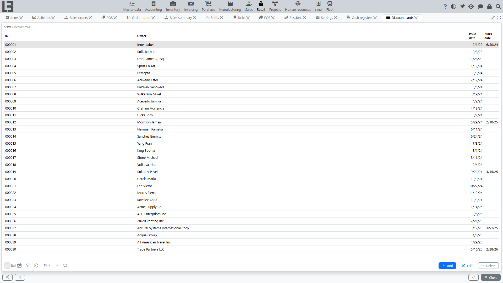

A discount card identifies a customer at the [cash register](pos.md): when a card is entered on a receipt, the receipt’s customer is set from the card’s holder. A card does not carry a discount percentage of its own — any discount comes from the [discount rules](../sales/discounts.md) that apply to the linked customer.

## Where to find it

**“Retail” → “Configuration” → “Discount cards”**.

## Main card data

A discount card has:

- **ID** — the card identifier; it is the code scanned at the POS;
- **owner** — the customer the card belongs to;
- **issue date**;
- **block date** — set when the card is blocked.

## Issuing a card

A card can be created:

- in the **“Discount cards”** list — create a card and specify its owner;
- from a customer’s card — on the partner’s **“Discount cards”** tab, where a new card is created already linked to that customer.

The card ID is assigned automatically by the numerator.

## Blocking a card

A card is blocked by setting a **block date**. The block date cannot be earlier than the issue date.

Blocking is effective from the block date: the card is rejected only on a receipt or invoice dated **on or after** that date. A future block date leaves the card usable until it arrives.

A blocked card cannot be used: at the POS the system shows **“Discount card blocked”** and does not attach it to the receipt; on a sales invoice the card fails validation.

## Using a card

- **At the POS** — enter or scan the card ID in the barcode field. The card’s holder becomes the receipt customer (see [Cash register and POS](pos.md)).
- **On a sales invoice** — the card is not selected directly on the standard [sales invoice](../invoicing/invoices.md) form; the card field is exposed at the POS. When a receipt (invoice) does carry a card, the system fills in the customer from the card and validates that the card matches the customer and is not blocked.
