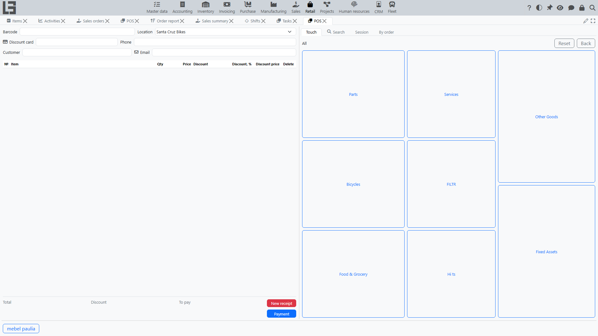
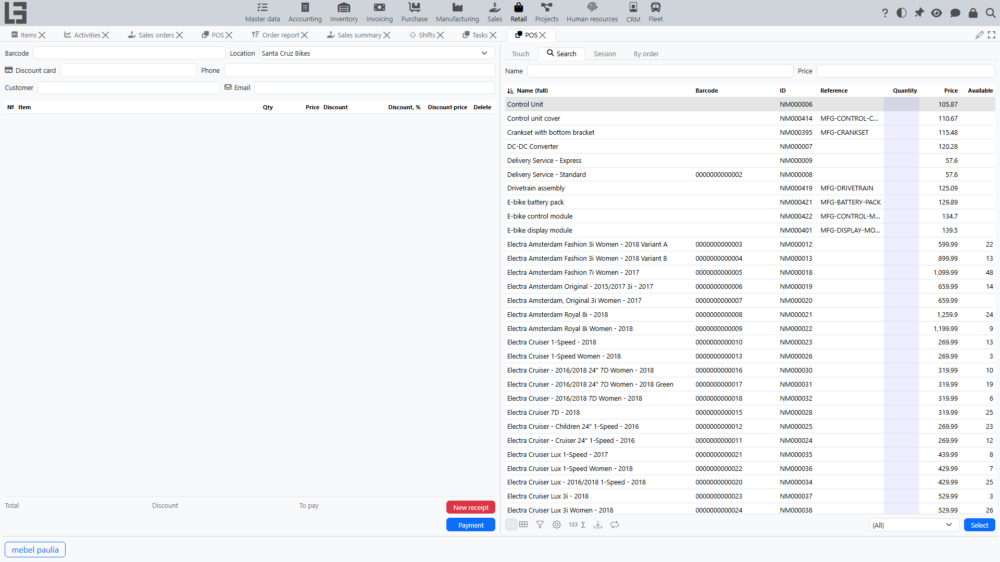
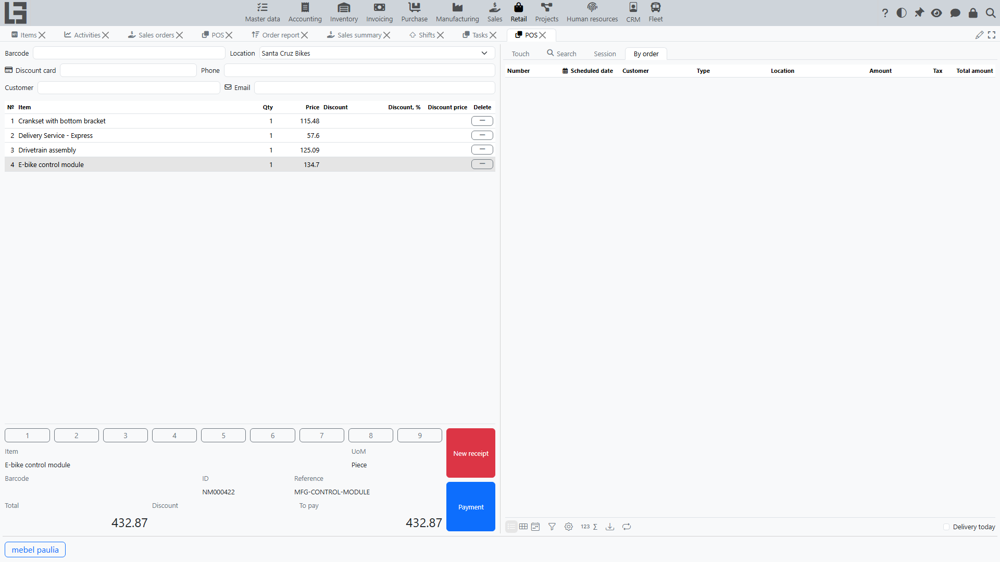
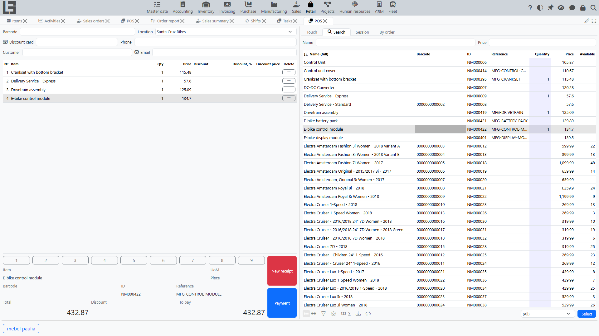
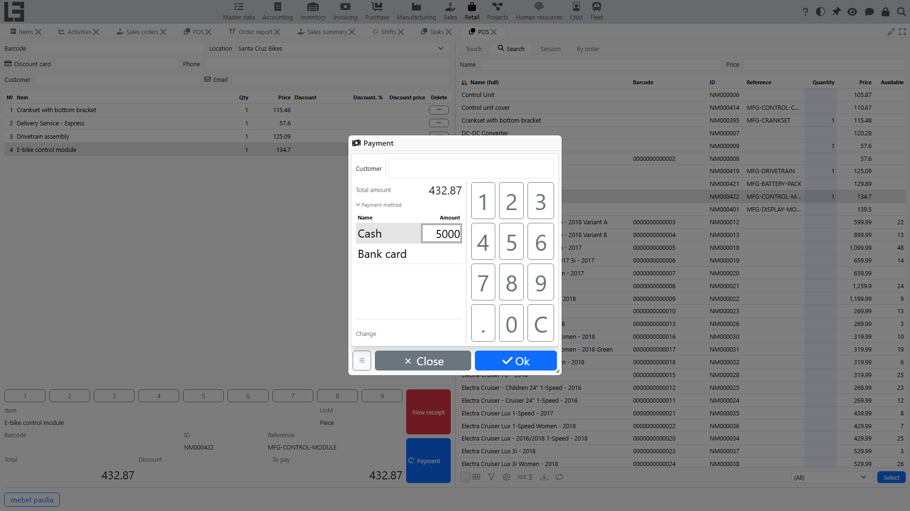
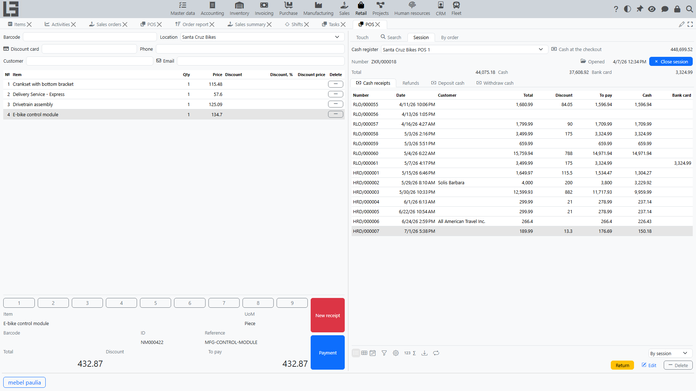

The **POS** screen (the cashier dashboard) is where a cashier processes sales and returns: opening and closing a [session](sessions.md), building a receipt, searching and scanning items, applying discounts and [discount cards](discount-cards.md), taking payment, and depositing or withdrawing cash.

## Where to find it

- **POS** — **“Retail” → “Operations” → “POS”**.
- **Sessions** list — **“Retail” → “Operations” → “Sessions”**.
- **Cash registers** (POS terminals) are configured in **“Retail” → “Configuration” → “Cash registers”** (see [Settings](settings.md)).

## Screen layout

The POS screen has two panes:

- the **left pane** — the current receipt: its header (the barcode field and customer), the list of receipt lines, item details and totals, the numeric keypad, and the action buttons;
- the **right pane** — a set of tabs: **Touch**, **Search**, **Session**, and **By order**.

A row of **hotkey buttons** for frequently sold items is shown at the bottom of the screen (see *Adding items* below).

## Selecting the cash register and session

On the **Session** tab, select the **cash register**. If the current computer is linked to cash registers, only those are offered for selection; otherwise all cash registers are available. In either case the selector also hides registers whose **location** you are not allowed to access (registers without a location stay visible).

To start working, open a **[session](sessions.md)**:

- press **“Open session”** on the Session tab — it is shown only while no session is open;
- the opening date/time and the session number appear, and the receipt area becomes available.

> If a session is already open for the cash register, the system shows **“There is already an open session”** and will not open a second one.

To finish, press **“Close session”** and confirm.

> Closing first discards the current unfinished receipt. Complete or deliberately abandon the receipt in progress before closing the session.

The **“Cash at the checkout”** field on the Session tab shows the current cash balance of the cash register.

## Building a receipt

A receipt is a sale document created inside the session. A new empty receipt is created automatically when a session is opened and after each completed payment.

### Adding items

Items can be added in several ways:

- **Barcode** — type or scan a code into the barcode field at the top of the receipt. The system recognises an item barcode, a lot code, or a [discount card](discount-cards.md). An unrecognised code produces a **“Barcode not found”** message.
- **Search tab** — find an item by **name** (`F6`) or by **price** (`F7`), then double-click it or set its quantity to add it to the receipt. The **“In document”** filter (`Shift+F10`) shows only items already on the receipt; the **“Available”** filter (`F10`) shows only products with available stock (non-stock items such as services are always shown). The list is automatically limited to active items that are allowed for sale and have a sales price.
- **Touch tab** — a tiled grid of categories and items with pictures. Tap a category to drill down, tap an item to add it; use **“Back”** and **“Reset”** to navigate. Categories and items can be hidden from this grid in the **“Touch”** tab of the Settings form.
- **Hotkey buttons** — items that have the **“Hot key (name)”** field filled in on the item card appear as quick-add buttons at the bottom of the POS screen.

### Changing a line

- **Quantity** — edit it directly in the line, or use the on-screen **numeric keypad**. Entering `0` on the keypad removes the line.
- A line can also be removed with the delete action in the line grid.
- The selected line shows item details (name, unit of measure, barcode, code, reference) below the list.

### Receipt totals

The bottom of the receipt shows **Total**, **Discount**, and **To pay**.

### New receipt

**“New receipt”** (`Shift+F12`) discards the current unfinished receipt — after a confirmation prompt — and starts a new one in the same session.

## Customer and discount card

A customer can be set on the receipt:

- enter or scan a **[discount card](discount-cards.md)** — the card’s holder becomes the receipt customer;
- or set the **customer** directly (`F5`).

The customer’s phone and email can also be entered. The customer is carried into the completed sale and into the payment.

## Discounts

Each receipt line has a **discount** selector and **discount** / **discount price** columns. A discount can be picked manually for a line, and automatic discounts are calculated by the rules of the [Sales discounts](../sales/discounts.md) module (by item, customer, quantity, and so on).

## Selling against an order

The **“By order”** tab lists confirmed [sales orders](../sales/orders.md) for the receipt’s customer (or orders without a customer if none is set on the receipt). The **“Delivery today”** filter narrows them to orders scheduled for the current date. **“Add to receipt”** copies the order lines into the current receipt.

## Marked goods and lots

If an item is tracked by lots, its lot codes are scanned into the receipt, and the system tracks the scanned quantity against the line quantity. Mandatory goods marking (for example, the “Chestny Znak” system) is handled by the Russian configuration.

## Taking payment

Press **“Payment”** (`Ctrl+Enter`) — the button becomes active once the receipt has an amount. In the payment dialog:

- enter the amount received for one or several **[payment methods](payments.md)** (split payment is allowed);
- if no amount is entered at all, pressing **“Ok”** assigns the whole **To pay** to the currently selected payment method;
- for cash, the **change** is calculated automatically;
- the payment cannot be confirmed if a non-cash method (for example, a bank card) exceeds **To pay**.

On confirmation the system records the payments, completes the receipt, and automatically opens the next empty receipt. See [Retail payments](payments.md) for details.

## Example: a sale from items to checkout

A full walkthrough of a sale at the cash register.

### Step 1. Open a session

Open the **POS** screen, select the cash register on the **Session** tab, and press **“Open session”**. The system creates an empty receipt — you can start the sale.

### Step 2. Add items to the receipt

Add items in any convenient way:

- scan the item barcode into the barcode field;
- or, on the **Search** tab, find the item by name or price and double-click it;
- or pick the item on the **Touch** tab or with a hotkey button.

Each added item appears as a receipt line with quantity, price, and (if applicable) discount. To add the same item again, scan it once more or change the line quantity.

### Step 3. Check quantities and discounts

- Adjust the **quantity** in the lines — directly in the line or with the on-screen numeric keypad; entering `0` on the keypad removes the line.
- If needed, set the **customer** or scan a **discount card** — this may change the applied discounts.
- Watch the totals at the bottom of the receipt: **Total**, **Discount**, and **To pay**.

### Step 4. Go to payment

Press **“Payment”** (`Ctrl+Enter`) — the button is active once the receipt has an amount. The payment dialog opens, showing the receipt amount.

### Step 5. Settle with the customer

In the payment dialog:

- enter the amount received for the relevant **payment method** (for example, “Cash”) — the amount can be typed on the on-screen keypad;
- if needed, split the payment across several methods (for example, part cash, part card);
- for cash, the system calculates and shows the **change** to give back to the customer.

The payment cannot be confirmed if the entered amount is insufficient or a non-cash method exceeds the amount to pay. The **“Close”** button closes the dialog without taking payment.

### Step 6. Complete the receipt

Press **“Ok”**. The system:

- records the payments and completes the receipt — the sale is now recorded;
- attempts to print/register the receipt on the fiscal device, if one is connected;
- automatically opens the next empty receipt for a new sale.

The completed receipt appears in the **“Cash receipts”** list on the **Session** tab and in the session totals.

## Cash operations

On the **Session** tab, the **“Deposit cash”** and **“Withdraw cash”** lists provide the actions:

- **“Deposit cash”** — register a cash deposit into the checkout;
- **“Withdraw”** — register a cash withdrawal.

Both open a numeric-keypad dialog for the amount. Open a session before using them: the operation is tagged with the open session if there is one. The two lists show the cash register’s deposits and withdrawals by its cash account (not only those of the current session), so they may also include earlier operations.

> The **“Deposit cash”** and **“Withdraw”** buttons are available only if the cash register has a **cash account** — the account for the **“Cash”** payment method. If it is not configured, the buttons are disabled (and the “Cash at the checkout” field is empty). This account is set on the cash-register card — see [Retail settings](settings.md).

## Fiscal registration

If a fiscal device is connected to the cash register, opening and closing a session, sales, returns, and cash operations are registered on it, and the POS screen provides the corresponding fiscal commands (such as printing an X-report). **Session opening and closing** are fiscalized first and gate the change: if the device fails, the session does not open (or close). **Sales, returns, and cash deposits/withdrawals** are fiscalized **after** they have already been recorded, so a device error can leave such a document completed but not fiscalized; it then shows a fiscal status and offers a **“Fiscalisation”** retry action (available while the fiscal session is open). Fiscal registration depends on your configuration and region.

## Returns

A return is processed from the **Session** tab: select the original sales receipt in the **“Cash receipts”** list and press **“Return”**. That list can be filtered **“By session”**, **“By POS”**, or **“Same location”**.

The full procedure — adjusting return lines, the return payment, and the rules for refunding by payment method — is described in [Returns](returns.md).

## Session results

The **Session** tab shows the session number, opening time, and totals, including the **net** amount for each payment method (payments received in sales minus payouts in returns). The **“Cash receipts”** and **“Refunds”** lists show the sales and returns made in the session.

