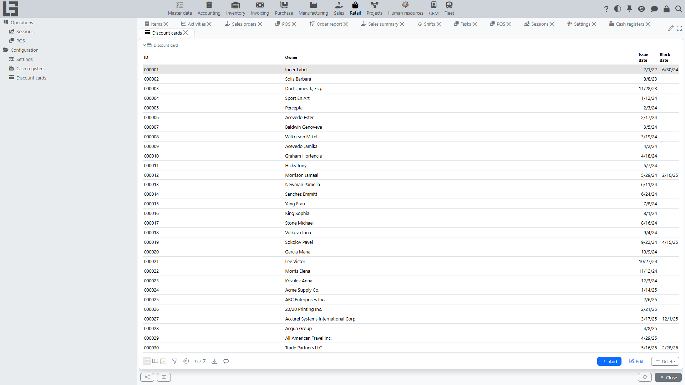

This documentation describes how to work with the **“Retail”** section: configuring **[cash registers](settings.md)**, managing **[sessions](sessions.md)**, processing sales and returns in **[POS](pos.md)**, applying **[discounts](../sales/discounts.md)** and **[discount cards](discount-cards.md)**, and taking **[payments](payments.md)**.

If some menu items or actions are missing in your configuration, this is normal: available functionality depends on enabled modules and settings.

## Who this section is for

The **“Retail”** section is typically used by:

- **Cashier** — processes sales and returns, takes payment, prints/sends a receipt to the customer.
- **Senior cashier / administrator** — opens and closes sessions, monitors operations for a cash register.
- **System administrator / person responsible for settings** — configures cash registers, payment methods, discount cards, and POS parameters.

## Contents

- [Quick start](#quick-start)
- [Navigation](#navigation)
- [Terms](#terms)

Sections:

- [Cash register and POS](pos.md)
- [Returns](returns.md)
- [Sessions](sessions.md)
- [Retail payments](payments.md)
- [Discount cards](discount-cards.md)
- [Settings](settings.md)

## Quick start

### Scenario: open a session → process a sale → take payment → close the session

1. In **“Retail” → “Configuration”** make sure that:
   - **cash registers** are created and (if needed) linked to computers — in the **“Cash registers”** directory;
   - **payment methods** are configured — on the **“Settings”** form.
2. Open **“Retail” → “Operations” → “POS”**.
3. Select the cash register and open a session with **“Open session”**.
4. Add items to the receipt (search / barcode scanning / touch grid); if needed, apply a discount or discount card.
5. Proceed to payment, enter amounts by payment methods, and confirm.
6. When finished, run **“Close session”**.

### Scenario: process a customer return

A POS return is processed against the original sales receipt:

1. Open POS.
2. On the **Session** tab, find the original receipt in the **“Cash receipts”** list and press **“Return”**.
3. Adjust the items and quantities being returned.
4. Process the return payment (cash-out): for each payment method you can refund at most what was paid by that method in the original receipt, and the refund total must equal the return amount.

Details: [Returns](returns.md).

## Navigation

The **“Retail”** section contains two groups:

- **Operations** — the **POS** cashier screen and the **Sessions** list.
- **Configuration** — the **Settings** form and the **Cash registers** and **Discount cards** directories.

Typical menu items:

- **“Retail” → “Operations” → “POS”** — the cashier screen for sales and returns.
- **“Retail” → “Operations” → “Sessions”** — the session list.
- **“Retail” → “Configuration” → “Settings”** — section parameters.

## Terms

### Cash register

A **[cash register](settings.md)** is a workplace used to process sales and returns. As a rule, a cash register is linked to a specific computer/device.

### Session

A **[session](sessions.md)** is a period of cash register operation between **opening a session** and **closing a session**. POS operations are performed within an open session.

### POS

**[POS](pos.md)** is a cashier screen for processing sales and returns: creating a receipt, adding items, applying discounts, and proceeding to payment.

### Receipt

The result of processing a sale or return (in **[POS](pos.md)**): list of lines, prices, discounts, To pay, and payment method(s).

### Payment method

A **[payment method](payments.md)** is a rule by which money is received (for example, cash or bank card) and the related financial operations are formed.

### Discount card

A **[discount card](discount-cards.md)** is a card that identifies a customer on the receipt; the receipt’s customer is set from the card’s holder.