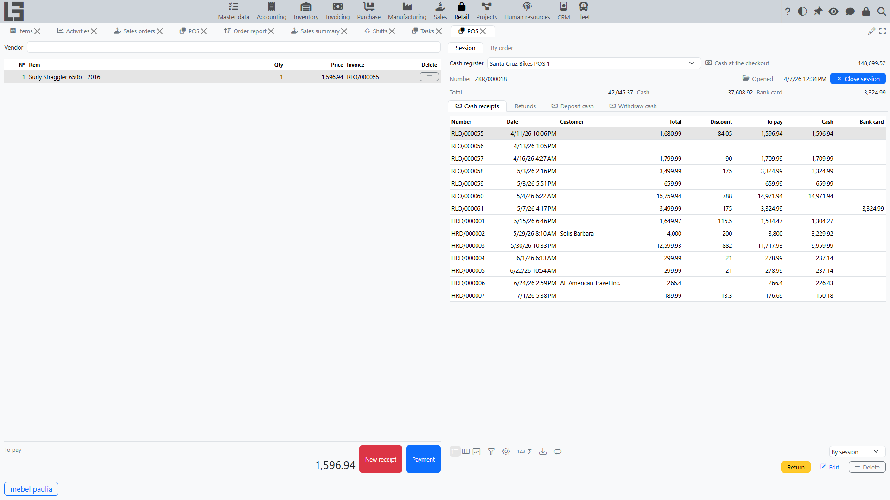
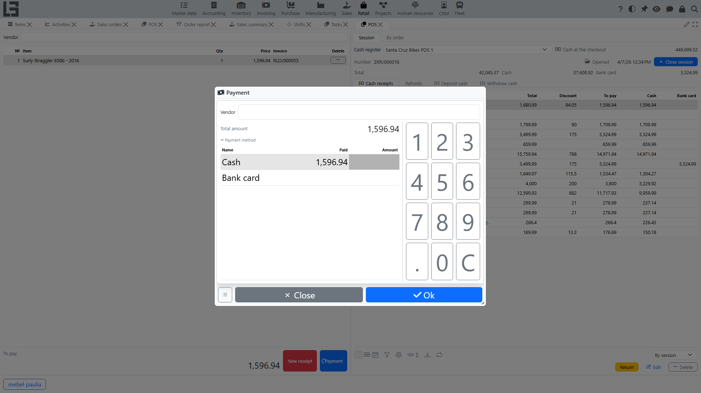

This page describes a typical process of returning goods by a customer in **[POS](pos.md)**: how to find the original receipt, create a return by receipt lines, and pay out funds.

> If some actions or fields are missing in your configuration, this is normal: the set of available features depends on enabled modules and settings.

## Where to find it

- POS: **“Retail” → “Operations” → “POS”**.

## Before processing a return

1. Make sure there is an open session for the cash register (see [Sessions](sessions.md)).
2. Prepare information about the original sale:
   - receipt number (if known);
   - purchase date/time;
   - purchased items and approximate quantities.

## Return by original receipt

This is the main scenario: the return is processed based on a previously issued sales receipt.

### Step 1. Find the original receipt

On the **Session** tab, the **“Cash receipts”** list shows sales receipts. Switch its filter to find the required receipt:

- **“By session”** — receipts of the current session;
- **“By POS”** — receipts of the cash register;
- **“Same location”** — receipts of the cash register’s location.

Select the original sales receipt in the list.

### Step 2. Create a return

Run the **“Return”** action.

The system creates a return (a credit note) for the selected receipt and:

- fills the **return partner** (the “Vendor” field) from the original receipt’s customer;
- fills the return lines with the items of the original receipt;
- copies each line’s **effective price after discount** and its taxes from the original sale, so the return amount matches the selected items and quantities.

### Step 3. Adjust items and quantities being returned

Check the return lines:

1. If not everything is returned, decrease the quantity for the required lines.
2. If a line should not be returned, delete it from the return.

If return quantity control is enabled in your configuration, the system will not allow returning more than was sold in the original receipt.

### Step 4. Pay out funds (return payment)

The pay-out is processed in a separate return payment form:

1. Check the return amount.
2. Enter amounts for one or multiple payment methods.
3. Confirm the pay-out.

#### Important rule about payment methods

The return payment is restricted: **you cannot refund more by a payment method than was paid by that method in the original receipt**, and the total refunded must equal the return amount. The limit is checked per return against the original receipt (earlier returns of the same receipt are not deducted).

Example: if the purchase was paid partly in cash and partly by bank card, then the return usually has to be split by the same payment methods within the paid amounts.

After confirming the return payment, POS usually creates a new receipt for further work.

## Common cases

### Cannot process a return: there is no open session

Open a session for the required cash register and try again. Returns are processed within a session.

### Cannot confirm the return payment amount

Check that:

- the total amount across all selected payment methods is **equal** to the return amount;
- for each payment method, the refunded amount does not exceed the amount paid by that payment method in the original receipt.

### No original receipt

A POS return is always processed against an original sales receipt. If the original receipt cannot be found in the **“Cash receipts”** list, switch the filter to **“By POS”** or **“Same location”** to widen the search. A return without an original receipt is not supported at the POS.