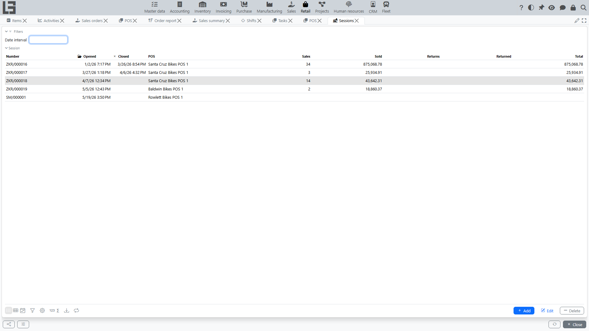

A session is the period of **[cash register](settings.md)** operation between opening and closing. Sales and returns in **[POS](pos.md)** are processed within an open session.

## Where to find it

**“Retail” → “Operations” → “Sessions”**.

## How to open a session

A session is opened from the **[POS](pos.md)** screen, not from the session list:

1. Open **“Retail” → “Operations” → “POS”**.
2. On the **Session** tab, select the **[cash register](settings.md)**.
3. Press **“Open session”**.

The system records the opening date and time and assigns the session number.

### Restrictions

- You cannot open a session if there is already an open session for the cash register — the system shows **“There is already an open session”**.

## How to close a session

On the **POS** screen, press **“Close session”** on the Session tab and confirm.

The system records the closing date and time.

## What a session shows

A session aggregates the operations performed at the cash register while it was open:

- **“Sales”** — the number of sales;
- **“Sold”** — the total amount of sales;
- **“Returns”** — the number of returns;
- **“Returned”** — the total amount of returns;
- **“Total”** — sales minus returns;
- the amount paid by each **[payment method](payments.md)**;
- the **“Cash receipts”** and **“Refunds”** lists;
- cash **deposits** and **withdrawals** and the resulting cash balance.

The standalone **“Retail” → “Operations” → “Sessions”** list is used to browse and review sessions — the sales and returns count and amount columns are shown there.

