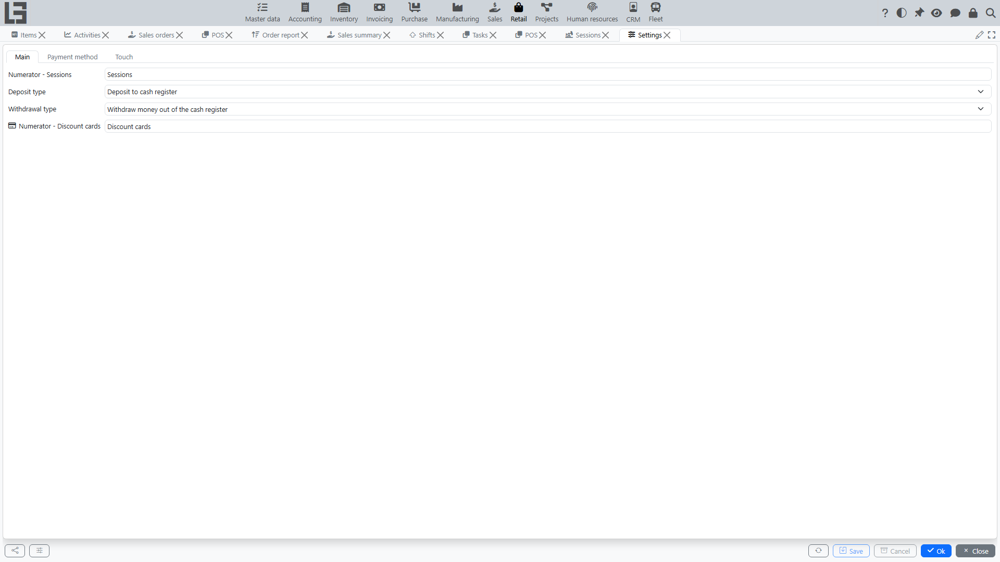
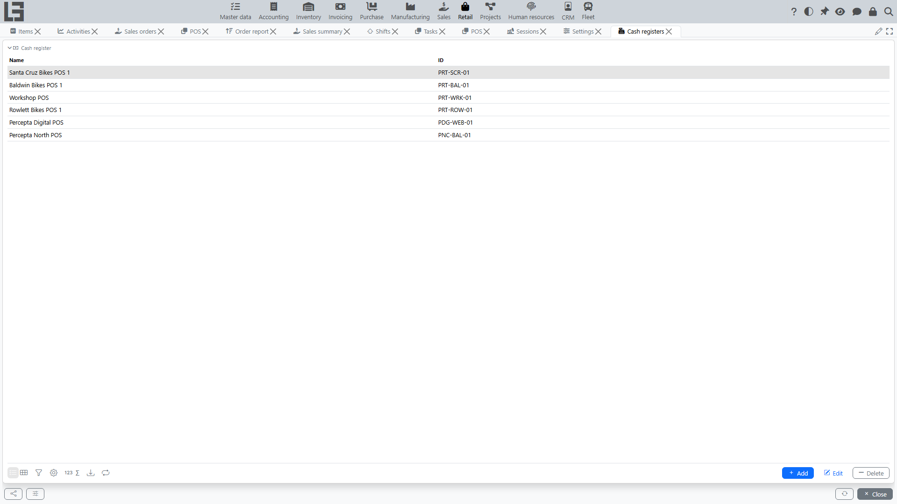

This page describes the basic settings that affect how the **[cash register](pos.md)** and **[POS](pos.md)** work.

## Where to find it

Settings are usually located in **“Retail” → “Configuration” → “Settings”**.

In most configurations, the main directories (cash registers, payment methods, discount cards) are available directly from this section.

## Cash registers

A cash register is a workplace from which sales and returns are processed.

Where to find: usually **“Retail” → “Configuration” → “Cash registers”**.

Typically configured:

- cash register **name** and **code**;
- **company**;
- linking the cash register to a **computer** (so that a specific computer suggests “its” cash register);
- **accounts per payment method** — on a separate cash-register tab you can specify, for each **[payment method](payments.md)**, the **account** that payments received with that method are posted to.

> **Cash account.** For the **“Deposit cash”** and **“Withdraw”** operations to work on the POS screen (and for the **“Cash at the checkout”** balance to show on the Session tab), the cash register must have an **account** specified for the **“Cash”** payment method. Until the cash account is set, the cash deposit and withdrawal buttons on the POS screen stay **disabled**. In addition, the **“Deposit type”** and **“Withdrawal type”** must be configured on the **“Main”** tab of the Settings form for the deposit/withdrawal operations themselves.

> **Central checkout account vs. the till.** The **“Cash account”** field in the cash-register header is the **central checkout account** — the counterparty for the **“Deposit cash”** and **“Withdraw”** operations: a deposit moves money from this central account into the **till** (the account assigned to the **“Cash”** payment method), and a withdrawal moves it back. For this reason the header **“Cash account”** must be a **different account** from the one assigned to the **“Cash”** payment method. If they are the same, a deposit/withdrawal posts both legs to one account, nets to zero, and the **“Cash at the checkout”** balance never changes. The system enforces this and will not save a cash register that uses the same account in both places.

## Sessions

**[Sessions](sessions.md)** are numbered automatically. The session numerator is selected on the **“Main”** tab of the Settings form.

## Payment methods

The list of payment methods is maintained on the **“Payment method”** tab of the Settings form (see also: **[Retail payments](payments.md)**). For each method you specify:

- **name** and **code**;
- the **“Cash”** flag — marks the method as cash (only one method can be cash; it is used to calculate change);
- the **“Incoming payment type”** and the **“Return payment type”** — the payment types used when the method is received in a sale and refunded in a return.

## Discount cards

**[Discount cards](discount-cards.md)** are numbered automatically; the discount-card numerator is selected on the **“Main”** tab of the Settings form. The card list itself is in **“Retail” → “Configuration” → “Discount cards”**.