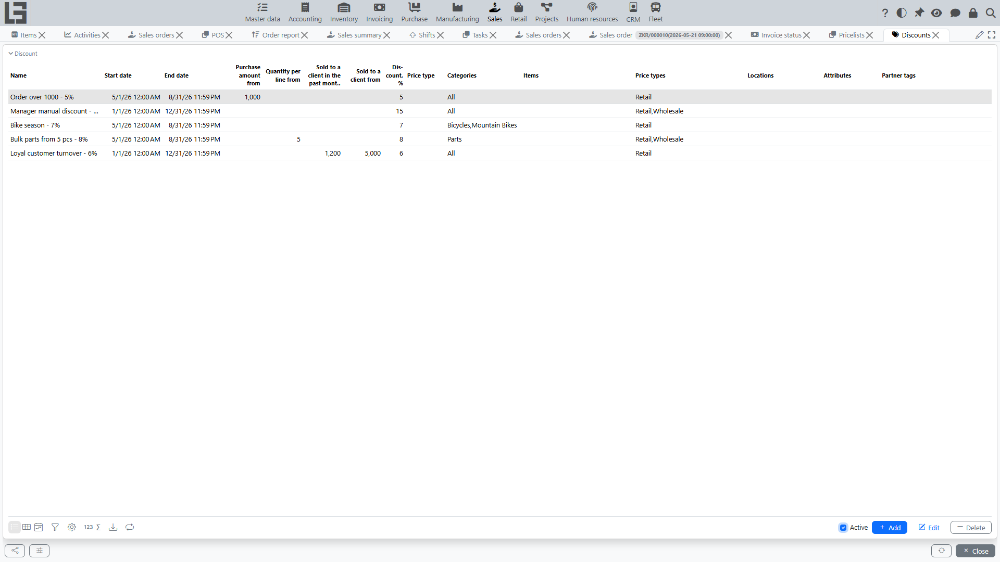
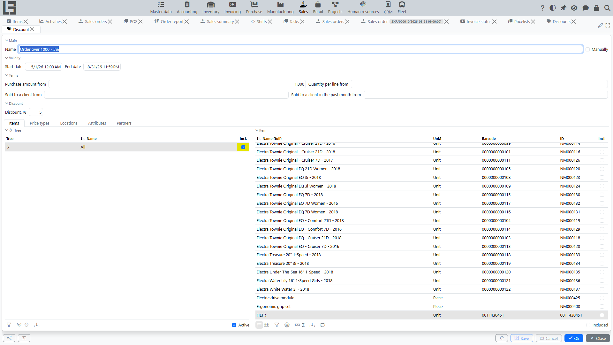

In the system, a discount is a separate **“Discount”** object that can be applied to sales document lines (primarily, to [sales order](orders.md) lines).

A discount can be defined:

- as a **discount percent**;
- as a **price from a price type** (that is, “fix the price by another price type”).

## Where discounts are configured

Usually, the discount list is located in **“Sales” → “Operations” → “Discounts”**.

By default, the list shows only currently valid discounts — the **“Active”** filter is enabled; turn it off to see all discounts.

In the discount card, you specify:

- validity period;
- applicability conditions;
- which [items](../masterdata/items.md)/categories it applies to;
- which [price types](pricelists.md) are allowed;
- if needed — which [locations](../inventory/locations.md) it applies to;
- discount amount (percent) or a price type (if the discount is defined by price).

## How the system decides whether a discount matches a line

For a sales order line, the system checks a discount against a set of conditions.

### 1) By items and categories

A discount can be linked:

- to specific items;
- to item categories (category hierarchy).

If neither categories nor items are selected in a discount, the discount is considered misconfigured and the system will not allow saving it.

### 2) By validity period

A discount is applied only if the line date/time falls within the discount’s validity interval — not earlier than the start date/time and not later than the end date/time.

### 3) By price type

A discount can be restricted by price types:

- if price types are specified in the discount, it applies only to lines with one of these price types;
- if price types are not specified, the restriction does not apply.

### 4) By location

A discount can be restricted by locations:

- locations are marked in the discount with a tri-state **“Incl.”** checkbox: a location can be included or explicitly excluded; sub-locations inherit the mark of the nearest marked parent, and an explicit exclude mark overrides inclusion via a parent;
- if the discount has locations configured, it applies only to lines whose location is included;
- if no locations are configured, the restriction does not apply.

### 5) By minimum quantity and purchase amount

A discount can require:

- a minimum quantity in the line — the **“Quantity per line from”** field is compared with the line quantity;
- a minimum purchase amount — the **“Purchase amount from”** field is compared with the tax-inclusive total amount of the whole document (not with the line amount).

If the threshold is not reached, the discount is not applied.

The amount used for the check is the document’s “full” amount: it is calculated from quantities and prices with taxes included (if a price does not include tax, the tax is added).

### 6) By cumulative conditions per customer

A discount can be cumulative and enabled only if the [customer](../masterdata/partners.md) has:

- total volume of previous purchases at least the threshold (discount field **“Sold to a client from”**);
- or purchase volume for the previous calendar month at least the threshold (discount field **“Sold to a client in the past month from”**).

The thresholds are met when the accumulated value is equal to or greater than the field value.

The values that are compared with the thresholds are accumulated by the system:

- **“Sold”** on the customer card — sum across the entire sales ledger (including the manually entered initial amount, if any);
- **“Sold in the previous month”** on the customer card — sum of sales for the previous calendar month.

The comparison uses the value as of the start of the current session (i.e. purchases made within the same session do not move the threshold).

### 7) By partner tags

A discount can be restricted to customers carrying specific tags (the **“Partner tags”** field):

- if tags are specified in the discount, it applies only to customers that carry one of those tags;
- if no tags are specified, the restriction does not apply.

### 8) By item attributes

A discount can be restricted by item attribute values:

- if attribute values are specified in the discount, it applies only to lines whose item matches those attribute values;
- if no attribute values are specified, the restriction does not apply.

> Discounts are never applied to refund (return) lines.

## How the price is calculated for a discount

For each matching discount, the system calculates the “discount price”.

### Option 1: percent discount

If the discount specifies a percent, the discount price is calculated as:

`discount price = base price × (100 − discount percent) / 100`

### Option 2: discount via price type

If the discount specifies a price type, the discount price is taken from this price type for the line date.

Practical meaning:

- you can define a discount as “sell at wholesale price” or “sell at the price from a special price list”.

## How an automatic discount is selected

If multiple discounts match a line, the system automatically selects the **most beneficial for the customer** among automatic discounts.

Selection rule:

- among all matching automatic discounts, the one with the **minimum discount price** is selected.

This corresponds to the selection logic in code: the discount with the minimal calculated price is chosen.

Important:

- discounts are not summed;
- one discount is chosen that gives the minimum price (that is, the “best benefit” within the configured discounts).

## Manual discount selection in a line

In a sales order line, a user can manually select a discount (the “Discount” field).

How it works:

1. The user opens the discount selection.
2. The system shows only discounts that match the line by conditions.
3. The user selects a discount.

The discount card has a **“Manually”** flag: discounts marked this way are excluded from automatic selection and are available only for manual picking in a line.

If the selected discount is percent-based, the system fills in the percent in the line (if the user has not entered a percent manually).

If the selected discount is defined by a price type, the system fills in the price by that price type and recalculates the discount/line amount.

## Automatic discount recalculation

If automatic discount recalculation is enabled, the system recalculates the discount for a line when these values change:

- document/line date;
- customer;
- item;
- quantity;
- price;
- document type;
- location;
- total document amount.

Automatic recalculation is performed only for discounts that are not marked as “manual”.

The order also has the **“Calculate discounts”** action, which forces recalculation of discounts for all lines (except manual ones).

Discounts are calculated not only in orders but also in standalone invoices.

### How to disable auto recalculation

In settings, there is a parameter **“Do not automatically calculate discounts in order”**.

If it is enabled:

- automatic recalculation on changes is not performed;
- the user applies discounts manually and/or via the “Calculate discounts” button.

For invoices, there is a separate setting **“Do not automatically calculate discounts in invoice”**.

## Where discounts are shown

Discounts are usually visible:

- in order lines (selected discount, percent/price);
- in invoices (if discounts are transferred to the invoice);
- in the sales report — the **“Discount amount”** column;
- on the POS dashboard (discount amount for the receipt).

The document discount amount is not shown on the order form itself.

## Typical issues

- **Discount is not applied** — check date, price type, location, quantity/amount thresholds, and item/category restrictions.
- **Multiple discounts match but a “wrong” one is selected** — the system selects the discount with the minimum discount price. If you need another one, use manual selection.
- **Discount “disappears” after changing a line** — auto recalculation is enabled and the selected discount is not manual.

## Examples

Below are a few simplified examples to illustrate how the rules work.

### Example 1. Percent discount with a quantity threshold

Discount conditions:

- items: “Cable” (or category “Cables”);
- validity: current month;
- minimum quantity in line: `10`;
- discount: `5%`.

Order situation:

- line: “Cable”, quantity `8`, price `100`.

Result:

- the discount is **not applied**, because the quantity is less than `10`.

If you change the quantity to `10`:

- discount price = `100 × (100 − 5) / 100 = 95`;
- the line will use price `95` (or percent `5%`, depending on how your form is configured to display it).

### Example 2. Discount via a price type

Discount conditions:

- items: category “Home appliances”;
- discount is defined via price type: “Wholesale”;
- validity: unlimited.

Order situation:

- line: “Kettle”, quantity `1`;
- current order price (for example, by a base price type) — `3,000`;
- price by the “Wholesale” price type on the order date — `2,700`.

Result:

- when applying this discount, the system will fill in price `2,700`.

Practical meaning: instead of calculating a “percent”, you fix that prices from another price type should be used for this group of goods.

### Example 3. Two discounts match — the most beneficial one is selected

Let two automatic discounts match a line:

1. Discount A: `10%`
2. Discount B: `5%`

Base price in the line: `100`.

Discount price:

- for discount A: `100 × (100 − 10) / 100 = 90`;
- for discount B: `100 × (100 − 5) / 100 = 95`.

Auto selection:

- the system will select discount A, because the discount price `90` is **lower** than `95`.

If business rules require applying another discount (not the most beneficial one), use manual discount selection in the line.
